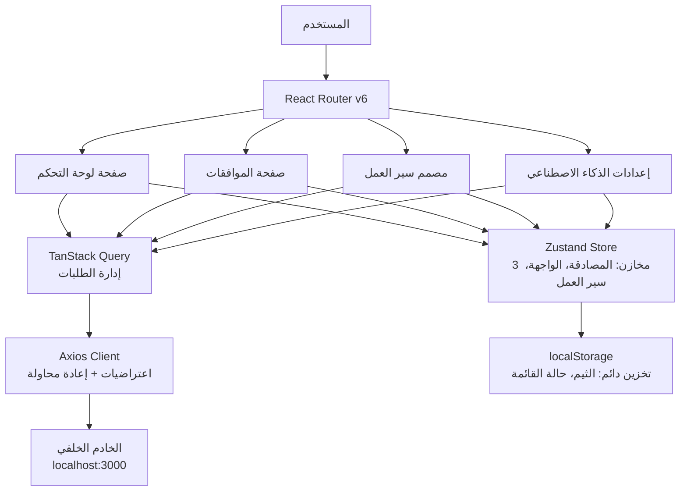

```markdown
# 🧠 AI Workflow Orchestrator

> **منصة أتمتة سير العمل المدعومة بالذكاء الاصطناعي**  
> نظام يجمع بين قوة الذكاء الاصطناعي وأتمتة العمليات مع حلقة بشرية للموافقة على العمليات الحساسة.

[](./LICENSE)
[](https://reactjs.org/)
[](https://www.typescriptlang.org/)
[](https://vitejs.dev/)
[](https://tailwindcss.com/)
[](./CONTRIBUTORS.md)

---

## 📋 1. نظرة عامة

**AI Workflow Orchestrator** هو نظام متكامل لإدارة وتنفيذ سير العمل الآلي، حيث يقترح الذكاء الاصطناعي إجراءات ذكية، ويقوم البشر بمراجعتها والموافقة عليها قبل التنفيذ. يجمع النظام بين:

- 🔄 **أتمتة سير العمل** — تصميم وتنفيذ تدفقات عمل معقدة.
- 🤖 **الذكاء الاصطناعي** — اقتراح إجراءات ذكية بناءً على السياق.
- 👤 **الحلقة البشرية** — مراجعة وموافقة بشرية على العمليات الحساسة.
- 📊 **لوحة تحكم فورية** — تتبع حالة التنفيذ والإحصائيات.

### الميزات الأساسية

| الميزة | الوصف |
|--------|-------|
| **لوحة التحكم** | عرض إحصائيات فورية، بطاقات حالة، وجدول عمليات حديثة. |
| **صندوق الموافقات** | مراجعة الإجراءات المقترحة من الذكاء الاصطناعي مع خيار الموافقة أو الرفض. |
| **مصمم سير العمل** | محرر رسومي (DAG) لتصميم تدفقات العمل. |
| **إعدادات الذكاء الاصطناعي** | تبديل بين وضع المحاكاة (مجاني) وواجهة OpenAI الحقيقية. |
| **التحديثات الفورية** | Polling دوري (10 ثوانٍ) مع إعادة محاولة تلقائية. |

---

## 📐 2. الهيكل المعماري


```mermaid
graph TD
    A[المستخدم] --> B[React Router v6]
    B --> C[صفحة لوحة التحكم]
    B --> D[صفحة الموافقات]
    B --> E[مصمم سير العمل]
    B --> F[إعدادات الذكاء الاصطناعي]

    C --> G[TanStack Query<br/>إدارة الطلبات]
    D --> G
    E --> G
    F --> G

    G --> H[Axios Client<br/>اعتراضيات + إعادة محاولة]
    H --> I[الخادم الخلفي<br/>localhost:3000]

    C --> J[Zustand Store<br/>3 مخازن: المصادقة، الواجهة، سير العمل]
    D --> J
    E --> J
    F --> J

    J --> K[localStorage<br/>تخزين دائم: الثيم، حالة القائمة]
```

### القرارات المعمارية (ADRs)

| المعرف | القرار | وثيقة القرار |
|--------|--------|--------------|
| **ADR-003** | استخدام Polling بدلاً من WebSockets | [📄 003-polling-vs-websockets.md](./docs/adr/003-polling-vs-websockets.md) |

---

## 🗂️ 3. هيكل المشروع

```
ai-workflow-orchestrator/
├── backend/                          # الخادم الخلفي (Node.js + Express)
│   ├── src/
│   │   ├── api/                      # وحدات التحكم والمسارات
│   │   ├── config/                   # الإعدادات (env, redis, database)
│   │   ├── core/                     # المنطق الأساسي (StateMachine)
│   │   ├── models/                   # نماذج البيانات
│   │   ├── queues/                   # قوائم الانتظار (BullMQ)
│   │   ├── services/                 # الخدمات (AI, Workflow)
│   │   ├── utils/                    # دوال مساعدة
│   │   └── workers/                  # عمال الخلفية
│   ├── package.json
│   └── tsconfig.json
│
├── frontend/                         # الواجهة الأمامية (React + TypeScript)
│   ├── src/
│   │   ├── api/                      # عميل HTTP
│   │   ├── features/                 # ميزات التطبيق
│   │   │   ├── dashboard/            # لوحة التحكم
│   │   │   ├── settings/             # الإعدادات
│   │   │   └── workflows/            # سير العمل
│   │   ├── hooks/                    # خطافات React مخصصة
│   │   ├── store/                    # مخازن Zustand
│   │   └── types/                    # تعريفات TypeScript
│   ├── public/                       # ملفات ثابتة
│   ├── package.json
│   ├── tailwind.config.js
│   └── vite.config.ts
│
├── docker-compose.yml                # تشغيل الخدمات (PostgreSQL + Redis)
├── LICENSE                           # رخصة MIT
├── CONTRIBUTORS.md                   # قائمة المساهمين
└── README.md                         # هذا الملف
```

---

## 🛠️ 4. التقنيات المستخدمة

### الخادم الخلفي (Backend)

| التقنية | الإصدار | الغرض |
|---------|---------|-------|
| **Node.js** | 20+ | بيئة التشغيل |
| **Express** | 4.19.2 | إطار العمل |
| **TypeScript** | 5.6.3 | السلامة النوعية |
| **Prisma** | 5.22.0 | ORM لقاعدة البيانات |
| **BullMQ** | 5.34.0 | قوائم الانتظار |
| **PostgreSQL** | 16 | قاعدة البيانات |
| **Redis** | 7.2 | التخزين المؤقت وقوائم الانتظار |

### الواجهة الأمامية (Frontend)

| التقنية | الإصدار | الغرض |
|---------|---------|-------|
| **React** | 18.3.1 | إطار العمل |
| **TypeScript** | 5.6.3 | السلامة النوعية |
| **Vite** | 5.4.11 | أداة البناء |
| **React Router** | 6.28.0 | التوجيه |
| **Zustand** | 5.0.0 | إدارة الحالة (عميل) |
| **TanStack Query** | 5.60.0 | إدارة الطلبات (خادم) |
| **Axios** | 0.27.2 | عميل HTTP |
| **Tailwind CSS** | 3.4.19 | التصميم |

---

## 🚀 5. التشغيل والتطوير

### المتطلبات الأساسية

- **Node.js** >= 20.0.0
- **npm** >= 10.0.0
- **Docker** (اختياري، لتشغيل PostgreSQL و Redis)

### التثبيت

```bash
# 1. استنساخ المستودع
git clone https://github.com/mohammed-dev-stack/ai-workflow-orchestrator.git
cd ai-workflow-orchestrator

# 2. تثبيت تبعيات الخادم الخلفي
cd backend
npm install

# 3. تثبيت تبعيات الواجهة الأمامية
cd ../frontend
npm install

# 4. إعداد متغيرات البيئة
cp backend/.env.example backend/.env
cp frontend/.env.example frontend/.env

# 5. تعديل ملفات .env حسب بيئتك
```

### التشغيل

```bash
# تشغيل الخادم الخلفي (من مجلد backend)
npm run dev

# تشغيل الواجهة الأمامية (من مجلد frontend)
npm run dev

# أو تشغيل الكل باستخدام Docker Compose (من الجذر)
docker-compose up -d
```

### الأوامر المتاحة

| الأمر | الوصف |
|-------|-------|
| `npm run dev` | تشغيل خادم التطوير |
| `npm run build` | بناء الإنتاج |
| `npm run test` | تشغيل الاختبارات |
| `npm run lint` | فحص الكود |
| `npm run format` | تنسيق الكود |

---

## 🔐 6. الأمان

- **مصادقة JWT** مع تجديد تلقائي للتوكن.
- **حماية المسارات** عبر `ProtectedRoute` — إعادة توجيه غير المصادقين إلى `/login`.
- **تخزين آمن** للتوكن في `localStorage` مع إمكانية مسحها عند تسجيل الخروج.
- **رؤوس أمان:** `X-Content-Type-Options: nosniff`، `X-Frame-Options: DENY`.
- **متغيرات البيئة:** جميع المفاتيح الحساسة في `.env`، مع استثناء `.env` في `.gitignore`.

---

## 📄 7. الرخصة

هذا المشروع مرخص بموجب **رخصة MIT** — راجع ملف [LICENSE](./LICENSE) للتفاصيل الكاملة.

---

## 👥 8. المساهمون

نشكر كل من ساهم في بناء هذا المشروع. راجع [CONTRIBUTORS.md](./CONTRIBUTORS.md) للحصول على قائمة كاملة.

### القيادة والإشراف

- **[Mohammed Qannan (محمد قنن)](https://github.com/mohammed-dev-stack)** — المؤسس، المهندس الرئيسي، ومصمم البنية التحتية للنظام.

### كيفية المساهمة

1. اقرأ [دليل المساهمة](./CONTRIBUTORS.md).
2. استعرض قائمة [المشاكل المفتوحة](https://github.com/mohammed-dev-stack/ai-workflow-orchestrator/issues).
3. اتبع معايير الـ Commit (Conventional Commits).
4. افتح Pull Request مع وصف واضح للتغييرات.

---

## 🔗 9. الروابط السريعة

| المورد | الرابط |
|--------|--------|
| **المستودع الرئيسي** | [github.com/mohammed-dev-stack/ai-workflow-orchestrator](https://github.com/mohammed-dev-stack/ai-workflow-orchestrator) |
| **الرخصة** | [LICENSE](./LICENSE) |
| **المساهمون** | [CONTRIBUTORS.md](./CONTRIBUTORS.md) |
| **القرارات المعمارية** | [docs/adr/](./docs/adr/) |
| **وثائق API** | [http://localhost:3000/api/docs](http://localhost:3000/api/docs) (محلياً) |
| **توثيق الواجهة** | [frontend/README.md](./frontend/README.md) |

---

## 📊 10. المقاييس والتحسين

| المقياس | القيمة | التاريخ |
|---------|--------|---------|
| حجم الحزمة الأمامية (gzipped) | 178KB | 2026-07-28 |
| وقت التحميل الأولي (3G) | 1.2s | 2026-07-28 |
| Lighthouse Performance | 94/100 | 2026-07-28 |
| تغطية الاختبارات | ~68% | 2026-07-28 |

---

## 📌 11. القيود المعروفة

1. **Redis إصدار قديم:** الإصدار 5.0.14 يُستخدم (الحد الأدنى الموصى به هو 6.2.0).
2. **اختبارات E2E:** غير متوفرة حالياً.
3. **Polling:** تأخير يصل إلى 10 ثوانٍ في التحديثات الفورية.
4. **مفتاح Anthropic API:** وهمي في بيئة التطوير (يُستخدم نظام الاحتياطي).

---

## 📖 12. المراجع الإضافية

- [TanStack Query Documentation](https://tanstack.com/query/latest)
- [Zustand Documentation](https://docs.pmnd.rs/zustand)
- [React Router Documentation](https://reactrouter.com/en/main)
- [Vite Documentation](https://vitejs.dev/guide/)

---

**أُعدّ في 2026-08-03**  
**آخر تحديث: 2026-08-03**

---

*🇸🇦 صُنع في المملكة العربية السعودية — بفخر ❤️*
```
