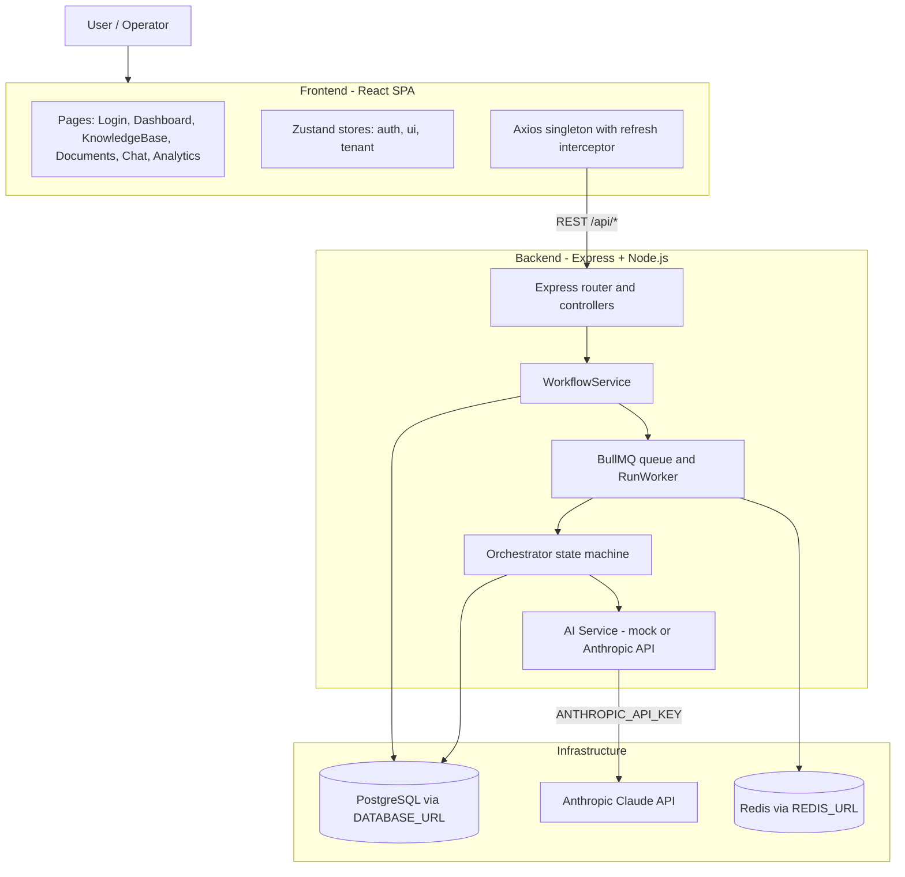

# WhatsApp AI Agent

> A multi-tenant, human-in-the-loop AI workflow platform: a React admin console on top of a Node.js orchestration engine that pauses at any step requiring human approval.


This is the root README for the project. Component-level detail lives in [`frontend/README.md`](./frontend/README.md) and [`backend/README.md`](./backend/README.md); this file covers the system as a whole.

## Table of Contents

- [Overview](#overview)
- [System Architecture](#system-architecture)
- [Tech Stack](#tech-stack)
- [Quick Start](#quick-start)
- [Security Note](#security-note)
- [Known Limitations](#known-limitations)
- [Screenshots](#screenshots)
- [Contributing](#contributing)
- [License](#license)

## Overview

WhatsApp AI Agent is a two-part system: a React-based admin console for managing knowledge bases, documents, and conversations, sitting on top of a Node.js orchestration engine that executes multi-step AI-assisted workflows through a BullMQ job queue. Any workflow step flagged as requiring approval pauses execution until a human reviewer approves or rejects it, and the AI decision layer can run in a deterministic mock mode or call the real Anthropic API. The database backing the orchestration engine is **PostgreSQL**, confirmed by the runtime `DATABASE_URL` variable — earlier component documentation referenced MongoDB, which no longer matches the running environment; see [Known Limitations](#known-limitations) for what that discrepancy does and doesn't tell us.

## System Architecture


```mermaid
graph TD
    U[User / Operator] --> FE

    subgraph FE["Frontend - React SPA"]
        F1[Pages: Login, Dashboard, KnowledgeBase, Documents, Chat, Analytics]
        F2[Zustand stores: auth, ui, tenant]
        F3[Axios singleton with refresh interceptor]
    end

    subgraph BE["Backend - Express + Node.js"]
        B1[Express router and controllers]
        B2[WorkflowService]
        B3[Orchestrator state machine]
        B4[BullMQ queue and RunWorker]
        B5[AI Service - mock or Anthropic API]
    end

    subgraph Infra["Infrastructure"]
        D1[(PostgreSQL via DATABASE_URL)]
        D2[(Redis via REDIS_URL)]
        D3[Anthropic Claude API]
    end

    F3 -->|REST /api/*| B1
    B1 --> B2
    B2 --> D1
    B2 --> B4
    B4 --> B3
    B3 --> D1
    B3 --> B5
    B5 -->|ANTHROPIC_API_KEY| D3
    B4 --> D2
```

The frontend talks to the backend exclusively through REST, via a single Axios instance that attaches a bearer token and refreshes it on 401 responses. The backend delegates business logic to `WorkflowService`, which persists workflow and run state, enqueues execution jobs on BullMQ, and hands step-by-step execution to the `Orchestrator` state machine — which is where the human-approval gate lives.

## Tech Stack

| Layer | Technology | Source |
|---|---|---|
| Frontend framework | React 18.3.1, TypeScript 5.6 (`strict: true`) | `frontend/README.md` |
| Frontend build tool | Vite 5.4 | `frontend/README.md` |
| Frontend state | Zustand 5.0 | `frontend/README.md` |
| Frontend HTTP client | Axios 1.7.9 | `frontend/README.md` |
| Backend runtime | Node.js >=20 | `backend/README.md` |
| Backend framework | Express ^4.21 | `backend/README.md` |
| **Database** | **PostgreSQL** (`DATABASE_URL`) | Runtime `.env` |
| ORM / query layer | Not confirmed by any source | Insufficient evidence from repository |
| Job queue | BullMQ ^5.12 + ioredis, backed by Redis (`REDIS_URL`) | `backend/README.md` + runtime `.env` |
| AI provider | `@anthropic-ai/sdk`, configured via `ANTHROPIC_API_KEY` / `ANTHROPIC_MODEL` / `ANTHROPIC_FALLBACK_MODEL` | Runtime `.env` |
| Logging | Winston ^3.14 | `backend/README.md` |
| Security headers | Helmet ^7.1 | `backend/README.md` |

## Quick Start

This uses the npm scripts documented in each component's own README and the variable names confirmed by the backend's runtime environment. The actual `.env.example` file was not provided for this audit — set the values below to whatever your local `.env.example` specifies; do not copy secret values from any shared `.env` file.

### 1. Backend

```bash
cd backend
npm ci
cp .env.example .env
# Set at minimum: DATABASE_URL (postgresql://...), REDIS_URL, ANTHROPIC_API_KEY
npm run dev
```

Verify it's up:

```bash
curl http://localhost:$PORT/health
```

`$PORT` is whatever `PORT` resolves to in your `.env` — Insufficient evidence from repository to state a confirmed default, since the two sources on hand disagree (see [Known Limitations](#known-limitations)).

### 2. Frontend

```bash
cd frontend
npm install
cat > .env <<EOF
VITE_API_URL=http://localhost:3000
VITE_WS_URL=ws://localhost:3000
EOF
npm run dev
```

Adjust `VITE_API_URL` to match the port your backend actually started on.

## Security Note

- Never commit a `.env` file with real credentials. If a `.env` containing live-looking secrets (JWT signing keys, encryption keys, API tokens) has ever been shared or committed, rotate all of those values immediately and confirm the file isn't in git history.
- The backend's `user-id` header-based request identification is not authentication — see [Known Limitations](#known-limitations).
- Only `VITE_`-prefixed variables are exposed to the frontend bundle; keep non-public secrets out of the frontend `.env` entirely.

## Known Limitations

These are documented plainly rather than smoothed over, because they affect whether this is production-ready as-is:

- **Database documentation is stale.** The backend's own README (prior revision) documents MongoDB/Mongoose in detail — schemas, a `MONGO_URI`-based connection string, Mongoose-specific error handling. The runtime environment instead defines `DATABASE_URL` in PostgreSQL format, with no `MONGO_URI` present anywhere. PostgreSQL is treated as the actual database; the ORM/query layer used to talk to it is not confirmed by any source reviewed.
- **Mongoose-specific error mapping is likely stale.** The previously documented error handler maps Mongoose `ValidationError`, `CastError`, and Mongo duplicate-key errors (code `11000`) to HTTP statuses. If the database is now PostgreSQL, the equivalent error shapes (e.g., a unique-constraint violation) are unconfirmed and should be re-verified against the actual error-handling code.
- **No confirmed authentication layer.** The backend trusts a `user-id` header as-is; there is no documented JWT verification, session handling, or rate-limiting middleware actually mounted, despite JWT- and rate-limit-related variables existing in the environment.
- **WebSocket client with no confirmed server.** The frontend implements a complete WebSocket client, but no WebSocket library or upgrade handler is documented on the backend side. This realtime path currently has no confirmed server counterpart.
- **License mismatch between components.** The frontend is `UNLICENSED`/private; the backend is MIT. These need to be reconciled by the project owner before treating the repository as consistently licensed.
- **WhatsApp integration is undocumented.** WhatsApp Cloud API credentials exist in the runtime environment, but no backend documentation describes how the integration works.
- **Default port is unclear.** Prior backend documentation used port 5000 in examples; the runtime environment defines `PORT` explicitly to a different value. Confirm the actual port from your own `.env` rather than assuming either documented default.
- **Tool execution is mocked.** Workflow tools such as sending email, creating calendar events, or creating tickets do not call any real external service in the documented implementation — they return synthetic responses after a short delay.
- **No test suite wired up** on the backend (no `test` script in `package.json`); the frontend has a configured Vitest/Testing Library harness but no test files.

## Screenshots

Screenshots will be added soon.

## Contributing

- Backend: run `npm run build` / `npm run dev` as documented in [`backend/README.md`](./backend/README.md). No `test` or `lint` script is currently defined.
- Frontend: run `npm run type-check` and `npm run lint` before opening a pull request, per [`frontend/README.md`](./frontend/README.md).
- Insufficient evidence from repository for a unified, cross-component contribution policy (branch naming, commit conventions) — consider adding a dedicated `CONTRIBUTING.md`.

## License

| Component | License |
|---|---|
| Frontend | `UNLICENSED`, private — no `LICENSE` file present |
| Backend | MIT |

These two licenses conflict and should be reconciled by the project owner before public distribution of the combined repository.
