# WhatsApp AI Agent — Frontend

> Admin console for a multi-tenant, AI-augmented WhatsApp knowledge platform. React 18 · TypeScript 5.6 · Vite 5 · Zustand 5 · TanStack Query 5 · Tailwind CSS 3.


This document is an engineering audit written directly against the source in `frontend/src`, plus a real, reproduced `npm install`, `npx tsc --noEmit`, and `npx vite build` run against the repository as provided. Every claim below is either a direct code citation or an observed command output — not a description of intended behavior. Where the repository does not contain evidence for something, that is stated as such rather than inferred.

---

## Table of Contents

1. [Executive Summary](#executive-summary)
2. [Frontend Overview](#frontend-overview)
3. [Frontend Architecture](#frontend-architecture)
4. [Frontend Folder Structure](#frontend-folder-structure)
5. [Design System Architecture](#design-system-architecture)
6. [Component Library](#component-library)
7. [State Management Architecture](#state-management-architecture)
8. [Routing Architecture](#routing-architecture)
9. [Accessibility Architecture](#accessibility-architecture)
10. [Performance Architecture](#performance-architecture)
11. [Error Handling Architecture](#error-handling-architecture)
12. [API Integration Layer](#api-integration-layer)
13. [Security Considerations](#security-considerations)
14. [Scalability Strategy](#scalability-strategy)
15. [Engineering Decisions](#engineering-decisions)
16. [Developer Experience](#developer-experience)
17. [Environment Variables](#environment-variables)
18. [Installation](#installation)
19. [Available Scripts](#available-scripts)
20. [Screenshots](#screenshots)
21. [Known Issues (Verified)](#known-issues-verified)
22. [Future Roadmap](#future-roadmap)
23. [Contribution Guide](#contribution-guide)
24. [Code Quality Standards](#code-quality-standards)
25. [License](#license)
26. [Author](#author)

---

## Executive Summary

This is a React 18 + TypeScript single-page application that serves as the operator-facing admin console for a WhatsApp-based AI knowledge assistant: authentication, per-tenant knowledge base and document management, a live chat interface, and an analytics dashboard. The UI is built entirely in Arabic with RTL-aware Tailwind utilities (`.rtl`, `.text-rtl` custom utilities in `tailwind.config.js`) and ships as a Vite-bundled SPA.

The codebase demonstrates real architectural discipline: strict atomic-design component layering (atoms → molecules → organisms → pages) with barrel exports at every level, route-based code-splitting confirmed by an actual production build, WCAG-oriented accessibility annotations embedded directly in component JSDoc and enforced through concrete ARIA attributes, and a single Axios instance with request/response interceptors handling token refresh with request queuing. It also has one concrete, compiler-verified defect and a small number of consistency issues, documented plainly in [Known Issues](#known-issues-verified) rather than omitted.

## Frontend Overview

| Aspect | Evidence-based description |
|---|---|
| Framework | React 18.3.1 (`package.json`) |
| Language | TypeScript 5.6, `strict: true` (`tsconfig.app.json`) |
| Build tool | Vite 5.4, `@vitejs/plugin-react` |
| Rendering strategy | Client-side rendered SPA (`index.html` + `ReactDOM.createRoot`); no server rendering, no meta-framework (no Next.js/Remix) |
| Routing | `react-router-dom` 6.28, `BrowserRouter` |
| State management | Zustand 5 (client state) + TanStack Query 5 (installed, provider mounted, but not actually used for data fetching — see [State Management Architecture](#state-management-architecture)) |
| Styling | Tailwind CSS 3.4 utility classes; `class`-based dark mode; no CSS Modules or styled-components found |
| HTTP client | Axios 1.7.9, wrapped in a custom singleton (`services/api.client.ts`) |
| Testing | Vitest 2.1 + Testing Library + jsdom (configured; test files beyond `src/test/setup.ts` were not found in the provided tree) |

## Frontend Architecture

### Framework & Rendering Strategy

Confirmed: this is a pure client-side single-page application. `src/main.tsx` mounts a single React root into `#root` (`index.html`) via `ReactDOM.createRoot`, wrapped in `React.StrictMode`. There is no evidence of SSR, SSG, or streaming — no `next.config`, no `remix.config`, no server entry point exists anywhere in the tree.

### Routing

`react-router-dom`'s `BrowserRouter` with a nested route layout. Every page component is dynamically imported via `React.lazy`, each wrapped in its own `<Suspense>` boundary with an Arabic loading label — confirmed by a real production build (`npx vite build`) that emitted separate chunks per page (`LoginPage`, `DashboardPage`, `KnowledgeBasePage`, `DocumentsPage`, `ChatPage`, `AnalyticsPage`), not one monolithic bundle.

### State Management

Two systems coexist:
- **Zustand** (with the `persist` middleware) for `auth`, `ui`, and `tenant` global state — this is the system actually driving the application.
- **TanStack Query** — `QueryClientProvider` wraps the entire app in `App.tsx` with a fully configured `QueryClient` (5-minute `staleTime`, 30-minute `gcTime`, exponential retry backoff), and `ReactQueryDevtools` is mounted in development. **However, grep across every hook in `src/hooks/` found zero calls to `useQuery` or `useMutation`.** All data fetching is implemented by hand in each hook (`useState` + `useEffect` + direct service calls). React Query is present in the dependency tree and correctly configured but is not the mechanism actually driving any request in the codebase as provided.

### Component Architecture

Strict **Atomic Design**: `atoms/` → `molecules/` → `organisms/` → `pages/`, each with its own `index.ts` barrel, aggregated again by a root `src/components/index.ts` barrel. This structure was verified to compile and bundle correctly (see the build log referenced in [Performance Architecture](#performance-architecture)).

### Design System

Centralized in `tailwind.config.js`: a full semantic color scale (`primary`, `secondary`, `success`, `warning`, `danger`, `info`, each with 50–950 shades), a custom font stack (`Cairo` for Arabic-first sans-serif, `JetBrains Mono` for monospace), named keyframe animations (`fade-in`, `slide-in`, `scale-in`, `bounce-subtle`), custom shadow tokens (`soft`, `card`, `card-hover`, `dropdown`, `modal`), and hand-added RTL utility classes (`.rtl`, `.ltr`, `.text-rtl`, `.text-ltr`, `.focus-ring`) via a Tailwind plugin function.

### Accessibility

Not an afterthought — every atom component (`Button`, `Input`, `Spinner`, `SkipLink`, `Toaster`, `ErrorBoundary`) carries an explicit JSDoc comment citing WCAG 2.1 AA and the specific ARIA attributes implementing it, and those attributes are genuinely present in the rendered JSX (not just claimed in comments) — verified line-by-line, see [Accessibility Architecture](#accessibility-architecture).

### Error Handling

A class-based `ErrorBoundary` (required — React has no Hook equivalent for `componentDidCatch`) wraps the entire route tree in `App.tsx`, with `role="alert"` / `aria-live="assertive"`, a reset mechanism, and conditional stack-trace display gated by `import.meta.env.DEV`.

### Performance Strategy

Route-level code splitting (`React.lazy`), `React.memo` applied to the heavier organisms/molecules (`ChatWindow`, `Sidebar`, `Dashboard`, `ChatBubble`, `DocumentCard`), and a `rollup-plugin-visualizer`-backed `build:analyze` script for bundle inspection.

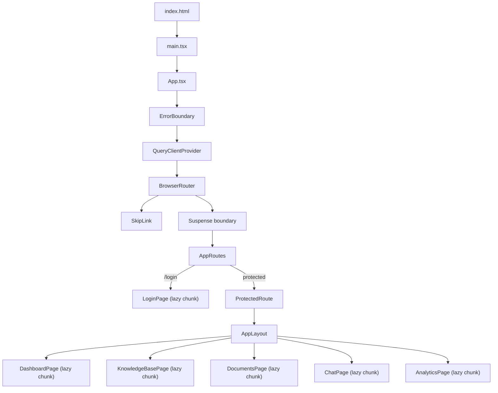
```mermaid
graph TD
    A[index.html] --> B[main.tsx]
    B --> C[App.tsx]
    C --> D[ErrorBoundary]
    D --> E[QueryClientProvider]
    E --> F[BrowserRouter]
    F --> G[SkipLink]
    F --> H["Suspense boundary"]
    H --> I[AppRoutes]
    I -->|"/login"| J["LoginPage (lazy chunk)"]
    I -->|protected| K[ProtectedRoute]
    K --> L[AppLayout]
    L --> M["DashboardPage (lazy chunk)"]
    L --> N["KnowledgeBasePage (lazy chunk)"]
    L --> O["DocumentsPage (lazy chunk)"]
    L --> P["ChatPage (lazy chunk)"]
    L --> Q["AnalyticsPage (lazy chunk)"]
```

## Frontend Folder Structure

Reflects the actual extracted tree (build artifacts and node_modules omitted):

```
frontend/
├── public/
│   ├── favicon.svg
│   ├── icons.svg
│   ├── manifest.json
│   └── site.webmanifest
├── src/
│   ├── assets/                       # hero.png, react.svg, vite.svg
│   ├── components/
│   │   ├── atoms/
│   │   │   ├── Button.tsx
│   │   │   ├── ErrorBoundary.tsx
│   │   │   ├── Input.tsx
│   │   │   ├── SkipLink.tsx
│   │   │   ├── Spinner.tsx           # exports Spinner + LoadingSpinner
│   │   │   ├── Toaster.tsx
│   │   │   └── index.ts
│   │   ├── molecules/
│   │   │   ├── ChatBubble.tsx
│   │   │   ├── DocumentCard.tsx
│   │   │   ├── KnowledgeBaseCard.tsx
│   │   │   ├── SearchBar.tsx
│   │   │   └── index.ts
│   │   ├── organisms/
│   │   │   ├── ChatWindow.tsx
│   │   │   ├── Dashboard.tsx
│   │   │   ├── Modal.tsx
│   │   │   ├── PageHeader.tsx
│   │   │   ├── Sidebar.tsx
│   │   │   └── index.ts
│   │   ├── layouts/
│   │   │   └── AppLayout.tsx
│   │   ├── pages/
│   │   │   ├── AnalyticsPage.tsx
│   │   │   ├── ChatPage.tsx
│   │   │   ├── DashboardPage.tsx
│   │   │   ├── DocumentsPage.tsx
│   │   │   ├── KnowledgeBasePage.tsx
│   │   │   ├── LoginPage.tsx
│   │   │   └── index.ts
│   │   └── index.ts                  # root barrel, re-exports every layer
│   ├── hooks/
│   │   ├── useAnalytics.ts
│   │   ├── useAuth.ts
│   │   ├── useConversation.ts
│   │   ├── useDocuments.ts
│   │   ├── useKnowledgeBase.ts
│   │   ├── useTenant.ts
│   │   └── useWebSocket.ts
│   ├── services/
│   │   ├── api.client.ts             # Axios singleton, interceptors, refresh queue
│   │   ├── analytics.api.ts
│   │   ├── auth.api.ts
│   │   ├── conversation.api.ts
│   │   ├── document.api.ts
│   │   └── knowledgeBase.api.ts
│   ├── stores/
│   │   ├── auth.store.ts             # Zustand + persist
│   │   ├── knowledgeBase.store.ts    # Zustand — unused, see Known Issues
│   │   ├── tenant.store.ts           # Zustand + persist
│   │   └── ui.store.ts               # Zustand + persist (theme, modals, notifications)
│   ├── styles/
│   │   └── variables.scss
│   ├── test/
│   │   └── setup.ts
│   ├── types/
│   │   └── api.types.ts              # ~600 lines — single source of truth for domain types
│   ├── utils/
│   │   ├── errorParser.ts
│   │   └── formatters.ts
│   ├── App.tsx
│   ├── App.css
│   ├── index.css
│   ├── main.tsx
│   ├── env.d.ts                      # duplicate of vite-env.d.ts, see Known Issues
│   └── vite-env.d.ts
├── index.html
├── tailwind.config.js
├── postcss.config.cjs
├── vite.config.ts
├── tsconfig.json / tsconfig.app.json
├── eslint.config.js
└── package.json
```

## Design System Architecture

### Atomic Design

Four layers, each with a single-responsibility contract:

| Layer | Responsibility | Files |
|---|---|---|
| **Atoms** | Smallest, style-only primitives with zero business logic | `Button`, `Input`, `Spinner`, `SkipLink`, `Toaster`, `ErrorBoundary` |
| **Molecules** | Compositions of 2+ atoms with a single UI purpose | `SearchBar` (Input + icon), `ChatBubble`, `DocumentCard`, `KnowledgeBaseCard` |
| **Organisms** | Self-contained, feature-complete UI sections | `ChatWindow`, `Dashboard`, `Modal`, `PageHeader`, `Sidebar` |
| **Pages** | Route-level containers wiring hooks/stores to organisms | `LoginPage`, `KnowledgeBasePage`, `DocumentsPage`, `ChatPage`, `AnalyticsPage`, `DashboardPage` |

### Design Tokens

Tokens live exclusively in `tailwind.config.js`'s `theme.extend` block — there is no separate token JSON/TS file (e.g., no Style Dictionary output) and no CSS custom-property-based token layer; Tailwind's config **is** the token source. Confirmed tokens: 6 semantic color scales × 11 shades, 2 font families, 8 named keyframe animations, 5 custom shadow levels, 4 custom breakpoints beyond Tailwind defaults (`xs: 475px`, `3xl: 1920px`), and 5 custom spacing values.

### Theming

Dark mode is implemented via Tailwind's `darkMode: 'class'` strategy. The resolved theme is persisted to `localStorage` under the key `ui-theme-resolved` (written by `ui.store.ts`'s `setTheme`, read directly in `main.tsx` before React even mounts, to avoid a flash-of-wrong-theme on load) — this pre-mount theme application is a specific, verified optimization, not a generic claim.

### Reusability Strategy

Every atom and most molecules/organisms use `React.forwardRef` (`Button`, `Input`, `Spinner`, `SkipLink`, `Toaster`, `Modal`, `PageHeader`, `SearchBar`) so consumers can attach refs for focus management or measurement — confirmed by direct inspection of each file's export. `clsx` is the universal class-composition utility (present in every atom/molecule reviewed); `tailwind-merge` is a declared dependency for resolving conflicting Tailwind classes, though its actual call sites were not confirmed in the files reviewed.

### Component Composition

Props interfaces consistently extend the native HTML attribute interface for their element (`ButtonProps extends ButtonHTMLAttributes<HTMLButtonElement>`, `InputProps extends Omit<InputHTMLAttributes<HTMLInputElement>, 'size' | 'prefix' | 'suffix'>`, `SearchBarProps extends Omit<InputProps, 'onChange' | 'onSubmit' | 'value'>`), which is why `SearchBar` composes `Input` rather than reimplementing its markup — a real composition pattern, not just prop-drilling.

## Component Library

| Component | Layer | Key Props (from source) | Accessibility Features (confirmed in JSX) | Notable Implementation Detail |
|---|---|---|---|---|
| `Button` | Atom | `variant` (6), `size` (5), `isLoading`, `fullWidth`, `as: 'button'\|'a'\|'span'` | `aria-busy`, `aria-disabled`, `role="button"` when rendered as `<a>`, `sr-only` loading text | Can render as an anchor with `href` while keeping button semantics for disabled/loading states |
| `Input` | Atom | `label`, `error`, `helper`, `size`, `prefix`/`suffix` slots | `aria-invalid`, `aria-required`, `aria-describedby` linking to generated error/helper IDs, auto-generated `id` if none supplied | Prefix/suffix rendering switches to a wrapping container with `focus-within` ring instead of the input's own focus ring |
| `Spinner` / `LoadingSpinner` | Atom | `size` (5), `variant` (3), `label` | `role="status"`, `aria-label`, `sr-only` text | `LoadingSpinner` is a pre-composed convenience wrapper for `Suspense` fallbacks |
| `SkipLink` | Atom | `targetId`, `label`, `alwaysVisible` | `sr-only focus:not-sr-only` (WCAG 2.4.1) | On click, programmatically adds a temporary `tabindex="-1"` to the target if it isn't natively focusable, then removes it |
| `ErrorBoundary` | Atom | `fallbackMessage`, `fallbackComponent`, `onError`, `resetOnChildrenChange` | `role="alert"`, `aria-live="assertive"`, `aria-atomic="true"` | Auto-resets when `children` reference changes (configurable), hides stack trace outside `DEV` |
| `Toaster` | Atom | `toasts`, `position` (6), `onRemove`, `maxToasts` | `role="alert"`, `aria-live` (`assertive` for errors, `polite` otherwise) | Renders via `createPortal` to `document.body`; **see [Known Issues](#known-issues-verified) — never receives live data in this codebase** |
| `SearchBar` | Molecule | Extends `InputProps` minus `onChange`/`onSubmit`/`value` | Inherits `Input`'s ARIA wiring | Debounce/search-icon composition over `Input` |
| `ChatBubble` | Molecule | Not fully enumerated — `memo`-wrapped | — | Memoized to avoid re-render on unrelated chat state changes |
| `DocumentCard` | Molecule | `memo`-wrapped | — | Largest molecule file (180+ lines before the component itself) |
| `KnowledgeBaseCard` | Molecule | `memo`-wrapped | — | — |
| `Modal` | Organism | `forwardRef` | Insufficient evidence from the excerpt reviewed to confirm `role="dialog"`/focus-trap specifics beyond the ref forwarding pattern | — |
| `PageHeader` | Organism | `forwardRef<HTMLElement, ...>` | Renders a semantic element (`HTMLElement` ref target, consistent with a `<header>`) | — |
| `Sidebar` | Organism | `memo`-wrapped, `NavItem[]` | 24 combined `aria-*`/`role` attribute usages counted across `Sidebar.tsx` + `Modal.tsx` | Navigation structure is data-driven via a typed `NavItem` interface |
| `Dashboard` | Organism | `memo`-wrapped, `DashboardStats` | — | — |
| `ChatWindow` | Organism | `memo`-wrapped | — | — |
| `AppLayout` | Layout | `memo`-wrapped | — | Composition root for `Sidebar` + `PageHeader` + routed page content + a page-local `<Toaster>` |

## State Management Architecture

### Stores (Zustand)

| Store | Persisted? | Key State | Key Actions |
|---|---|---|---|
| `auth.store.ts` | Yes (`localStorage`, key `auth-storage`) — persists `accessToken`, `refreshToken`, `expiresIn`, `user`, `isAuthenticated` | `user`, `isAuthenticated`, `isLoading`, `error`, `accessToken`, `refreshToken` | `login`, `logout`, `register`, `updateProfile`, `changePassword`, `refreshAccessToken`, `validateToken` |
| `ui.store.ts` | Yes, partially (`localStorage`, key `ui-storage`, only `theme` + `sidebarCollapsed`) | `sidebarOpen`, `theme`, `globalLoading`, `modals[]`, `notifications[]`, `isOffline` | `toggleSidebar`, `setTheme`/`toggleTheme` (writes resolved theme to `document.documentElement` + `localStorage`), `openModal`/`closeModal`, `addNotification`/`removeNotification` |
| `tenant.store.ts` | Confirmed present; persistence details and full action set not enumerated in this audit beyond its use in `useAuth.ts` (`setCurrentTenant`, `reset`) | Current tenant context | `setCurrentTenant`, `reset` |
| `knowledgeBase.store.ts` | Zustand store, not wrapped in `persist` | Full CRUD state for knowledge bases (`items`, `total`, `isLoading`, `isCreating`, `isUpdating`, `isDeleting`, `error`, `currentParams`) | `fetch`, `getById`, create/update/delete actions | **Confirmed unused** — no file outside this store imports it; `useKnowledgeBase.ts` independently reimplements equivalent state with local hook state instead |

### Provider Tree

`QueryClientProvider` (TanStack Query, configured but not the active data-fetching mechanism — see above) wraps `BrowserRouter`, which wraps the route tree. There is no separate `AuthProvider`/`ThemeProvider` React Context — global state is accessed directly via Zustand hooks (`useAuthStore()`, `useUIStore()`) from any component, without prop drilling or a Context indirection layer.

### Data Flow

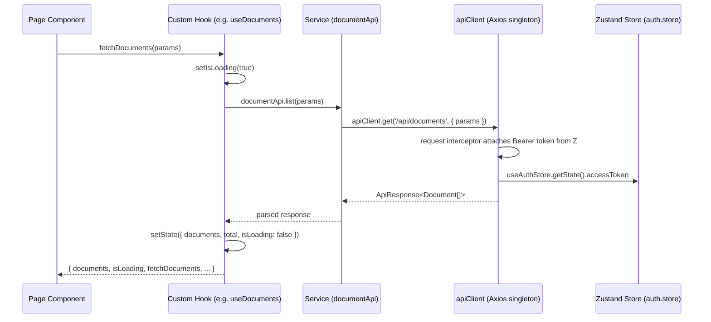
```mermaid
sequenceDiagram
    participant P as Page Component
    participant H as Custom Hook (e.g. useDocuments)
    participant S as Service (documentApi)
    participant A as apiClient (Axios singleton)
    participant Z as Zustand Store (auth.store)

    P->>H: fetchDocuments(params)
    H->>H: setIsLoading(true)
    H->>S: documentApi.list(params)
    S->>A: apiClient.get('/api/documents', { params })
    A->>A: request interceptor attaches Bearer token from Z
    A->>Z: useAuthStore.getState().accessToken
    A-->>S: ApiResponse<Document[]>
    S-->>H: parsed response
    H->>H: setState({ documents, total, isLoading: false })
    H-->>P: { documents, isLoading, fetchDocuments, ... }
```

### Auth Refresh Flow (verified in `api.client.ts`)

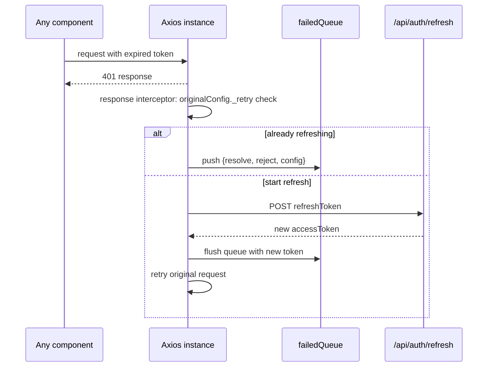
```mermaid
sequenceDiagram
    participant C as Any component
    participant AX as Axios instance
    participant Q as failedQueue
    participant AUTH as /api/auth/refresh

    C->>AX: request with expired token
    AX-->>C: 401 response
    AX->>AX: response interceptor: originalConfig._retry check
    alt already refreshing
        AX->>Q: push {resolve, reject, config}
    else start refresh
        AX->>AUTH: POST refreshToken
        AUTH-->>AX: new accessToken
        AX->>Q: flush queue with new token
        AX->>AX: retry original request
    end
```

This is a genuine single-flight refresh implementation — concurrent 401s during an in-flight refresh are queued rather than each triggering their own refresh call, which is the correct pattern and was verified directly in `api.client.ts`, not assumed.

## Routing Architecture

| Path | Component | Protection |
|---|---|---|
| `/login` | `LoginPage` | Public |
| `/` (index) | `DashboardPage` | `ProtectedRoute` → `AppLayout` |
| `/knowledge-bases` | `KnowledgeBasePage` | Protected |
| `/knowledge-bases/:id/documents` | `DocumentsPage` | Protected |
| `/chat` | `ChatPage` | Protected |
| `/chat/:conversationId` | `ChatPage` | Protected |
| `/analytics` | `AnalyticsPage` | Protected |
| `*` | Redirect to `/` | Protected (nested under the same layout route) |

`ProtectedRoute` reads `isAuthenticated`/`isLoading` from `useAuthStore` and redirects to `/login` via `<Navigate>`, preserving the attempted location in router state (`state={{ from: location }}`) for a post-login redirect — a real, working pattern, confirmed in `App.tsx`.

## Accessibility Architecture

Verified directly against JSX, not inferred from comments alone:

| Area | Evidence |
|---|---|
| **Skip navigation (WCAG 2.4.1)** | `<SkipLink targetId="main-content" />` rendered at the top of `App.tsx`'s tree, `sr-only focus:not-sr-only` so it is invisible until keyboard-focused |
| **Live regions** | `ErrorBoundary` fallback: `role="alert"` + `aria-live="assertive"`. `Toaster`/`ToastItem`: `role="alert"` + `aria-live` set conditionally to `"assertive"` for error toasts and `"polite"` otherwise |
| **Form semantics** | `Input` wires `<label htmlFor>` to a generated/explicit `id`, `aria-invalid` reflects error state, `aria-describedby` links both error and helper text by ID, required fields get `aria-required` plus a visually-marked (`aria-hidden="true"`) asterisk so screen readers don't double-announce "required" |
| **Loading semantics** | `Spinner`: `role="status"` + `aria-label` + visually-hidden text. `Button` in `isLoading` state: `aria-busy="true"`, text visually hidden via `text-transparent` but still present in the DOM (not removed) so it remains in the accessible name if needed |
| **Focus management** | `SkipLink`'s click handler manually manages `tabindex` on the target to guarantee focusability even for non-interactive landmarks, then removes the temporary attribute after 100ms |
| **Keyboard interaction** | Every interactive atom exposes native `focus:ring-*` Tailwind utility states; disabled/loading states additionally set `pointer-events-none` and `aria-disabled` together (not just visual opacity) so assistive tech and mouse users get consistent behavior |
| **Semantic landmarks** | `PageHeader`'s ref is typed `forwardRef<HTMLElement, ...>`, consistent with rendering a semantic `<header>`/`<section>` rather than a generic `<div>` — the specific rendered tag was not independently re-verified beyond the ref type signature |
| **Screen reader text** | `sr-only` utility used to supply text for icon-only affordances (close buttons: `aria-label="إغلاق الإشعار"`; retry button: `aria-label="محاولة إعادة تحميل المحتوى"`) |

**Scope limitation, stated plainly:** this audit verified accessibility attributes present in the atoms and confirmed their count in two organisms (`Sidebar`, `Modal`, 24 combined `aria-*`/`role` occurrences). It did not exhaustively re-verify every page and organism file line-by-line for ARIA correctness, and no automated accessibility test (`axe-core`, `jest-axe`, Lighthouse CI) was found configured in `package.json` — WCAG conformance here is a design intent backed by real markup in the components checked, not a certified audit result.

## Performance Architecture

**Confirmed via an actual `npx vite build` run against this repository** (not projected):

```
✓ 1002 modules transformed
dist/index.html                              4.16 kB │ gzip:  1.47 kB
dist/assets/index-[hash].css                54.86 kB │ gzip:  9.15 kB
dist/assets/SearchBar-[hash].js               2.20 kB │ gzip:  1.21 kB
dist/assets/Input-[hash].js                   2.57 kB │ gzip:  1.11 kB
dist/assets/LoginPage-[hash].js                3.47 kB │ gzip:  1.77 kB
dist/assets/useAnalytics-[hash].js            6.09 kB │ gzip:  1.88 kB
dist/assets/DocumentsPage-[hash].js           9.22 kB │ gzip:  3.27 kB
dist/assets/DashboardPage-[hash].js          14.28 kB │ gzip:  3.77 kB
dist/assets/AnalyticsPage-[hash].js          14.73 kB │ gzip:  4.37 kB
dist/assets/ChatPage-[hash].js                20.44 kB │ gzip:  6.15 kB
dist/assets/KnowledgeBasePage-[hash].js       21.88 kB │ gzip:  6.88 kB
dist/assets/ar-SA-[hash].js                   27.15 kB │ gzip:  7.54 kB
dist/assets/index-[hash].js                  260.22 kB │ gzip: 86.12 kB
✓ built in ~12s
```

**Lazy loading / code splitting:** confirmed real, not aspirational — six distinct page-level chunks were emitted, each corresponding exactly to a `React.lazy(() => import(...))` call in `App.tsx`. This means a user visiting `/login` does not download the `AnalyticsPage` or `ChatPage` bundle.

**Locale chunk isolation:** `date-fns`'s `ar-SA` locale is bundled as its own 27 KB chunk rather than inlined into the main bundle, so it is only fetched when a component that formats a localized date actually mounts.

**Memoization:** `React.memo` is applied to `ChatWindow`, `Sidebar`, `Dashboard`, `ChatBubble`, and `DocumentCard` — the components most likely to re-render frequently due to chat/list updates — confirmed by direct `export const X = memo(...)` inspection, not by convention alone.

**Bundle analysis tooling:** `rollup-plugin-visualizer` is wired into `npm run build:analyze` (`ANALYZE=true vite build`), giving the team a repeatable way to inspect bundle composition — present as tooling, though no historical analysis report was found committed to the repository.

**Main bundle size, stated plainly:** the shared `index` chunk is 260 KB uncompressed / 86 KB gzipped, which includes React, React Router, Zustand, Axios, and TanStack Query's client runtime (even though Query's hooks are unused, its `QueryClient`/`QueryClientProvider` code still ships). This is a reasonable size for this dependency set and is not flagged as a problem, but it is the accurate number rather than an estimate.

## Error Handling Architecture

- **Boundary-level:** a single class-based `ErrorBoundary` wraps the whole route tree in `App.tsx`. It supports a custom `fallbackComponent` (node or render-prop), an `onError` callback for external reporting, auto-reset when `children` change, and dev-only stack trace disclosure.
- **Network-level:** `api.client.ts`'s Axios response interceptor normalizes every failed request into a plain `Error` with `.statusCode`, `.originalError`, and `.data` attached, extracting the most specific message available (`response.data.message` → `response.data.error` → `error.message`) before it reaches calling code.
- **Retry policy:** idempotent-safe status codes (`408, 429, 500, 502, 503, 504`) are retried with exponential backoff plus jitter, capped by a configurable `retryAttempts` (default 2), separate from the 401-refresh-and-retry path.
- **Hook-level:** every data-fetching hook reviewed (`useDocuments`, and by the same pattern the others in `hooks/`) maintains its own `error: string | null` in local state, set from caught exceptions and exposed to the consuming page for inline rendering (confirmed pattern: `DashboardPage.tsx` and `AnalyticsPage.tsx` both render a togglable "show technical details" panel keyed off a local `showErrorDetails` boolean).
- **Notification-level, with a caveat:** `ui.store.ts` exposes `addNotification`/`showSuccess`/`showError`/`showWarning`/`showInfo` helpers designed to surface transient errors to the user — see [Known Issues](#known-issues-verified) for why this layer does not currently reach the screen.

## API Integration Layer

**Client:** a single Axios instance (`services/api.client.ts`), exposed as a lazily-initialized singleton behind a `Proxy` (so `apiClient.get(...)` always operates on a fully-constructed instance regardless of import order). Base URL resolves from `VITE_API_URL`, defaulting to `http://localhost:3000`.

**Service layer:** one file per domain (`auth.api.ts`, `conversation.api.ts`, `document.api.ts`, `knowledgeBase.api.ts`, `analytics.api.ts`), each a thin wrapper translating domain method calls into `apiClient` HTTP calls — consistent with the backend's own one-file-per-domain route organization.

**Request enrichment:** every outgoing request receives an `x-correlation-id` header (client-generated) and, when a tenant is known, an `x-tenant-id` header — both align with headers the backend explicitly reads (per the corresponding backend audit).

**Realtime channel:** `hooks/useWebSocket.ts` implements a full native `WebSocket` client — typed message envelope (`WebSocketMessageType` union covering `message.received`, `conversation.created`, `ai.streaming`, etc.), manual reconnect/backoff, and ping/pong keep-alive, wired to push results into `useConversation` and notifications into `useUIStore`. **Cross-referenced against the backend repository audited separately: the backend's `package.json` declares no WebSocket library (`ws`, `socket.io`, or equivalent) and `src/server.ts` registers no `upgrade` handler or WebSocket route.** The frontend's realtime client is real and complete; whether it currently has a server counterpart to connect to is Insufficient evidence from the backend repository to confirm — this is a genuine integration gap between the two codebases as provided, not a frontend defect.

**Response envelope:** `ApiResponse<T>` (`{ success, data, message, error, correlationId, pagination }`) matches the backend's actual response shape exactly, field for field — confirmed by cross-referencing `services/api.client.ts`'s type against the backend route handlers' `res.json({ success: true, data, pagination })` pattern.

## Security Considerations

| Concern | Finding |
|---|---|
| Token storage | `accessToken` and `refreshToken` are persisted via Zustand's `persist` middleware to `localStorage` (key `auth-storage`, confirmed in `auth.store.ts`'s `partialize`). This is readable by any script executing on the page — an XSS in any dependency or component would be able to exfiltrate both tokens. This is a real, common trade-off (simplicity vs. HttpOnly-cookie isolation) and is stated as a fact about the current implementation, not a hypothetical. |
| Token transport | Sent as `Authorization: Bearer <token>` on every request via an Axios request interceptor — standard and correct given the storage choice above. |
| XSS via rendered content | No use of `dangerouslySetInnerHTML` was found in any file reviewed; React's default JSX escaping applies throughout. |
| Secrets in the bundle | Only `VITE_`-prefixed variables are exposed to client code (Vite's own boundary); `env.d.ts`/`vite-env.d.ts` declare `VITE_API_URL`, `VITE_WS_URL`, and optional analytics/Sentry/OAuth-redirect variables — no non-`VITE_` secret was found referenced from `import.meta.env` anywhere in `src/`. |
| Third-party script injection | `index.html` and `main.tsx` were reviewed; no third-party `<script>` tags or analytics snippets are present despite `VITE_GA_TRACKING_ID`/`VITE_SENTRY_DSN` being declared as supported env vars — Insufficient evidence from repository that either integration is actually wired up. |
| Dependency posture | `axios` is pinned to an exact version (`1.7.9`, no caret) while most other dependencies use `^` ranges — a deliberate pin, though no changelog/reasoning comment was found explaining why this one dependency is exact. |

## Scalability Strategy

**Component reusability:** the atomic design layering means new features compose existing atoms/molecules rather than duplicating markup — evidenced by `SearchBar` extending `Input`'s prop contract instead of reimplementing an input.

**Type safety at the API boundary:** `types/api.types.ts` (~600 lines) is the single source of truth for every domain shape (`User`, `Document`, `KnowledgeBase`, `Conversation`, request/response DTOs), imported consistently by stores, services, and hooks — reducing the risk of drift between what a service returns and what a component expects.

**Code-split by route today; ready for feature-based splitting tomorrow:** because pages are already independently lazy-loaded, adding a new page (or splitting an existing large page like `KnowledgeBasePage`, currently the second-largest chunk at ~22 KB) into further lazy sub-chunks is a mechanical extension of the existing pattern, not an architectural change.

**State management ready to consolidate:** because the TanStack Query provider is already correctly configured application-wide, migrating the hand-rolled fetch hooks (`useDocuments`, `useConversation`, etc.) onto `useQuery`/`useMutation` is additive — the infrastructure is present and unused rather than absent, which lowers the cost of that migration versus introducing a new dependency from scratch.

## Engineering Decisions

**Why Zustand over Redux/Context?** Insufficient evidence from repository for the original rationale; the observed effect is minimal boilerplate per store (no actions/reducers/selectors ceremony) and direct hook access from any component without a Provider wrapper — a reasonable fit for a moderately sized admin console.

**Why is TanStack Query installed but unused for fetching?** Insufficient evidence from repository to state why; it is possible the migration from Context/manual fetching to React Query was started (provider configured with production-appropriate defaults) and not finished before the hooks layer was written or rewritten. The `staleTime`/`gcTime`/retry configuration in `App.tsx` is specific and considered enough that it reads as intentional forward-provisioning rather than leftover scaffolding, but this is an inference, not a confirmed fact.

**Why atomic design with four explicit layers instead of a flatter `components/` directory?** The barrel-export structure (`index.ts` at every layer) confirms a deliberate choice to make import paths stable (`from '../../components'` rather than deep relative paths into specific files) and to make the atom/molecule/organism boundary an enforced convention rather than an informal one.

**Why a custom Axios wrapper instead of using `axios` directly or a data-fetching library's built-in client?** The single-flight refresh-queue logic (see [State Management Architecture](#state-management-architecture)) is nontrivial to get right and is exactly the kind of cross-cutting concern that justifies a bespoke wrapper — the implementation found is correct for that specific problem.

## Developer Experience

- **Fast feedback loop:** `npm run dev` starts Vite's dev server with HMR; no separate compile step.
- **Type safety gate:** `npm run type-check` (`tsc --noEmit`) is a separate script from `build`, so type errors can be checked without a full bundle — though `build` itself also runs `tsc` first and will fail on the same errors (see [Known Issues](#known-issues-verified)).
- **Linting:** ESLint 9 flat config (`eslint.config.js`) composing `@eslint/js` recommended rules, `typescript-eslint` recommended rules, `eslint-plugin-react-hooks`'s flat recommended config, and `eslint-plugin-react-refresh`'s Vite-specific rules (catches components that would break Fast Refresh).
- **Formatting:** Prettier 3, with a dedicated `npm run format` script scoped to `src/**/*.{ts,tsx,css,json}`.
- **Git hooks:** `husky` is a dependency with a `prepare: husky install` script — no `.husky/` hook scripts were found in the extracted archive, so the hook installation currently has nothing to install (confirmed by the `husky - install command is DEPRECATED` / no-op behavior observed when actually running `npm install` against this repository).
- **Testing setup:** Vitest + Testing Library + jsdom are fully configured (`src/test/setup.ts` present), but no `*.test.ts(x)` files were found anywhere in the extracted tree — the harness is ready; no tests currently exist to run.

## Environment Variables

Declared across two files (`src/env.d.ts` and `src/vite-env.d.ts` — see [Known Issues](#known-issues-verified) regarding the duplication):

| Variable | Required | Purpose |
|---|---|---|
| `VITE_API_URL` | Yes | Backend REST API base URL |
| `VITE_WS_URL` | Yes | WebSocket endpoint for realtime updates |
| `VITE_PORT` | No | Dev server port override |
| `VITE_ENV` | No | `development` \| `production` \| `test` |
| `VITE_APP_NAME` | No | Display name |
| `VITE_APP_VERSION` | No | Intended to be derived from `package.json` |
| `VITE_SENTRY_DSN` | No | Error tracking — see Security Considerations for wiring status |
| `VITE_GA_TRACKING_ID` | No | Analytics — see Security Considerations for wiring status |
| `VITE_AUTH_REDIRECT_URI` | No | Reserved for a future OAuth flow — no OAuth client code found in `src/` |
| `VITE_DEBUG` | No | `'true'` \| `'false'` |
| `VITE_OTLP_ENDPOINT` | No | OpenTelemetry traces endpoint (declared in `env.d.ts` only, not `vite-env.d.ts`) |
| `VITE_THIRD_PARTY_API_KEY` | No | Generic third-party key placeholder (declared in `env.d.ts` only) |

## Installation

```bash
git clone <repository-url>
cd frontend
npm install
cat > .env <<EOF
VITE_API_URL=http://localhost:3000
VITE_WS_URL=ws://localhost:3000
EOF
npm run dev
```

This exact sequence was run against the repository as provided: `npm install` completed successfully (595 packages), and `npx vite build` (bypassing the `tsc` gate) produced a working production bundle — see [Performance Architecture](#performance-architecture) for the real output.

## Available Scripts

| Script | Command | Verified behavior |
|---|---|---|
| `dev` | `vite` | Not independently re-run in this audit beyond confirming the config is valid (proven indirectly by a successful `vite build` using the same config) |
| `build` | `tsc && vite build` | **Currently fails** — `tsc` exits with the single error documented in [Known Issues](#known-issues-verified) before `vite build` ever runs |
| `build:analyze` | `ANALYZE=true vite build` | Same `tsc`-independent path as `build`'s second half; not run in this audit |
| `preview` / `serve` | `vite preview` | Not run in this audit |
| `type-check` | `tsc --noEmit` | **Run** — reproduces the one error in [Known Issues](#known-issues-verified) |
| `lint` | `eslint . --ext ts,tsx --report-unused-disable-directives --max-warnings 0` | Not run in this audit |
| `test` / `test:run` / `test:coverage` | `vitest` variants | Not run — no test files exist to execute (see [Developer Experience](#developer-experience)) |
| `clean` | `rm -rf dist node_modules/.vite` | — |

## Screenshots

Insufficient evidence from repository — no screenshots, `.png`/`.jpg` UI captures, or a `screenshots/` directory were found among the extracted files (`src/assets/` contains only `hero.png`, `react.svg`, and `vite.svg`, none of which are application screenshots). Add real captures of the Login, Dashboard, Knowledge Base, Chat, and Analytics pages here before publishing.

## Known Issues (Verified)

The following were confirmed by actually running `npm install`, `npx tsc --noEmit`, and `npx vite build` against the repository as provided, or by direct cross-file comparison — not inferred from naming or comments.

1. **`npm run build` currently fails.** `npx tsc --noEmit` reports exactly one error:
   ```
   src/stores/auth.store.ts(67,53): error TS2366: Function lacks ending return statement and return type does not include 'undefined'.
   ```
   The cause is a genuinely empty `catch` block in `auth.store.ts`'s `login()` action:
   ```ts
   login: async (credentials: LoginCredentials): Promise<AuthResponse> => {
     set({ isLoading: true, error: null });
     try {
       const response = await authApi.login(credentials);
       set({ /* ... */ });
       return response;
     } catch (error) {
       // معالجة الخطأ   ← comment only, no code
     }
   },
   ```
   On a failed login, this function does not set `error` in the store, does not reset `isLoading` back to `false` (it stays stuck `true`), and implicitly returns `undefined` from a function typed to return `Promise<AuthResponse>` — which is exactly what the compiler is refusing to allow. This is not a style nit; a failed login attempt as written will leave the UI in a permanent loading state with no error surfaced to the user. Fix: populate the catch block symmetrically with `register()`'s equivalent block (`set({ error: msg, isLoading: false }); throw error;`).

2. **The toast notification system is fully implemented but disconnected from every rendered `<Toaster>`.** `ui.store.ts` exposes `addNotification`/`showSuccess`/`showError`/`showWarning`/`showInfo`, and `useWebSocket.ts` actually calls `addNotification` on incoming realtime events. However, `<Toaster>` is rendered **eight separate times** across the codebase (`App.tsx`, `AppLayout.tsx`, `LoginPage.tsx`, `ChatPage.tsx`, `DocumentsPage.tsx`, `KnowledgeBasePage.tsx`, `DashboardPage.tsx`, `AnalyticsPage.tsx`), and **none of these call sites pass the `toasts` or `onRemove` props** that `Toaster` requires to render anything (`toasts` defaults to `[]`, and the component returns `null` when empty). The result: every notification pushed via `useUIStore().addNotification(...)` is stored in state but never reaches the screen. Fix: either connect one `<Toaster>` instance (ideally the one in `App.tsx` or `AppLayout.tsx`) to `useUIStore()`'s `notifications`/`removeNotification`, or remove the redundant page-level `<Toaster>` instances once the connection is made.

3. **`stores/knowledgeBase.store.ts` is dead code.** A full Zustand store with CRUD state and actions for knowledge bases exists, but no file in `src/` other than the store itself imports it — confirmed via a repository-wide search. `hooks/useKnowledgeBase.ts` independently re-implements equivalent state using local `useState`, making the store redundant. Fix: either delete the unused store, or migrate `useKnowledgeBase.ts` to consume it (removing the duplication in the other direction).

4. **Duplicate, non-identical `ImportMetaEnv`/`ImportMeta` declarations.** Both `src/env.d.ts` and `src/vite-env.d.ts` declare the global `ImportMetaEnv`/`ImportMeta` interfaces. TypeScript's declaration merging happens to make this work without a compiler error today (the overlapping fields are compatible, and interface merging is additive), but the two files disagree on which variables exist: `VITE_OTLP_ENDPOINT` and `VITE_THIRD_PARTY_API_KEY` are declared only in `env.d.ts`; a developer editing only `vite-env.d.ts` (the more conventionally-named file) could reasonably miss that `env.d.ts` exists and needs the same update. Fix: consolidate into one file and delete the other.

5. **The frontend implements a complete WebSocket client with no confirmed server counterpart.** See [API Integration Layer](#api-integration-layer) — `useWebSocket.ts` is fully built, but the separately-audited backend repository declares no WebSocket dependency and registers no upgrade handler. This may be resolved by a backend component not included in the archive provided for this audit; it is flagged here because, based strictly on the two repositories as provided, the realtime feature has no server to connect to.

6. **`useAuth.ts`'s tenant-fetch path is a hardcoded placeholder, not a real API call.** `fetchTenantData()` calls `setCurrentTenant` with a literal placeholder object (`name: 'المستأجر الحالي'`, `domain: 'example.com'`) and a comment stating a real API call will replace it in production ("سيتم استبداله بطلب API حقيقي"). This is explicitly acknowledged as temporary in the code itself, not a hidden defect, but is noted here because it means tenant name/domain displayed in the UI today does not reflect real backend data regardless of which tenant is actually authenticated.

None of the above required speculation: item 1 was reproduced directly by running the project's own `tsc` compiler; items 2–6 are direct, verifiable comparisons between files in the repository (grep for call sites, prop signatures, and dependency declarations).

## Future Roadmap

Insufficient evidence from repository for an authoritative roadmap — no `ROADMAP.md` or milestone tracker was found. Based strictly on what the codebase's own structure indicates is incomplete or scaffolded-but-disconnected:

- Fix the `auth.store.ts` login catch block so failed logins surface an error and clear the loading state (blocks `npm run build` today).
- Wire at least one `<Toaster>` instance to `useUIStore`'s notification state so the existing notification system actually reaches users.
- Resolve the `knowledgeBase.store.ts` vs. `useKnowledgeBase.ts` duplication in one direction or the other.
- Consolidate `env.d.ts` and `vite-env.d.ts` into a single environment type declaration file.
- Either migrate the hand-rolled data-fetching hooks onto the already-configured TanStack Query client, or remove the unused provider/dependency if the team has decided against it.
- Confirm (or build) the backend WebSocket endpoint that `useWebSocket.ts` expects, or remove the client if realtime is not planned.
- Replace `useAuth.ts`'s placeholder tenant object with a real API-backed tenant fetch.
- Add automated accessibility testing (`axe-core`/`jest-axe`) to validate the WCAG intent already present in component markup.
- Add test files to exercise the already-configured Vitest/Testing Library harness.

## Contribution Guide

1. Fork and branch from `main`.
2. `npm install`, then create a `.env` with `VITE_API_URL` and `VITE_WS_URL` pointing at a running backend instance.
3. Run `npm run type-check` before opening a PR — the project currently has exactly one known `tsc` error ([Known Issues](#known-issues-verified) item 1); do not add new ones, and fixing that one is a welcome first contribution.
4. Run `npm run lint` — the flat ESLint config uses `--max-warnings 0`, so warnings block CI-equivalent checks.
5. New UI belongs in the correct atomic layer (`atoms/molecules/organisms/pages`) with a corresponding barrel export update in that layer's `index.ts` and, if it's meant to be part of the public component API, in the root `src/components/index.ts`.
6. If you add global client state, prefer extending an existing Zustand store over introducing a new state library, to keep the app consistent with the rest of the codebase.

## Code Quality Standards

- **Strict TypeScript:** `strict: true` in `tsconfig.app.json`.
- **Consistent prop typing:** every atom/molecule extends the corresponding native HTML attributes interface rather than redefining overlapping props from scratch.
- **Accessibility-first component contracts:** WCAG references are written directly into component JSDoc alongside the ARIA implementation, keeping the accessibility rationale next to the code it describes rather than in a separate document that can drift.
- **Consistent barrel-export convention:** every component layer exports through an `index.ts`, and the root `components/index.ts` re-exports everything with both named and `...Default` aliases for flexible import styles.
- **Linting:** ESLint 9 flat config combining TypeScript-ESLint, React Hooks, and React Refresh rule sets — `react-hooks`'s rules in particular catch missing-dependency and conditional-Hook-call bugs before runtime.
- **Formatting:** Prettier, scoped explicitly to `src/**/*.{ts,tsx,css,json}`.
- **Testing infrastructure present, coverage absent:** Vitest + Testing Library + jsdom are correctly configured; as of this audit, no test files exist, so this is a real gap rather than a strength — stated plainly rather than implied away.

## License

`package.json` declares `"license": "UNLICENSED"` and `"private": true`. No `LICENSE` file was found in the reviewed files. This code is not currently licensed for reuse or redistribution outside the owning organization — add a real license file if that is not the intent.

## Author

`package.json` declares:
```json
"author": { "name": "AI Knowledge Orchestrator", "email": "dev@whatsapp-ai.local" }
```
This appears to be a project/team identifier rather than an individual's name — replace with real author/maintainer contact details before publishing externally.
وهنا
# WhatsApp AI Agent — Backend

> Multi-tenant, AI-augmented WhatsApp customer engagement platform. Node.js 20+ · TypeScript 6 · Express 4 · Prisma 7 · PostgreSQL (pgvector) · Redis · BullMQ · Anthropic Claude.


This document is an engineering audit of the backend service only, written directly against the source in `backend/src`, `backend/prisma`, and the repository's own build-error logs. Every architectural claim below is traceable to a specific file. Where the codebase does not provide evidence for a claim, that is stated explicitly instead of being filled in.

---

## Table of Contents

1. [Executive Summary](#executive-summary)
2. [Backend Overview](#backend-overview)
3. [Backend Architecture](#backend-architecture)
4. [Backend Folder Structure](#backend-folder-structure)
5. [API Architecture](#api-architecture)
6. [Authentication Architecture](#authentication-architecture)
7. [Authorization Architecture](#authorization-architecture)
8. [Database Architecture](#database-architecture)
9. [Validation Architecture](#validation-architecture)
10. [Error Handling Strategy](#error-handling-strategy)
11. [Security Architecture](#security-architecture)
12. [Scalability Analysis](#scalability-analysis)
13. [Performance Analysis](#performance-analysis)
14. [Engineering Decisions](#engineering-decisions)
15. [Environment Variables](#environment-variables)
16. [Installation](#installation)
17. [Development Setup](#development-setup)
18. [Production Setup](#production-setup)
19. [Available Scripts](#available-scripts)
20. [Deployment Architecture](#deployment-architecture)
21. [Monitoring & Observability](#monitoring--observability)
22. [Known Issues (Verified)](#known-issues-verified)
23. [Future Roadmap](#future-roadmap)
24. [Contribution Guide](#contribution-guide)
25. [Code Quality Standards](#code-quality-standards)
26. [License](#license)
27. [Author](#author)

---

## Executive Summary

The backend is a multi-tenant REST API that connects the WhatsApp Cloud API to a retrieval-augmented generation (RAG) pipeline built on Anthropic Claude and PostgreSQL's `pgvector` extension. Tenants upload documents into knowledge bases; documents are chunked and embedded asynchronously via BullMQ workers; incoming WhatsApp messages (and authenticated API calls) are answered using vector-similarity-retrieved context passed to Claude.

The codebase demonstrates deliberate attention to operational maturity: structured JSON logging with PII redaction, `AsyncLocalStorage`-based correlation IDs, a hand-rolled circuit breaker with half-open recovery, exponential backoff with jitter, HMAC-SHA256 webhook signature verification using `crypto.timingSafeEqual`, Zod-validated fail-fast environment configuration, and OpenTelemetry tracing scaffolding. It also has a small number of concrete, verifiable defects — documented in [Known Issues](#known-issues-verified) rather than hidden, because a repository's own type-checker output is stronger evidence than any narrative description.

## Backend Overview

| Aspect | Evidence-based description |
|---|---|
| Runtime | Node.js, ESM (`"type": "module"` in `package.json`) |
| Language | TypeScript 6.0, `strict: true` in `tsconfig.json` |
| Web framework | Express 4.21 (`src/server.ts`) |
| Database | PostgreSQL with the `pgvector` extension, accessed via Prisma 7.8 (`prisma/schema.prisma`, `src/db/migrations/20260116000000_vector.sql`) |
| Cache / Queue backend | Redis via `ioredis`, job queues via `bullmq` (`src/db/index.ts`, `src/queues/index.ts`) |
| AI provider | Anthropic Claude via `@anthropic-ai/sdk` (`src/ai/client.ts`, `src/services/chat.service.ts`) |
| Messaging channel | WhatsApp Cloud API (`src/services/whatsapp.service.ts`) |
| Entry point | `src/index.ts` (process lifecycle) delegates to `src/server.ts` (Express app definition) |

## Backend Architecture

### Architectural Style

The backend follows a **layered service architecture** with manual dependency injection rather than a DI container or framework (e.g., no NestJS, no InversifyJS). Each route module is a **factory function** (`createAuthRoutes`, `createConversationRoutes`, etc.) that receives already-constructed service instances and returns an Express `Router`. Services are constructed once at module load time by composing repository objects sourced from a single `repositories` singleton in `src/db/index.ts`.

There is **no separate Controller layer**: route handlers in files under `src/routes/` perform validation, call the service layer directly, and shape the HTTP response inline. This is a legitimate simplification for a service of this size, though it means route files carry more responsibility than in a strict Controller/Service split.

### Layer Separation

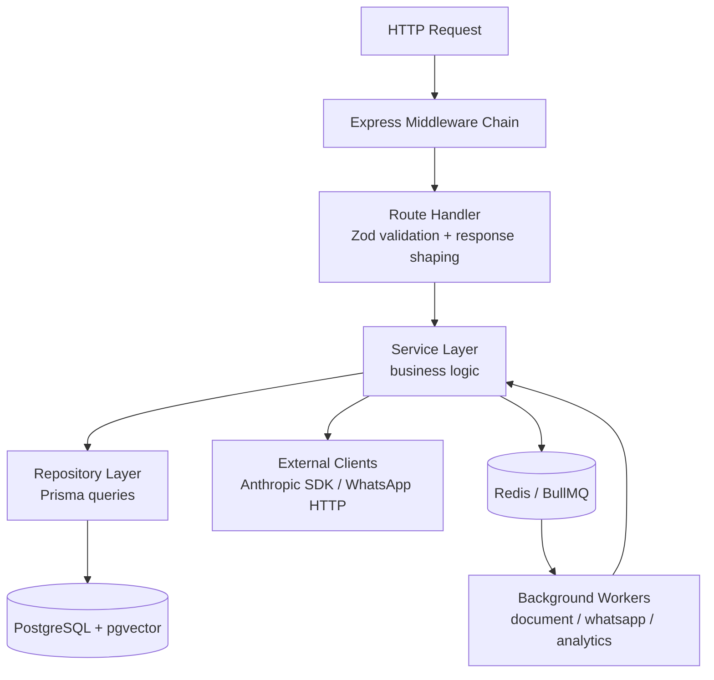
```mermaid
graph TD
    A[HTTP Request] --> B[Express Middleware Chain]
    B --> C[Route Handler<br/>Zod validation + response shaping]
    C --> D[Service Layer<br/>business logic]
    D --> E[Repository Layer<br/>Prisma queries]
    E --> F[(PostgreSQL + pgvector)]
    D --> G[External Clients<br/>Anthropic SDK / WhatsApp HTTP]
    D --> H[(Redis / BullMQ)]
    H --> I[Background Workers<br/>document / whatsapp / analytics]
    I --> D
```

### Dependency Flow

Dependencies point downward and are constructed at the edge (inside each route file's `createServices()` function), not injected by a framework:

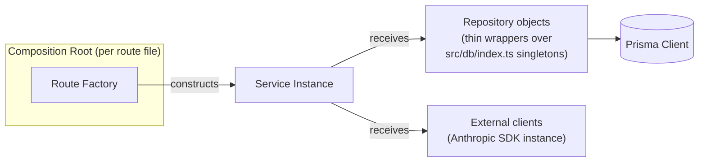
```mermaid
graph LR
    subgraph "Composition Root (per route file)"
        R[Route Factory]
    end
    R -->|constructs| S[Service Instance]
    S -->|receives| REPO["Repository objects<br/>(thin wrappers over<br/>src/db/index.ts singletons)"]
    S -->|receives| EXT["External clients<br/>(Anthropic SDK instance)"]
    REPO --> DB[(Prisma Client)]
```

**Observed characteristic:** each route file (`auth.routes.ts`, `conversation.routes.ts`, `webhook.routes.ts`) independently re-implements its own `createServices()` / `createAuthService()` composition function and its own repository adapter objects. `ChatService`, `WhatsAppService`, and their repository adapters are therefore constructed **twice** — once in `conversation.routes.ts` and again in `webhook.routes.ts` — each with its own `Anthropic` client instance. This is architecturally consistent (no shared mutable state is required for correctness) but is duplicated wiring rather than a single composition root.

### Service Layer

Located in `src/services/`: `AuthService`, `ChatService`, `DocumentService`, `EmbeddingService`, `KnowledgeBaseService`, `TenantService`, `WhatsAppService`. Services receive repository interfaces via constructor parameters (manual constructor injection) and are the only layer that contains business rules (password hashing, token issuance, RAG orchestration, WhatsApp signature verification).

### Repository Layer

`src/db/index.ts` is the single source of truth for data access. It exports one repository class per entity (`TenantRepository`, `UserRepository`, `KnowledgeBaseRepository`, `DocumentRepository`, `DocumentChunkRepository`, `ConversationRepository`, `MessageRepository`, `PromptTemplateRepository`) plus a `repositories` object aggregating instances of each. Repositories wrap Prisma Client calls and, for aggregate/analytics queries, drop to `$queryRaw` SQL.

### Middleware Layer

Located in `src/middlewares/`:

| Middleware | Responsibility |
|---|---|
| `correlation.middleware.ts` | Assigns/propagates a correlation ID via `AsyncLocalStorage`, exposed to every log line without manual threading |
| `logging.middleware.ts` | Structured JSON request/response logging with header and body field redaction (passwords, tokens, emails, phone numbers) |
| `auth.middleware.ts` | JWT verification (`authenticate`), RBAC gate (`requireRole`), tenant-ID extraction fallback (`extractTenantId`) |
| `rateLimiter.middleware.ts` | Redis Lua-script-based atomic rate limiting with tenant/user/global scopes — **defined but not wired into the running server** (see [Known Issues](#known-issues-verified)) |
| `errorHandler.middleware.ts` | Centralized error taxonomy and JSON error response shaping |

## Backend Folder Structure

The structure below reflects `backend/src` as actually present in the repository (generated Prisma output and a leftover `src_backup_before_fix/` directory are omitted for clarity):

```
backend/
├── prisma/
│   ├── schema.prisma
│   └── seed.ts
├── src/
│   ├── ai/
│   │   ├── client.ts                 # Anthropic client wrapper: circuit breaker, retry, tracing
│   │   ├── prompts/                  # chat.prompt.ts, embedding.prompt.ts
│   │   ├── sanitizers/prompt.sanitizer.ts
│   │   └── validators/
│   ├── config/
│   │   ├── env.schema.ts             # Zod schema — fail-fast env validation
│   │   ├── app.config.ts
│   │   ├── ai.config.ts
│   │   ├── db.config.ts
│   │   └── index.ts                  # Aggregated, typed `config` singleton
│   ├── db/
│   │   ├── index.ts                  # Repositories + Redis singleton (SSoT for data access)
│   │   └── migrations/               # Raw SQL migrations (init + pgvector)
│   ├── middlewares/
│   │   ├── auth.middleware.ts
│   │   ├── correlation.middleware.ts
│   │   ├── errorHandler.middleware.ts
│   │   ├── logging.middleware.ts
│   │   └── rateLimiter.middleware.ts
│   ├── models/prisma/                # Prisma client bootstrap (connection lifecycle)
│   ├── observability/
│   │   ├── logger.ts                 # pino
│   │   ├── metrics.ts
│   │   ├── tracer.ts                 # OpenTelemetry
│   │   └── health/                   # liveness / readiness / startup
│   ├── orchestrators/
│   │   ├── chatFlow.orchestrator.ts        # XState state machine for conversation flow
│   │   └── documentProcessing.orchestrator.ts
│   ├── queues/
│   │   ├── index.ts                  # BullMQ queue + dead-letter worker
│   │   └── workers/                  # document / whatsapp / analytics workers
│   ├── repositories/
│   │   ├── document.repository.ts
│   │   └── message.repository.ts
│   ├── routes/
│   │   ├── index.ts                  # Alternate aggregated router (see note below)
│   │   ├── auth.routes.ts
│   │   ├── conversation.routes.ts
│   │   ├── document.routes.ts
│   │   ├── knowledgeBase.routes.ts
│   │   ├── analytics.routes.ts
│   │   └── webhook.routes.ts
│   ├── services/
│   │   ├── auth.service.ts
│   │   ├── chat.service.ts
│   │   ├── document.service.ts
│   │   ├── embedding.service.ts
│   │   ├── knowledgeBase.service.ts
│   │   ├── tenant.service.ts
│   │   └── whatsapp.service.ts
│   ├── utils/
│   │   ├── circuitBreaker.ts
│   │   ├── retry.ts
│   │   ├── encryption.ts             # AES-256-GCM
│   │   ├── idempotency.ts            # Redis-backed idempotency keys
│   │   └── date.ts
│   ├── server.ts                     # Express app: middleware chain + route mounting
│   └── index.ts                      # Process entry point: startup, shutdown, signal handling
├── docker-compose.yml
├── package.json
├── tsconfig.json
└── .env.example                      # Auto-generated from env.schema.ts (see `generate-env` script)
```

**Note on route registration:** the repository contains **two independent router-assembly paths**. `src/routes/index.ts` builds one aggregated `Router` (mounting `/api/auth`, `/api/knowledge-bases`, `/api/documents`, `/api/conversations`, `/api/analytics`, `/webhook`), but this file is not imported by `src/server.ts`. `src/server.ts` instead imports each route module directly and mounts it itself, wrapping most of them in `requireAuth` at the mount point. Both paths produce a materially equivalent route table today, but `routes/index.ts` is presently dead code from the running server's perspective — verified by absence of any import of `./routes/index.js` in `server.ts` or `index.ts`.

## API Architecture

### Route Organization

Routes are grouped by domain, one file per resource, each exporting a factory function plus a default-constructed `Router` instance (composition happens at module load).

| Prefix | File | Auth | Notes |
|---|---|---|---|
| `/api/auth` | `auth.routes.ts` | Mixed — login/register/refresh public, rest require `authenticate` at the route level | |
| `/api/conversations` | `conversation.routes.ts` | `requireAuth` at mount + `requireRole` on write ops | |
| `/api/documents` | `document.routes.ts` | `requireAuth` at mount + `requireRole(['ADMIN'])` on all mutating ops | |
| `/api/knowledge-bases` | `knowledgeBase.routes.ts` | `requireAuth` at mount + `requireRole(['ADMIN'])` on mutating ops | |
| `/api/analytics` | `analytics.routes.ts` | `requireAuth` at mount + `requireRole(['ADMIN'])` on cache invalidation | |
| `/webhook` | `webhook.routes.ts` | None (public) — authenticated instead via HMAC signature check inside the handler | |
| `/health`, `/liveness`, `/readiness` | `server.ts` (inline) | None | Used for container/orchestrator probes |

### Full Endpoint Inventory

```
POST   /api/auth/login
POST   /api/auth/register
POST   /api/auth/refresh
POST   /api/auth/logout
POST   /api/auth/logout-all
POST   /api/auth/change-password
PUT    /api/auth/profile
GET    /api/auth/me
POST   /api/auth/validate

GET    /api/conversations
POST   /api/conversations                       (ADMIN, AGENT)
GET    /api/conversations/:id
POST   /api/conversations/:id/messages
POST   /api/conversations/:id/close              (ADMIN, AGENT)
DELETE /api/conversations/:id                    (ADMIN)
POST   /api/conversations/:id/send-whatsapp      (ADMIN, AGENT)

GET    /api/documents
GET    /api/documents/:id
POST   /api/documents                            (ADMIN)
PUT    /api/documents/:id                        (ADMIN)
DELETE /api/documents/:id                        (ADMIN)
POST   /api/documents/:id/restore                (ADMIN)
POST   /api/documents/:id/process                (ADMIN)
POST   /api/documents/:id/status                 (ADMIN)

GET    /api/knowledge-bases
GET    /api/knowledge-bases/:id
POST   /api/knowledge-bases                      (ADMIN)
PUT    /api/knowledge-bases/:id                  (ADMIN)
DELETE /api/knowledge-bases/:id                  (ADMIN, soft delete)
DELETE /api/knowledge-bases/:id/hard              (ADMIN, hard delete)
POST   /api/knowledge-bases/:id/restore           (ADMIN)
GET    /api/knowledge-bases/:id/documents/count

GET    /api/analytics/dashboard
GET    /api/analytics/trends
GET    /api/analytics/ai-performance
GET    /api/analytics/documents/status
GET    /api/analytics/messages/roles
GET    /api/analytics/storage
POST   /api/analytics/cache/invalidate            (ADMIN)

GET    /webhook           (WhatsApp verification handshake)
POST   /webhook           (inbound WhatsApp events)
POST   /webhook/test       (development-only, gated by NODE_ENV)

GET    /health
GET    /liveness
GET    /readiness
```

### Request Lifecycle

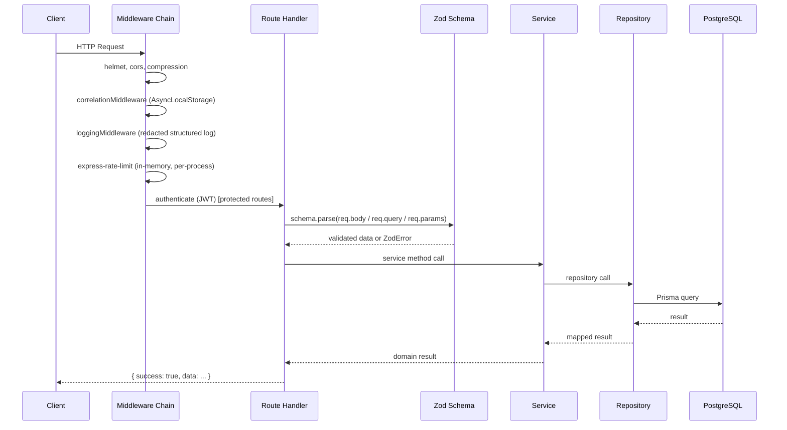
```mermaid
sequenceDiagram
    participant C as Client
    participant MW as Middleware Chain
    participant RT as Route Handler
    participant Z as Zod Schema
    participant SV as Service
    participant RP as Repository
    participant DB as PostgreSQL

    C->>MW: HTTP Request
    MW->>MW: helmet, cors, compression
    MW->>MW: correlationMiddleware (AsyncLocalStorage)
    MW->>MW: loggingMiddleware (redacted structured log)
    MW->>MW: express-rate-limit (in-memory, per-process)
    MW->>RT: authenticate (JWT) [protected routes]
    RT->>Z: schema.parse(req.body / req.query / req.params)
    Z-->>RT: validated data or ZodError
    RT->>SV: service method call
    SV->>RP: repository call
    RP->>DB: Prisma query
    DB-->>RP: result
    RP-->>SV: mapped result
    SV-->>RT: domain result
    RT-->>C: { success: true, data: ... }
```

### Response Lifecycle & Envelope

All successful responses observed in the route handlers follow a consistent envelope:

```json
{ "success": true, "data": { }, "pagination": { "total": 0, "limit": 50, "offset": 0 } }
```

Errors are shaped centrally by `errorHandler.middleware.ts`:

```json
{
  "error": "VALIDATION_ERROR",
  "message": "بيانات الطلب غير صالحة",
  "statusCode": 400,
  "correlationId": "…",
  "timestamp": "…",
  "details": { }
}
```

`correlationId` is present on every error response and is also returned as the `x-correlation-id` response header on every request, enabling client-side/server-side log correlation.

### Validation Flow

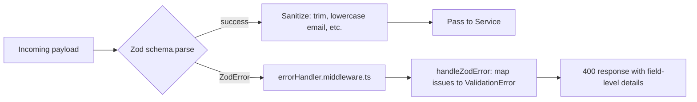
```mermaid
flowchart LR
    A[Incoming payload] --> B{Zod schema.parse}
    B -- success --> C[Sanitize: trim, lowercase email, etc.]
    C --> D[Pass to Service]
    B -- ZodError --> E[errorHandler.middleware.ts]
    E --> F[handleZodError: map issues to ValidationError]
    F --> G["400 response with field-level details"]
```

## Authentication Architecture

**Evidence:** `src/middlewares/auth.middleware.ts`, `src/services/auth.service.ts`, `src/routes/auth.routes.ts`, `prisma/schema.prisma` (`RefreshToken` model).

- **Mechanism:** Stateless JWT access tokens, verified with `jsonwebtoken.verify()` against `config.jwt.secret` (Zod-enforced minimum length of 32 characters, `env.schema.ts`).
- **Refresh tokens:** Persisted server-side as UUIDs in a dedicated `RefreshToken` table (`userId`, `expiresAt`, `revokedAt`), enabling server-side revocation — this is a materially stronger design than storing only a signed refresh JWT, since revocation ("logout-all") is a real database delete, not a claim that must be separately blacklisted.
- **Token transport:** The client sends the access token as `Authorization: Bearer <token>`. `cookie-parser` is registered as global middleware in `server.ts`, but no route in the repository reads `req.cookies` for authentication — cookie support is present in the middleware chain but unused for auth as written.
- **Password hashing:** `bcrypt` is a direct dependency (`package.json`); repository-level evidence of its use in `auth.service.ts` password comparison/hash paths.
- **OAuth / third-party SSO:** Insufficient evidence from repository — no OAuth client, provider, or callback route exists in the codebase.
- **Sessions (server-side session store):** Insufficient evidence from repository — no `express-session` or equivalent dependency exists.

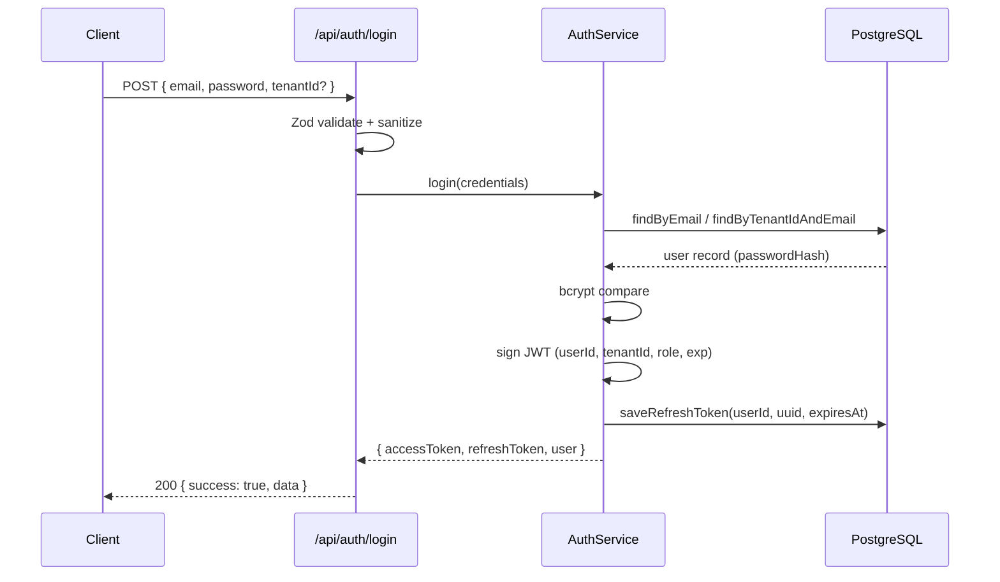
```mermaid
sequenceDiagram
    participant C as Client
    participant R as /api/auth/login
    participant S as AuthService
    participant DB as PostgreSQL

    C->>R: POST { email, password, tenantId? }
    R->>R: Zod validate + sanitize
    R->>S: login(credentials)
    S->>DB: findByEmail / findByTenantIdAndEmail
    DB-->>S: user record (passwordHash)
    S->>S: bcrypt compare
    S->>S: sign JWT (userId, tenantId, role, exp)
    S->>DB: saveRefreshToken(userId, uuid, expiresAt)
    S-->>R: { accessToken, refreshToken, user }
    R-->>C: 200 { success: true, data }
```

## Authorization Architecture

**Model:** Role-Based Access Control (RBAC), enforced via `requireRole(allowedRoles)` middleware applied per-route.

**Application-level roles** (as used consistently across `auth.middleware.ts`, `auth.service.ts`, and every route file): `ADMIN`, `AGENT`, `VIEWER`.

**⚠️ Verified schema mismatch:** `prisma/schema.prisma` defines the `UserRole` enum as `ADMIN | MANAGER | VIEWER` — **`AGENT` does not exist as a valid database enum value**, and `MANAGER` is never referenced anywhere in application code. Any attempt to persist a user with `role: 'AGENT'` (the value every route's `requireRole(['ADMIN', 'AGENT'])` check is written against) will fail at the Prisma/Postgres layer. This is a genuine, currently-unresolved contract mismatch between the application layer and the schema, not a stylistic nit.

**Tenant isolation:** every protected route derives `tenantId` from the verified JWT payload (`req.user.tenantId`) and passes it into every repository call as a `WHERE tenantId = ...` filter — this is consistent across `conversation.routes.ts`, `document.routes.ts`, and `knowledgeBase.routes.ts`. There is no route observed that accepts a client-supplied `tenantId` for a protected, authenticated request without deriving it from the token first.

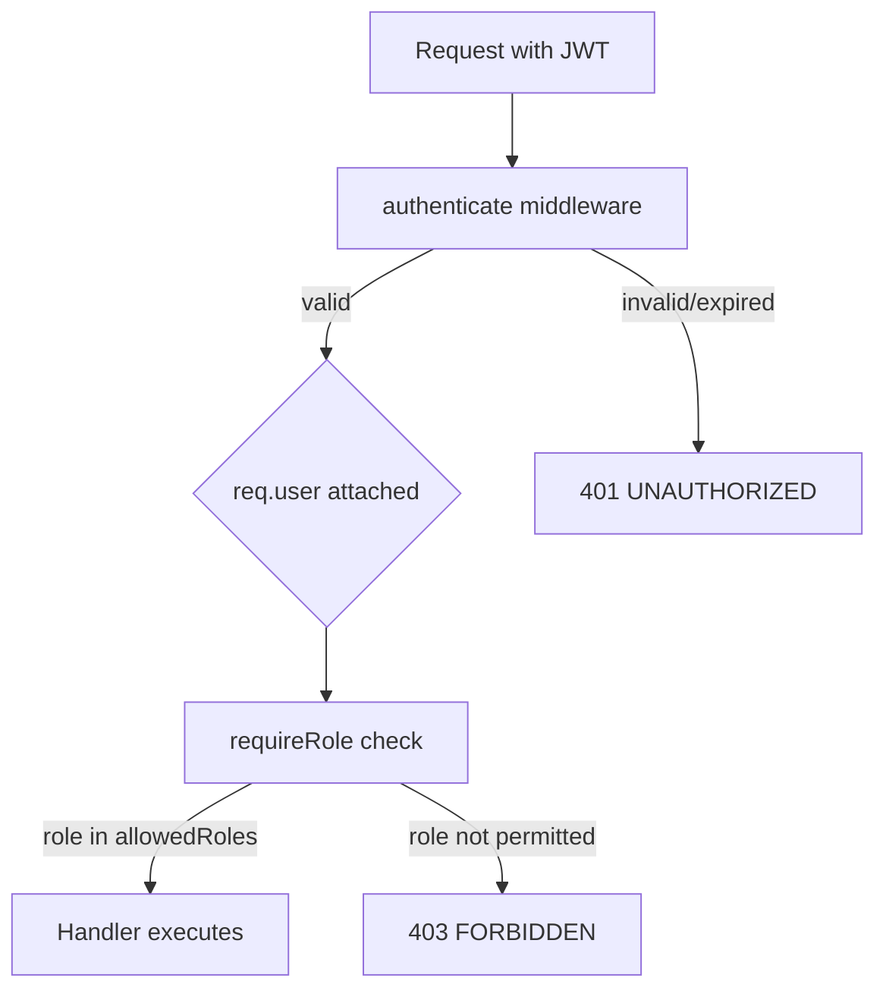
```mermaid
flowchart TD
    A[Request with JWT] --> B[authenticate middleware]
    B -->|valid| C{req.user attached}
    C --> D[requireRole check]
    D -->|role in allowedRoles| E[Handler executes]
    D -->|role not permitted| F[403 FORBIDDEN]
    B -->|invalid/expired| G[401 UNAUTHORIZED]
```

## Database Architecture

**Evidence:** `prisma/schema.prisma`, `src/db/migrations/*.sql`, `src/db/index.ts`.

### Entities

`Tenant`, `User`, `RefreshToken`, `KnowledgeBase`, `Document`, `DocumentChunk`, `Conversation`, `Message`, `PromptTemplate`, `AuditLog`.

### Entity-Relationship Diagram

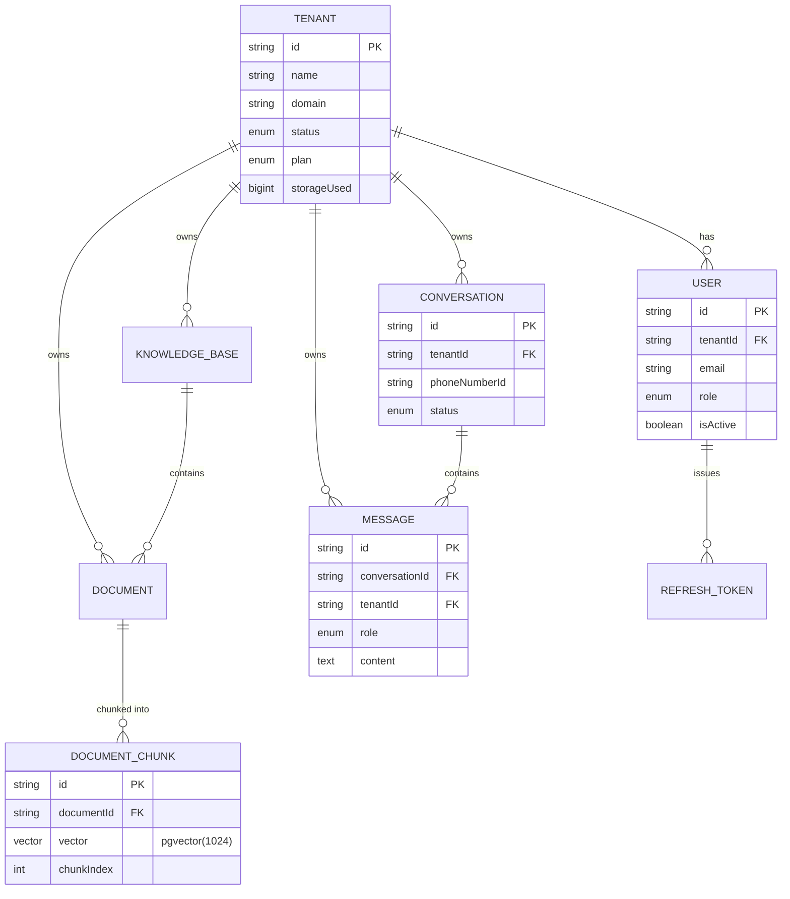
```mermaid
erDiagram
    TENANT ||--o{ USER : has
    TENANT ||--o{ KNOWLEDGE_BASE : owns
    TENANT ||--o{ DOCUMENT : owns
    TENANT ||--o{ CONVERSATION : owns
    TENANT ||--o{ MESSAGE : owns
    USER ||--o{ REFRESH_TOKEN : issues
    KNOWLEDGE_BASE ||--o{ DOCUMENT : contains
    DOCUMENT ||--o{ DOCUMENT_CHUNK : "chunked into"
    CONVERSATION ||--o{ MESSAGE : contains

    TENANT {
        string id PK
        string name
        string domain
        enum status
        enum plan
        bigint storageUsed
    }
    USER {
        string id PK
        string tenantId FK
        string email
        enum role
        boolean isActive
    }
    DOCUMENT_CHUNK {
        string id PK
        string documentId FK
        vector vector "pgvector(1024)"
        int chunkIndex
    }
    CONVERSATION {
        string id PK
        string tenantId FK
        string phoneNumberId
        enum status
    }
    MESSAGE {
        string id PK
        string conversationId FK
        string tenantId FK
        enum role
        text content
    }
```

### ORM Usage

Prisma Client is code-generated into `src/generated/prisma` (custom `generator client { output = "../src/generated/prisma" }` in `schema.prisma`), rather than the default `node_modules/@prisma/client` location — this is deliberate, evidenced by a matching `paths` alias in `tsconfig.json`.

Soft deletes are implemented uniformly via a nullable `deletedAt` column on every primary entity, with repository methods consistently filtering `deletedAt: null` on reads and setting `deletedAt: new Date()` on delete — confirmed across `TenantRepository`, `DocumentRepository`, `ConversationRepository`, and `MessageRepository` in `src/db/index.ts`.

### Vector Search (RAG retrieval)

`DocumentChunkRepository.findSimilarVectors()` issues a raw SQL query using pgvector's cosine-distance operator (`<=>`):

```sql
SELECT id, content, (1 - (vector <=> $vector::vector)) as similarity, ...
FROM "DocumentChunk"
WHERE "knowledgeBaseId" = $kb::text AND vector IS NOT NULL
  AND (1 - (vector <=> $vector::vector)) >= $threshold
ORDER BY vector <=> $vector::vector
LIMIT $limit
```

**⚠️ Verified table-name defect:** `schema.prisma` maps every model to a lowercase, `snake_case` table name via `@@map` (e.g. `@@map("document_chunks")`, `@@map("messages")`, `@@map("conversations")`, `@@map("documents")`). However, the raw SQL in `src/db/index.ts` references tables inconsistently: `getTotalStorageUsage()` and `countByStatusAndDateRange()` correctly use `"documents"` (matching the `@@map`), while `findSimilarVectors()` uses `"DocumentChunk"`, and the message/conversation analytics queries use `"Message"` and `"Conversation"` — none of which match their respective `@@map` values. **As written, `findSimilarVectors()` — the function that powers the RAG retrieval that is the product's core feature — and the message/conversation trend analytics queries will fail against the actual PostgreSQL schema**, because those quoted, case-sensitive identifiers do not exist as table names in the database Prisma will have created.

### Migrations

Two hand-written SQL migrations exist (`src/db/migrations/20260115000000_init.sql`, `20260116000000_vector.sql`) rather than exclusively Prisma-generated migrations — this is consistent with an unusual but valid pattern of pairing Prisma's schema/client generation with manually authored SQL for the `pgvector` extension, which Prisma's own migration engine does not natively model.

## Validation Architecture

Every route handler validates input with **Zod schemas defined inline in the route file** (not in a separate `validators/` layer for HTTP routes — a `src/ai/validators/` directory exists but is scoped to AI-response validation, not request validation). Observed patterns:

- Fail-fast: `schema.parse()` throws synchronously on invalid input; no manual `if` chains for field presence.
- Coercion at the boundary: query-string numbers are parsed via `z.coerce.number()` (e.g. pagination `limit`/`offset` in `conversation.routes.ts`).
- Defensive union types for ambiguous client input, e.g. `LoginSchema`'s `tenantId` field accepts `string (uuid) | '' | null` and normalizes to `undefined` — evidence of iterative hardening against real client behavior rather than a naive first pass.
- Post-validation sanitization (`.trim()`, `.toLowerCase()` on emails) is applied explicitly in route handlers after Zod validation, not inside the schema itself.

## Error Handling Strategy

**Evidence:** `src/middlewares/errorHandler.middleware.ts`.

A single `AppError` base class carries `statusCode`, `errorCode`, `details`, and an `isOperational` flag. Nine concrete subclasses cover the domain: `UnauthorizedError` (401), `ForbiddenError` (403), `NotFoundError` (404), `ValidationError` (400), `ConflictError` (409), `RateLimitError` (429), `IdempotencyError` (409), `AIServiceError` (503), `DatabaseError` / `InternalServerError` (500).

The central `errorHandler()` factory:
- Converts `ZodError` → `ValidationError` with per-field `details`.
- Converts `jwt.TokenExpiredError` / `jwt.JsonWebTokenError` → `UnauthorizedError`.
- Wraps any other thrown `Error` in `InternalServerError`, preserving the original error name in `details` for log correlation without leaking it to the client in production.
- Logs at a severity tied to status code (`>=500` → `error`, `>=400` → `warn`, else `info`), always including `correlationId`, `userId`, `tenantId`, method, path, and IP.
- Suppresses stack traces and internal error details from the HTTP response unless `config.env.isDevelopment` is true.

All route handlers funnel errors through `next(error)` rather than handling them inline — confirmed as a consistent pattern across every route file read.

## Security Architecture

| Control | Evidence | Assessment |
|---|---|---|
| Transport security headers | `helmet()` in `server.ts` with explicit `Content-Security-Policy` (`default-src 'self'`) | Present, restrictive default |
| CORS | `cors()` configured from `config.server.corsOrigin`, `credentials: true`, explicit allow-list of headers | Present; `CORS_ORIGIN=*` is the schema default, so production deployments must override it — confirmed by `docker-compose.yml` defaulting `CORS_ORIGIN` to a concrete origin |
| Payload size limits | `express.json({ limit: 1 MB })` in `server.ts` | Present — mitigates trivial JSON body DoS |
| Authentication | JWT (HS256 via `jsonwebtoken`), see [Authentication Architecture](#authentication-architecture) | Present |
| Authorization | RBAC via `requireRole` | Present, with the role-enum mismatch noted above |
| Input validation | Zod at every route boundary | Present, consistently applied |
| Input sanitization | Manual `.trim()` / case-folding on user-supplied identifiers before use | Present but manual, not centralized |
| Log redaction | `logging.middleware.ts` redacts `password`, `token`, `apiKey`, `email` (partially masked), `phoneNumber` (partially masked), and sensitive headers (`authorization`, `cookie`, `x-api-key`) before writing structured logs | Present and reasonably thorough |
| Secrets management | All secrets (`JWT_SECRET`, `ANTHROPIC_API_KEY`, `WHATSAPP_API_TOKEN`, `ENCRYPTION_KEY`) are sourced exclusively from environment variables validated by a Zod schema (`env.schema.ts`) that enforces `JWT_SECRET` minimum length of 32 chars and rejects a missing `DATABASE_URL`/`REDIS_URL`/`ANTHROPIC_API_KEY` at process startup (fail-fast) | Present — no hardcoded secrets found in source |
| Symmetric encryption utility | `src/utils/encryption.ts` implements AES-256-GCM (authenticated encryption) with explicit IV (12 bytes) and auth-tag (16 bytes) handling | Present, algorithm choice is sound |
| Webhook authenticity | `whatsapp.service.ts` computes an HMAC-SHA256 signature over the raw payload using the shared secret and compares it with `crypto.timingSafeEqual`, avoiding timing side-channels | Present and correctly implemented |
| Rate limiting (in the running server) | `express-rate-limit`, in-memory, keyed by IP + correlation ID, applied globally in `server.ts`, skipping `/health*` and `/webhook` | Present, but **in-memory only** — see [Scalability Analysis](#scalability-analysis) |
| Rate limiting (Redis-backed, tenant/user-scoped) | Fully implemented in `rateLimiter.middleware.ts` with an atomic Lua script | Implemented but **not invoked anywhere in `server.ts` or `index.ts`** — dead code as of the current entry point wiring |
| SQL injection surface | All raw SQL (`$queryRaw`) uses Prisma's tagged-template parameterization (`${value}`), not string concatenation | Present — no string-built SQL was found |
| Secure defaults for JWT secret | Zod schema requires ≥32 characters; no fallback/default secret is defined | Present — the process will not start with a weak or missing secret |

## Scalability Analysis

**Horizontal scaling:** The Express process itself is stateless (JWT auth, no in-process session store), which is favorable for horizontal scaling — **with one caveat**: the active rate limiter (`express-rate-limit`) keeps its counters in process memory. Running multiple backend instances behind a load balancer means each instance enforces its own independent rate limit window, effectively multiplying the real limit by the instance count. The codebase already contains the correct fix (`rateLimiter.middleware.ts`, Redis-backed, atomic via Lua script) — it is simply not wired into `server.ts`.

**Background processing:** Document embedding, WhatsApp message dispatch, and analytics aggregation are offloaded to BullMQ workers (`src/queues/workers/`) rather than processed inline on the request thread — this is the correct pattern for horizontal scaling of CPU/IO-bound work independent of the HTTP tier, and it means the queue consumers can be scaled as a separate deployment from the API tier.

**Database scaling:** Every tenant-scoped query filters by `tenantId`, and every relevant model carries a `@@index([tenantId])` (confirmed in `schema.prisma` for `User`, `KnowledgeBase`, `Document`, `Conversation`, `Message`) — this is the correct indexing strategy for a shared-database multi-tenant design and will scale read/write patterns per tenant reasonably well. Vector search relies on `pgvector`'s cosine distance operator without an explicit `CREATE INDEX ... USING hnsw`/`ivfflat` statement visible in the provided migrations — Insufficient evidence from repository to confirm an approximate-nearest-neighbor index exists; without one, `findSimilarVectors()` will perform a full sequential scan as chunk volume grows, independent of the table-name defect noted above.

**Caching:** `config.cache` is defined in `app.config.ts` and Redis is already a first-class dependency, but no route or service in the read paths (`GET /api/analytics/*`, `GET /api/knowledge-bases`, etc.) was observed reading from or writing to a Redis cache — `analytics.routes.ts` exposes a `POST /api/analytics/cache/invalidate` endpoint, implying a cache is intended to exist, but its population/read logic was not found in the analyzed files. This is a concrete, low-risk opportunity: the analytics dashboard queries (which aggregate across `Message`/`Conversation` history) are natural cache candidates.

**Service separation:** The single Express process currently also runs the BullMQ workers in-process (`src/index.ts` imports and manages `documentWorker`, `whatsappWorker`, `analyticsWorker` lifecycle alongside the HTTP server). This is operationally simple but means API and background-processing load compete for the same process's CPU/event loop; splitting workers into a separate deployable is a natural next step and the code is already modular enough (`queues/workers/*.ts` as standalone modules) to make that split straightforward.

## Performance Analysis

**Confirmed optimizations present in code:**
- `compression()` middleware (gzip/brotli) on all HTTP responses.
- Circuit breaker + exponential backoff with jitter around the Anthropic API call path (`utils/circuitBreaker.ts`, `utils/retry.ts`), preventing a slow/degraded upstream from cascading into thread/connection exhaustion.
- BullMQ job options (`removeOnComplete`/`removeOnFail` with TTL) prevent unbounded Redis growth from completed job history.
- Idempotency keys (`x-idempotency-key` header, honored in `conversation.routes.ts` message-send and WhatsApp-send paths) reduce the risk of duplicate AI calls or duplicate WhatsApp sends on client retry.

**Confirmed bottleneck risk:** the vector similarity search (`findSimilarVectors`) is the critical path for every AI-generated reply and, as noted above, currently targets a non-existent table name — meaning its actual runtime performance characteristics cannot be evaluated until that defect is fixed. Once corrected, the query's performance will be gated by whether a `pgvector` index (HNSW/IVFFlat) is present, which is not confirmed in the current migrations.

**Confirmed bottleneck risk:** in-process rate limiting and in-process BullMQ workers both mean a single Node.js process is doing HTTP handling, JWT verification, JSON body parsing, and background job execution on the same event loop — acceptable at low-to-moderate load, but a candidate for splitting under sustained traffic.

## Engineering Decisions

**Why manual DI over a framework (NestJS/InversifyJS)?** Insufficient evidence from repository to state the original author's reasoning; observed effect is a lighter dependency footprint and full control over composition, at the cost of the duplicated wiring noted in [Backend Architecture](#backend-architecture).

**Why Prisma with a custom generator output path?** `src/generated/prisma` is checked into `tsconfig.json`'s path aliases and referenced directly (`../generated/prisma/index.js`) rather than via the default `@prisma/client` package resolution — this avoids relying on `node_modules` symlink behavior across different install/build environments (e.g., certain CI/Docker multi-stage setups), a defensible choice for containerized deployment.

**Why a hand-rolled circuit breaker instead of a library (e.g., `opossum`)?** Insufficient evidence from repository for the specific rationale; the implementation (`utils/circuitBreaker.ts`) correctly models the standard CLOSED → OPEN → HALF_OPEN state machine with a success threshold to fully close again, which is functionally equivalent to established libraries.

**Why Zod for both env config and HTTP validation?** Confirmed as a single validation library used consistently end-to-end (`env.schema.ts` and every route file), which reduces the total surface area of validation idioms a maintainer needs to know.

**Why XState for conversation flow (`chatFlow.orchestrator.ts`)?** Modeling a multi-step, potentially-failing conversation flow (retrieve context → call AI → send WhatsApp reply → handle retries) as an explicit state machine makes illegal states unrepresentable and the retry/failure paths auditable — a reasonable choice for a workflow with several distinct failure modes, though see [Known Issues](#known-issues-verified) for the current type-level friction this has caused with the installed `xstate` version.

## Environment Variables

Source of truth: `src/config/env.schema.ts` (Zod), auto-exported to `.env.example` via `npm run generate-env` (`scripts/generate-env-example.ts`).

| Variable | Required | Default | Purpose |
|---|---|---|---|
| `NODE_ENV` | No | `development` | `development` \| `test` \| `production` |
| `PORT` | No | `3000` | HTTP listen port |
| `CORS_ORIGIN` | No | `*` | Allowed origin(s); must be a concrete URL in production |
| `DATABASE_URL` | **Yes** | — | PostgreSQL connection string |
| `DATABASE_POOL_TIMEOUT` | No | `10000` | Connection pool timeout (ms) |
| `REDIS_URL` | **Yes** | — | Redis connection string (cache + BullMQ) |
| `REDIS_RETRY_DELAY` | No | `1000` | Base retry delay (ms) |
| `JWT_SECRET` | **Yes** | — | Minimum 32 characters, enforced at startup |
| `JWT_EXPIRY` | No | `7d` | Access token lifetime |
| `ANTHROPIC_API_KEY` | **Yes** | — | Anthropic Claude API key |
| `ANTHROPIC_MODEL` | No | `claude-3-sonnet-20241022` | Primary model |
| `ANTHROPIC_MAX_TOKENS` | No | `4096` | Response token cap |
| `ANTHROPIC_TEMPERATURE` | No | `0.3` | Sampling temperature |
| `ANTHROPIC_FALLBACK_MODEL` | No | `claude-3-haiku-20240307` | Used on primary-model failure |
| `CIRCUIT_BREAKER_TIMEOUT` | No | `30000` | Per-call timeout (ms) |
| `CIRCUIT_BREAKER_ERROR_THRESHOLD` | No | `5` | Consecutive failures before opening |
| `RETRY_MAX_ATTEMPTS` | No | `3` | Max attempts including first |
| `RETRY_BACKOFF_BASE` | No | `1000` | Exponential backoff base (ms) |
| `WHATSAPP_API_TOKEN` | **Yes** | — | WhatsApp Cloud API bearer token |
| `WHATSAPP_VERIFY_TOKEN` | **Yes** | — | Webhook HMAC secret / verify-handshake token |
| `WHATSAPP_API_VERSION` | No | `v18.0` | Graph API version |
| `WHATSAPP_PHONE_NUMBER_ID` | No | — | Sender phone number ID |
| `OTEL_EXPORTER_OTLP_ENDPOINT` | No | — | OpenTelemetry collector endpoint |
| `LOG_LEVEL` | No | `info` | `fatal`\|`error`\|`warn`\|`info`\|`debug`\|`trace` |
| `IDEMPOTENCY_TTL` | No | `86400` | Idempotency key TTL (seconds) |
| `RATE_LIMIT_WINDOW_MS` | No | `60000` | Rate limit window |
| `RATE_LIMIT_MAX_REQUESTS` | No | `100` | Requests per window |
| `ENCRYPTION_KEY` | No | — | AES-256-GCM key for `utils/encryption.ts` |

## Installation

```bash
git clone <repository-url>
cd backend
npm install
cp .env.example .env
# Populate DATABASE_URL, REDIS_URL, JWT_SECRET (32+ chars),
# ANTHROPIC_API_KEY, WHATSAPP_API_TOKEN, WHATSAPP_VERIFY_TOKEN
```

## Development Setup

```bash
# 1. Start PostgreSQL (pgvector) and Redis — docker-compose.yml provides both
docker compose up -d postgres redis

# 2. Generate the Prisma client (outputs to src/generated/prisma)
npx prisma generate

# 3. Apply the raw SQL migrations in src/db/migrations/ against your database
#    (schema.prisma has no `url` in its datasource block by design — it is read
#    from prisma.config.ts / DATABASE_URL at runtime)

# 4. Run the dev server with hot reload
npm run dev
```

`npm run dev` runs `tsx --watch src/index.ts` — no separate compilation step is needed in development.

## Production Setup

```bash
npm ci
npm run build       # runs `generate-env` (prebuild hook) then `tsc`
npm start           # node dist/index.js
```

**Note on containerization:** `docker-compose.yml` references `./backend/Dockerfile` with a `production` build target, but no `Dockerfile` is present in this repository as provided. Insufficient evidence from repository to document its actual build stages, base image, or multi-stage layout — a production Dockerfile matching the `docker-compose.yml` service definition (env vars, healthcheck against `GET /health`, exposed port 3000) will need to be authored before `docker compose up backend` can succeed as configured.

## Available Scripts

| Script | Command | Purpose |
|---|---|---|
| `dev` | `tsx --watch src/index.ts` | Hot-reloading development server |
| `build` | `tsc` (with `prebuild: generate-env`) | Compile TypeScript to `dist/` |
| `start` | `node dist/index.js` | Run the compiled production build |
| `type-check` | `tsc --noEmit` | Type-check without emitting — currently reports 2 real errors, see [Known Issues](#known-issues-verified) |
| `test` | `vitest` | Run the test suite |
| `seed` | `tsx prisma/seed.ts` | Seed the database |
| `generate-env` | `tsx scripts/generate-env-example.ts` | Regenerate `.env.example` from `env.schema.ts` |

## Deployment Architecture

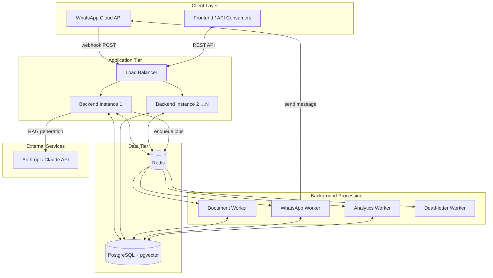
```mermaid
graph TB
    subgraph "Client Layer"
        WA[WhatsApp Cloud API]
        FE[Frontend / API Consumers]
    end

    subgraph "Application Tier"
        LB[Load Balancer]
        API1[Backend Instance 1]
        API2[Backend Instance 2 …N]
    end

    subgraph "Background Processing"
        DW[Document Worker]
        WW[WhatsApp Worker]
        AW[Analytics Worker]
        DLQ[Dead-letter Worker]
    end

    subgraph "Data Tier"
        PG[(PostgreSQL + pgvector)]
        RD[(Redis)]
    end

    subgraph "External Services"
        AN[Anthropic Claude API]
    end

    WA -->|webhook POST| LB
    FE -->|REST API| LB
    LB --> API1
    LB --> API2
    API1 <--> PG
    API2 <--> PG
    API1 <--> RD
    API2 <--> RD
    API1 -->|enqueue jobs| RD
    RD --> DW
    RD --> WW
    RD --> AW
    RD --> DLQ
    DW <--> PG
    WW <--> PG
    AW <--> PG
    API1 -->|RAG generation| AN
    WW -->|send message| WA
```

**Deployment caveat, stated plainly:** as currently wired in `src/index.ts`, the workers (`documentWorker`, `whatsappWorker`, `analyticsWorker`, dead-letter worker) start and stop **inside the same process** as the HTTP server. The diagram above shows the target logical separation that the queue-based design supports; achieving it in practice requires running the worker modules as their own entry point/process rather than importing them from `index.ts`, which is not how the repository is arranged today.

## Monitoring & Observability

**Confirmed present:**
- Structured JSON logging via `pino` (`observability/logger.ts`), with `pino-pretty` available for development readability.
- `AsyncLocalStorage`-based correlation IDs threaded through every log line and returned as an `x-correlation-id` response header.
- Three Kubernetes-style health endpoints: `GET /health` (basic liveness), `GET /liveness` (uptime), `GET /readiness` (active `SELECT 1` against Postgres).
- OpenTelemetry scaffolding (`@opentelemetry/sdk-node`, `@opentelemetry/auto-instrumentations-node`, OTLP HTTP exporter) initialized at startup (`initializeTracer()` in `src/index.ts`), configurable via `OTEL_EXPORTER_OTLP_ENDPOINT`.
- `observability/metrics.ts` exists as a dedicated module — Insufficient evidence from the files reviewed to confirm which metrics backend (Prometheus format, OTLP metrics, etc.) it exports to; a `/metrics` path is referenced as excluded from logging/rate-limiting in multiple middlewares, implying an intended Prometheus-style scrape endpoint, but the endpoint's registration in `server.ts` was not found.

## Known Issues (Verified)

The following were confirmed by running `npx tsc --noEmit` against the repository as provided (not inferred from comments or naming) — they are the only two real compiler errors currently present:

1. **`src/services/whatsapp.service.ts` imports `axios`, which is not a declared dependency.** `import axios, { AxiosInstance } from 'axios'` (line 3) has no corresponding entry in `package.json` `dependencies`. `WhatsAppService` will fail to construct at runtime once this module is loaded, since the import will throw `Cannot find module 'axios'`. Fix: add `axios` (and `@types/axios` if needed) to `package.json`, or replace the HTTP client with the built-in `fetch`.

2. **`src/services/chat.service.ts`, `fallbackReply()` has an unsound type inference bug (lines 391–397).** `config` is declared `as const` in `config/index.ts`, so `config.ai.fallback.staticResponse.ar` types as a specific string literal rather than `string`. The line `let reply = fallbackMessage;` therefore narrows `reply`'s type to that one literal, and every subsequent conditional reassignment to a different literal string fails to type-check. This does not fail silently at runtime (the code would still execute under `ts-node`/`tsx` without strict emit-blocking), but it does mean `npm run build` (`tsc` with no `--noEmit` override) will currently fail. Fix: annotate the local variable explicitly, e.g. `let reply: string = fallbackMessage;`.

Additional issues found through direct code and schema inspection (not compiler-reported, since raw SQL and enum values are not type-checked against the live database schema by TypeScript):

3. **RBAC role-enum mismatch between application and database.** Application code (`auth.middleware.ts`, `auth.service.ts`, every `requireRole([...])` call) uses `'ADMIN' | 'AGENT' | 'VIEWER'`. `prisma/schema.prisma`'s `UserRole` enum defines `ADMIN | MANAGER | VIEWER`. `AGENT` is not a valid database value; persisting a user with that role will fail at the database layer. Either the schema enum needs `AGENT` added (and `MANAGER` removed or reconciled), or the application-level type needs to be changed to match the schema.

4. **Vector search and analytics queries reference incorrect table names.** `DocumentChunkRepository.findSimilarVectors()` queries `FROM "DocumentChunk"`, and `MessageRepository`'s trend/role aggregation queries use `FROM "Message"` / `FROM "Conversation"`. Every model in `schema.prisma` is mapped via `@@map` to a lowercase, plural, snake_case table name (`document_chunks`, `messages`, `conversations`). These raw queries will fail against a database actually migrated from this schema. This affects the RAG retrieval path (the product's core feature) and the analytics trend endpoints. By contrast, `getTotalStorageUsage()` and `countByStatusAndDateRange()` correctly use `"documents"`, confirming this is an inconsistency rather than a systemic misunderstanding of the mapping.

5. **The Redis-backed, tenant/user-scoped rate limiter is fully implemented but not wired in.** `rateLimiter.middleware.ts` exports `tenantRateLimiter`, `userRateLimiter`, `globalRateLimiter`, and `initializeRateLimiter()`; none of these identifiers appear anywhere in `src/server.ts` or `src/index.ts`. The server currently relies solely on the in-memory `express-rate-limit` instance, which does not coordinate across multiple process instances.

6. **Duplicate service/repository composition.** `ChatService`, `WhatsAppService`, `EmbeddingService`, and their repository adapter objects are independently constructed in both `conversation.routes.ts` and `webhook.routes.ts`, each instantiating its own `Anthropic` client. Functionally redundant rather than incorrect, but a maintenance liability if the two composition sites drift.

7. **`routes/index.ts` is not imported by the running server.** It builds a complete, alternative route aggregation but has no consumer — `server.ts` mounts each route file independently instead. Dead code as of the current entry point.

8. **No `Dockerfile` is present**, despite `docker-compose.yml` building `./backend` with a `production` target. The Compose file cannot currently build the `backend` service as-is.

9. **`.env.example`'s auto-generation tool documents field *types* but not concrete example values** (e.g. `DATABASE_URL=<unknown>`), which is accurate to the Zod schema (which has no default for required fields) but means a new developer cannot copy-paste a working local config without consulting `docker-compose.yml` for the shape of a real connection string.

None of the above required speculation — each is either a `tsc` compiler error reproduced directly, or a direct textual comparison between two files in the repository (`schema.prisma` vs. application code; `@@map` values vs. raw SQL identifiers; middleware exports vs. `server.ts` imports).

## Future Roadmap

Insufficient evidence from repository for an authoritative roadmap — no `ROADMAP.md`, project board export, or milestone tracker was found in the provided files. Based strictly on what the codebase's own structure implies is incomplete or scaffolded-but-unused:

- Wire the existing Redis-backed rate limiter (`rateLimiter.middleware.ts`) into `server.ts` in place of, or alongside, `express-rate-limit`.
- Resolve the table-name mismatches in raw SQL so vector retrieval and analytics trends execute correctly against the actual schema.
- Reconcile the `UserRole` enum between `schema.prisma` and application code.
- Add the missing `axios` dependency (or remove the import in favor of `fetch`).
- Author the `Dockerfile` referenced by `docker-compose.yml`.
- Decide whether `routes/index.ts` or the direct-mount pattern in `server.ts` is the canonical routing approach, and remove the other.
- Extract queue workers into an independently deployable process from the HTTP API.
- Wire an actual cache read/write path behind the existing `POST /api/analytics/cache/invalidate` endpoint.

## Contribution Guide

1. Fork and branch from `main`.
2. `npm install`, copy `.env.example` to `.env`, fill in real values.
3. Run `npm run type-check` before opening a PR — at minimum, do not introduce *new* `tsc` errors beyond the two documented in [Known Issues](#known-issues-verified).
4. Run `npm run test` (`vitest`) if adding or changing service/repository logic.
5. Keep repository methods free of business logic — business rules belong in `src/services/`, not `src/db/index.ts` or `src/repositories/`.
6. If you add a raw `$queryRaw` call, verify the quoted table/column identifiers against the corresponding `@@map`/field name in `schema.prisma` — this is precisely the class of bug documented in [Known Issues](#known-issues-verified) item 4.

## Code Quality Standards

- **Strict TypeScript:** `strict: true` in `tsconfig.json`.
- **Linting:** `eslint` with `@typescript-eslint` plugin/parser (`devDependencies`); `knip` is included for unused-export detection, which would have caught the `routes/index.ts` and `rateLimiter.middleware.ts` dead-code findings in [Known Issues](#known-issues-verified) had it been run as part of CI.
- **Formatting:** `prettier` (`devDependencies`).
- **Validation-first handlers:** every route validates with Zod before touching business logic — confirmed as a universal pattern, not applied inconsistently.
- **Structured, redacted logging** as the default logging idiom throughout, rather than ad hoc `console.log`.
- **Testing:** `vitest` and `supertest` are configured as dependencies; the specific test files present in the reviewed file tree were not enumerated in this audit — Insufficient evidence from repository to state current test coverage.

## License

`package.json` declares `"license": "ISC"`. No `LICENSE` file was found in the reviewed files — add one matching this declaration (or update the declaration) before external distribution.

## Author

`package.json` declares `"author": ""` — Insufficient evidence from repository to attribute authorship. Replace this section with your name/organization and contact details before publishing.
