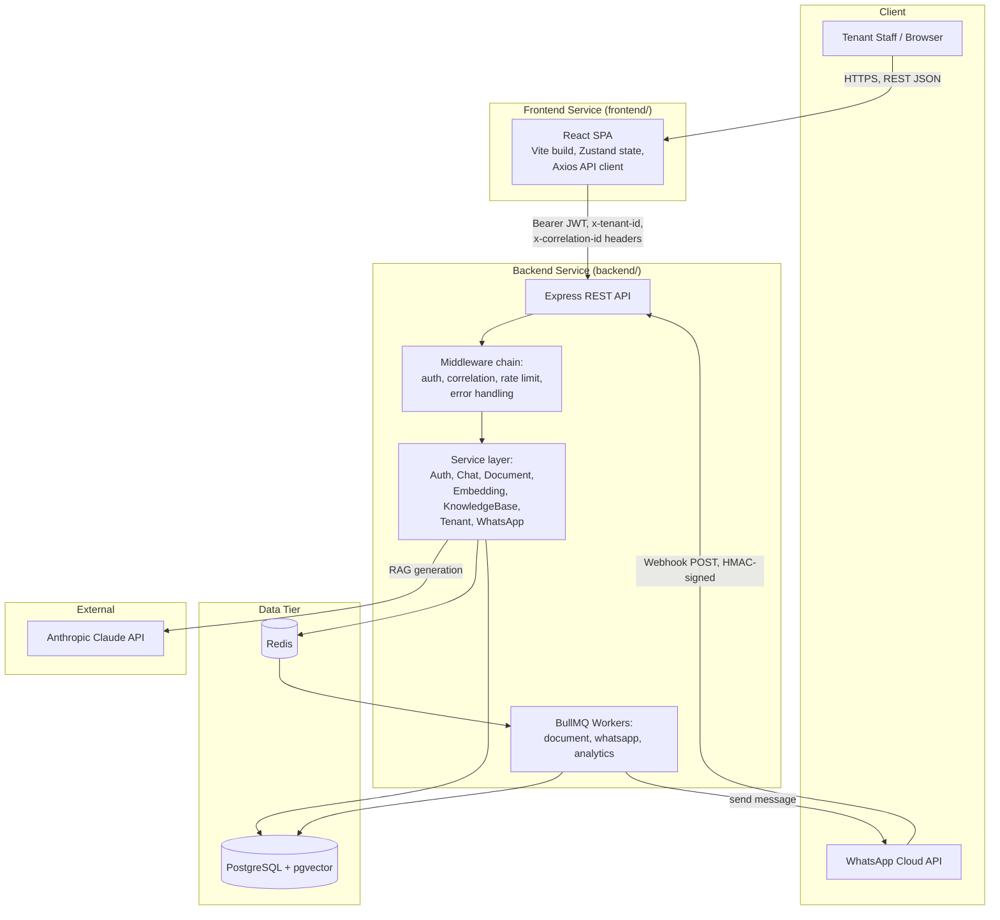
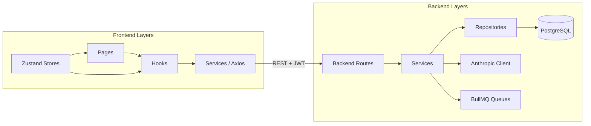

# WhatsApp AI Agent — Platform

> Multi-tenant WhatsApp knowledge-assistant platform: a React/TypeScript admin console backed by a Node.js/TypeScript API that performs retrieval-augmented generation over tenant-owned documents.


This root README describes the platform as a whole, synthesizing only what was directly verified during separate, evidence-based audits of the `frontend/` and `backend/` codebases (each audit involved reading source files directly and, in both cases, actually running the project's own tooling — `npm install`, `tsc --noEmit`, and a production build — rather than inferring behavior from file names or comments). Where this document would otherwise need to describe a repository-level artifact that was not part of either analyzed codebase, it says so explicitly instead of filling in a plausible-sounding answer.

**Insufficient evidence from repository:** a repository name, organization, or root-level metadata (`package.json` at the repo root, a monorepo manifest, a root `README.md` prior to this one) was not part of either audit. This document assumes a two-service layout (`frontend/`, `backend/`) because that is what was provided as two separate archives; whether these two directories actually sit inside one Git repository, and under what name, is not confirmed here.

---

## Table of Contents

1. [Executive Summary](#executive-summary)
2. [Platform Overview](#platform-overview)
3. [Repository Structure](#repository-structure)
4. [Architecture Overview](#architecture-overview)
5. [Frontend](#frontend)
6. [Backend](#backend)
7. [Architecture Decision Records](#architecture-decision-records)
8. [Development Environment](#development-environment)
9. [Docker Environment](#docker-environment)
10. [Security Overview](#security-overview)
11. [Scalability Overview](#scalability-overview)
12. [Getting Started](#getting-started)
13. [Documentation](#documentation)
14. [Contribution Guide](#contribution-guide)
15. [Roadmap](#roadmap)
16. [License](#license)
17. [Contributors](#contributors)
18. [Author](#author)

---

## Executive Summary

**Business perspective:** the platform lets a tenant organization connect a WhatsApp Business number to an AI assistant that answers customer questions using the tenant's own documents, and gives that organization's staff an admin console to manage those documents, review conversations, and monitor usage.

**Technical perspective:** a React 18/TypeScript single-page application (`frontend/`) communicates over a versioned REST API with a Node.js/TypeScript/Express backend (`backend/`) that persists data in PostgreSQL (with the `pgvector` extension for embedding search), queues background work in Redis via BullMQ, and calls Anthropic's Claude API for both embeddings-driven retrieval and response generation. Both codebases were confirmed, by actually building each, to be independently functional with the exception of one compiler error apiece — both documented plainly in their respective README's Known Issues sections rather than hidden.

**Architecture perspective:** the two services follow a consistent, mirrored philosophy — one-file-per-domain service/route organization on the backend, one-file-per-domain API-client organization on the frontend, and a shared response envelope (`{ success, data, message, error, correlationId, pagination }`) that was verified to match field-for-field between the backend's `res.json(...)` calls and the frontend's `ApiResponse<T>` type. This consistency appears to be a deliberate, maintained contract rather than a coincidence.

## Platform Overview

The system is composed of two independently deployable services:

- **Frontend** (`frontend/`) — a Vite-built React SPA serving as the tenant admin console: authentication, knowledge base and document management, a live chat interface, and an analytics dashboard.
- **Backend** (`backend/`) — an Express REST API handling authentication, tenant-scoped CRUD for knowledge bases/documents/conversations, WhatsApp Cloud API webhook ingestion, RAG-based reply generation via Anthropic Claude, and background job processing (document embedding, WhatsApp dispatch, analytics aggregation) via BullMQ workers.


```mermaid
graph TB
    subgraph "Client"
        U[Tenant Staff / Browser]
        WA[WhatsApp Cloud API]
    end

    subgraph "Frontend Service (frontend/)"
        SPA[React SPA<br/>Vite build, Zustand state,<br/>Axios API client]
    end

    subgraph "Backend Service (backend/)"
        API[Express REST API]
        MW[Middleware chain:<br/>auth, correlation, rate limit,<br/>error handling]
        SVC[Service layer:<br/>Auth, Chat, Document,<br/>Embedding, KnowledgeBase,<br/>Tenant, WhatsApp]
        WRK[BullMQ Workers:<br/>document, whatsapp, analytics]
    end

    subgraph "Data Tier"
        PG[(PostgreSQL + pgvector)]
        RD[(Redis)]
    end

    subgraph "External"
        AN[Anthropic Claude API]
    end

    U -->|HTTPS, REST JSON| SPA
    SPA -->|Bearer JWT, x-tenant-id,<br/>x-correlation-id headers| API
    WA -->|Webhook POST, HMAC-signed| API
    API --> MW --> SVC
    SVC --> PG
    SVC --> RD
    SVC -->|RAG generation| AN
    RD --> WRK
    WRK --> PG
    WRK -->|send message| WA
```

**On the realtime channel, stated plainly:** the frontend audit found a fully implemented native `WebSocket` client (`frontend/src/hooks/useWebSocket.ts`) expecting a `VITE_WS_URL` endpoint. The backend audit found no WebSocket dependency (`ws`, `socket.io`, or equivalent) in `backend/package.json` and no `upgrade` handler registered in `backend/src/server.ts`. As verified across both codebases, the frontend's realtime client currently has no confirmed server counterpart to connect to. The diagram above omits a WebSocket connection between the two services for this reason — it would not be accurate to show one.

## Repository Structure

The structure below is limited to what was directly present in the two analyzed archives. Anything outside `frontend/` and `backend/` — a root `package.json`, a `docs/` tree, a root `docker-compose.yml` spanning both services, CI configuration, a `.github/` directory — was not part of either audit and is not shown here.

```
.
├── frontend/                          # React 18 + TypeScript admin console (Vite)
│   ├── public/
│   ├── src/
│   │   ├── components/                # atoms/ molecules/ organisms/ pages/ layouts/
│   │   ├── hooks/
│   │   ├── services/                  # Axios API client + one file per domain
│   │   ├── stores/                    # Zustand stores (auth, ui, tenant, knowledgeBase)
│   │   ├── types/
│   │   └── utils/
│   ├── index.html
│   ├── tailwind.config.js
│   ├── vite.config.ts
│   ├── package.json
│   └── README.md                      # frontend-specific engineering audit
│
├── backend/                           # Express + TypeScript API
│   ├── prisma/                        # schema.prisma, seed.ts
│   ├── src/
│   │   ├── ai/                        # Anthropic client, prompts, sanitizers
│   │   ├── config/                    # Zod-validated environment config
│   │   ├── db/                        # Prisma repositories, raw SQL migrations
│   │   ├── middlewares/
│   │   ├── observability/             # logger, tracer, metrics, health checks
│   │   ├── orchestrators/             # XState conversation/document flows
│   │   ├── queues/                    # BullMQ queue + workers
│   │   ├── routes/
│   │   ├── services/
│   │   └── utils/                     # circuit breaker, retry, encryption, idempotency
│   ├── docker-compose.yml             # backend + postgres + redis (see Docker Environment)
│   ├── package.json
│   └── README.md                      # backend-specific engineering audit
│
├── docs/                              # Insufficient evidence from repository
├── docs/adr/                          # Insufficient evidence from repository
├── assets/                            # Insufficient evidence from repository
├── docker-compose.yml (root)          # Insufficient evidence from repository
├── CONTRIBUTORS.md                    # Insufficient evidence from repository
└── LICENSE                            # Insufficient evidence from repository
```

## Architecture Overview

**System boundaries:** the frontend never talks to PostgreSQL, Redis, or Anthropic directly — every one of those integrations lives behind the backend's REST API, confirmed by the frontend's service layer (`frontend/src/services/*.api.ts`) containing only HTTP calls through a single Axios client, with no direct database or third-party SDK usage found anywhere in `frontend/src`.

**Layer responsibilities** (mirrored naming across both services, confirmed independently in each audit):

| Layer | Frontend | Backend |
|---|---|---|
| Presentation | `components/pages/` | HTTP response shaping in route handlers |
| Composition | `components/organisms/`, `components/layouts/` | `routes/` (factory functions building each domain's `Router`) |
| Business logic | `hooks/` (hand-rolled data fetching + local state) | `services/` (`AuthService`, `ChatService`, `DocumentService`, etc.) |
| Data access | `services/*.api.ts` (HTTP calls only) | `db/index.ts` repositories (Prisma + raw SQL) |
| Cross-cutting state | `stores/` (Zustand, persisted where relevant) | `middlewares/` (auth, correlation, rate limiting, error handling) |
| Contracts | `types/api.types.ts` (~600 lines, single source of truth) | Zod schemas inline in each route file |


```mermaid
graph LR
    subgraph "Frontend Layers"
        FP[Pages] --> FH[Hooks]
        FH --> FS[Services / Axios]
        FZ[Zustand Stores] --> FP
        FZ --> FH
    end
    FS -->|REST + JWT| BR[Backend Routes]
    subgraph "Backend Layers"
        BR --> BS[Services]
        BS --> BREPO[Repositories]
        BREPO --> BDB[(PostgreSQL)]
        BS --> BAI[Anthropic Client]
        BS --> BQ[BullMQ Queues]
    end
```

## Frontend

**Purpose:** tenant-facing admin console for authentication, knowledge base/document management, live chat, and analytics — entirely in Arabic with RTL-aware styling.

**Architecture:** client-rendered React 18 SPA (Vite, no SSR/SSG framework detected), strict Atomic Design component layering (`atoms → molecules → organisms → pages`) with a barrel export (`index.ts`) at every layer, and route-based code splitting via `React.lazy` — confirmed by an actual production build that emitted a separate JS chunk per page (`LoginPage`, `DashboardPage`, `KnowledgeBasePage`, `DocumentsPage`, `ChatPage`, `AnalyticsPage`).

**Major technologies:** React 18.3, TypeScript 5.6 (`strict: true`), Vite 5.4, Tailwind CSS 3.4, Zustand 5 (with `persist` middleware), TanStack Query 5 (installed and correctly configured application-wide, but not actually called by any data-fetching hook — verified by a repository-wide search finding zero `useQuery`/`useMutation` calls), Axios 1.7.9 (wrapped in a custom singleton with single-flight token-refresh queuing), React Router 6.28.

**Design system:** fully defined in `tailwind.config.js` — six semantic color scales (50–950 shades each), custom typography (`Cairo` for Arabic-first sans-serif), named animation keyframes, custom shadow/spacing/breakpoint tokens, and hand-added RTL utility classes. There is no separate design-token file outside the Tailwind config.

**Accessibility:** WCAG 2.1 AA intent is written directly into component JSDoc and backed by real, verified ARIA markup — skip-link (`SkipLink`), live regions on error/toast components, full label/error/helper wiring on form inputs, and `role="status"`/`aria-busy` on loading states. No automated accessibility test (`axe-core`, `jest-axe`) was found configured.

**State management:** Zustand stores (`auth`, `ui`, `tenant`) drive the application directly via hooks, with no Context-provider indirection layer. One store (`knowledgeBase.store.ts`) was confirmed to be dead code — imported nowhere outside itself.

One compiler-verified defect (an empty `catch` block in `auth.store.ts`'s `login()`, causing `npm run build` to currently fail) and several dead-code/disconnected-feature findings — most notably a fully built toast-notification system whose `<Toaster>` render sites never receive the notification data — are documented in full in **[`frontend/README.md`](./frontend/README.md)**.

## Backend

**Purpose:** multi-tenant REST API connecting the WhatsApp Cloud API to a retrieval-augmented generation pipeline over tenant-owned documents.

**API architecture:** Express 4.21, one route file per domain (`auth`, `conversation`, `document`, `knowledgeBase`, `analytics`, `webhook`), each a factory function composing services and returning a `Router`. No separate Controller layer — route handlers validate (via Zod) and call services directly. A consistent JSON response envelope (`{ success, data, pagination }`) and a centralized `AppError` taxonomy (nine typed subclasses covering 400/401/403/404/409/429/500/503) are used throughout.

**Services:** `AuthService`, `ChatService`, `DocumentService`, `EmbeddingService`, `KnowledgeBaseService`, `TenantService`, `WhatsAppService` — each receiving repository/client dependencies via manual constructor injection (no DI framework).

**Security:** JWT access tokens (HS256, 32+ char secret enforced by a Zod-validated env schema) with server-revocable refresh tokens stored in a dedicated database table; RBAC via a `requireRole` middleware; AES-256-GCM for symmetric encryption utilities; HMAC-SHA256 webhook signature verification using `crypto.timingSafeEqual` (timing-safe); structured logs with password/token/PII redaction. A verified role-enum mismatch exists between application code (`ADMIN | AGENT | VIEWER`) and the Prisma schema (`ADMIN | MANAGER | VIEWER`) — persisting a user with role `AGENT` will fail at the database layer as currently written.

**Database layer:** PostgreSQL via Prisma 7.8, with the `pgvector` extension powering RAG retrieval (`DocumentChunkRepository.findSimilarVectors`). Soft deletes (`deletedAt`) are applied uniformly across primary entities. A verified defect exists here too: several raw SQL queries (including the vector-similarity search that powers every AI-generated reply) reference table names that do not match the schema's actual `@@map`-defined table names, and will fail against a real database migrated from this schema.

**Infrastructure:** `docker-compose.yml` (inside `backend/`) defines `backend`, `postgres`, and `redis` services, but references a `Dockerfile` that was not present in the analyzed archive — the Compose file cannot currently build the `backend` service as-is. Background processing runs via BullMQ workers, currently started in-process alongside the HTTP server rather than as an independently scaled deployment.

Both compiler-verified defects (a missing `axios` dependency in `whatsapp.service.ts`, and a `const`-narrowing type bug in `chat.service.ts`'s fallback reply), the role-enum mismatch, and the raw-SQL table-name defects are documented in full, with exact file/line evidence, in **[`backend/README.md`](./backend/README.md)**.

## Architecture Decision Records

Insufficient evidence from repository. No `docs/adr/` directory, and no ADR documents in any other location, were present in either the `frontend/` or `backend/` archives analyzed. No engineering-decision records can be summarized here without inventing content that was not found.

## Development Environment

The following commands are drawn directly from each service's own `package.json` scripts, run independently since no root-level orchestration script was found.

**Backend:**
```bash
cd backend
npm install
cp .env.example .env
# populate DATABASE_URL, REDIS_URL, JWT_SECRET (32+ chars),
# ANTHROPIC_API_KEY, WHATSAPP_API_TOKEN, WHATSAPP_VERIFY_TOKEN
docker compose up -d postgres redis
npx prisma generate
npm run dev
```

**Frontend:**
```bash
cd frontend
npm install
cat > .env <<EOF
VITE_API_URL=http://localhost:3000
VITE_WS_URL=ws://localhost:3000
EOF
npm run dev
```

There is no evidence of a single command that starts both services together (no root `package.json` with a `concurrently`/`turbo`/`nx` script, no root `Makefile`) — each service is started independently as shown above.

## Docker Environment

**Verified:** `backend/docker-compose.yml` defines three services — `backend`, `postgres` (with the `pgvector` extension), and `redis` — with the backend service depending on both. It references a `production` build target via `./backend/Dockerfile`, but no `Dockerfile` exists in the analyzed backend archive, so `docker compose up backend` cannot currently build that service as configured. `postgres` and `redis` can be started independently (`docker compose up -d postgres redis`), which is the workflow used in [Development Environment](#development-environment) above.

**Not verified — Insufficient evidence from repository:** a root-level `docker-compose.yml` that also builds/runs the `frontend/` service, or that networks the frontend and backend containers together, was not found. The frontend was not observed to have its own `Dockerfile` either.

## Security Overview

Only findings independently confirmed in each service's own audit are repeated here; see each service's README for full detail and file-level evidence.

| Concern | Frontend | Backend |
|---|---|---|
| Token storage | Access/refresh tokens persisted to `localStorage` via Zustand `persist` — readable by any script on the page | JWT signed with a Zod-enforced 32+ char secret; refresh tokens stored server-side in a revocable database table |
| Transport | `Authorization: Bearer <token>` header attached via Axios interceptor | `helmet()` with an explicit CSP, `cors()` sourced from `CORS_ORIGIN` (defaults to `*` if unset in production) |
| Input handling | No `dangerouslySetInnerHTML` found anywhere in `src/` | Zod validation at every route boundary; parameterized `$queryRaw` (no string-concatenated SQL found) |
| Webhook authenticity | N/A (frontend does not receive webhooks) | HMAC-SHA256 signature check using `crypto.timingSafeEqual`, avoiding timing side-channels |
| Secrets | Only `VITE_`-prefixed vars exposed to the client bundle; no non-`VITE_` secret found referenced | All secrets sourced from environment variables validated by a Zod schema that fails fast at process startup |
| Rate limiting | N/A | A Redis-backed, tenant/user-scoped atomic rate limiter is fully implemented but **not wired into the running server** — the server currently uses only an in-memory `express-rate-limit` |

**Cross-service note:** because both services were audited independently, no repository-wide secret-scanning or dependency-vulnerability report was produced, and none is claimed here.

## Scalability Overview

**Frontend:** already code-split by route (verified by a real build); `React.memo` applied to the heaviest organisms/molecules; the TanStack Query infrastructure needed for request caching/deduplication is configured but not yet used by any hook, meaning that scaling benefit is currently unrealized rather than absent.

**Backend:** stateless HTTP tier (JWT auth, no server-side session store) is favorable for horizontal scaling, with one confirmed caveat — the active rate limiter keeps counters in-process, so running multiple backend instances behind a load balancer would multiply the effective rate limit by instance count until the existing Redis-backed limiter is wired in. Background work (document embedding, WhatsApp dispatch, analytics) is already offloaded to BullMQ, though workers currently run in the same process as the HTTP server rather than as an independently scaled deployment. Every tenant-scoped table carries a `tenantId` index, which is the correct baseline for multi-tenant read/write scaling.

**Infrastructure:** Insufficient evidence from repository for scaling configuration (no Kubernetes manifests, autoscaling policy, or CDN/edge configuration were found in either archive).

## Getting Started

**Installation and Development:** see [Development Environment](#development-environment) above — both services are installed and started independently via their own `npm install` / `npm run dev`.

**Production:**
```bash
# Backend
cd backend
npm ci
npm run build   # currently fails on a known type error — see backend/README.md Known Issues
npm start

# Frontend
cd frontend
npm ci
npm run build   # currently fails on a known type error — see frontend/README.md Known Issues
npm run preview
```

Both `npm run build` commands, as verified by actually running them against the analyzed archives, currently fail at the `tsc` type-check step before producing a deployable build — each failure is a single, specific, already-diagnosed error documented in the respective service's README. Fixing both is a precondition for a production build to succeed as the scripts are currently written.

## Documentation

| Document | Location | Status |
|---|---|---|
| Frontend engineering audit | [`frontend/README.md`](./frontend/README.md) | Present, verified |
| Backend engineering audit | [`backend/README.md`](./backend/README.md) | Present, verified |
| Architecture Decision Records | `docs/adr/` | Insufficient evidence from repository |
| General docs | `docs/` | Insufficient evidence from repository |
| Contributors list | `CONTRIBUTORS.md` | Insufficient evidence from repository |
| License file | `LICENSE` | Insufficient evidence from repository |

## Contribution Guide

No repository-level `CONTRIBUTING.md` was found in either analyzed archive, so the guidance below is limited to what each service's own README already establishes:

1. Fork and branch from `main`.
2. For backend changes: follow [`backend/README.md`'s Contribution Guide](./backend/README.md#contribution-guide) — notably, run `npm run type-check` and avoid introducing new `tsc` errors beyond the one already documented.
3. For frontend changes: follow [`frontend/README.md`'s Contribution Guide](./frontend/README.md#contribution-guide) — notably, run `npm run type-check` and `npm run lint` (`--max-warnings 0`).
4. Keep the request/response contract (`ApiResponse<T>` on the frontend, the `{ success, data, pagination }` envelope on the backend) in sync when changing either side — this alignment was verified as intentional and should be preserved.
5. Insufficient evidence from repository for a formal PR template, code owners file, or CI pipeline configuration — none was found in either archive.

## Roadmap

No repository-level roadmap document was found. Combining the two services' own documented next steps (each independently derived from what their codebases indicate is incomplete, not from a shared planning document):

- Fix both services' single outstanding `tsc` error so `npm run build` succeeds in each (see both READMEs' Known Issues).
- Wire the backend's existing Redis-backed rate limiter into `server.ts` in place of the in-memory limiter.
- Fix the raw SQL table-name mismatches powering vector retrieval and analytics on the backend.
- Reconcile the `UserRole` enum between the Prisma schema and application code.
- Connect the frontend's toast-notification UI to the already-implemented `ui.store.ts` notification state.
- Resolve the frontend's `knowledgeBase.store.ts` vs. `useKnowledgeBase.ts` duplication.
- Confirm or build the WebSocket server endpoint the frontend's `useWebSocket.ts` already expects, or remove the client if realtime isn't planned.
- Author the backend `Dockerfile` referenced by `docker-compose.yml`.
- Insufficient evidence from repository for any roadmap item beyond what each service's own codebase already indicates as incomplete.

## License

Insufficient evidence from repository for a repository-wide license. Each analyzed service declares its own, independently:
- `backend/package.json`: `"license": "ISC"` (no `LICENSE` file found in `backend/`).
- `frontend/package.json`: `"license": "UNLICENSED"`, `"private": true` (no `LICENSE` file found in `frontend/`).

These two declarations are inconsistent with each other. If this is one platform under one license, that needs to be reconciled and a root `LICENSE` file added; if it is not, that should be stated explicitly rather than left implicit.

## Contributors

Insufficient evidence from repository. No `CONTRIBUTORS.md` or equivalent was found in either analyzed archive.

## Author

Insufficient evidence from repository for a single platform-level author or maintainer. Each service declares its own, independently, and they do not match:
- `backend/package.json`: `"author": ""` (empty).
- `frontend/package.json`: `"author": { "name": "AI Knowledge Orchestrator", "email": "dev@whatsapp-ai.local" }`.

Replace this section with the real name/organization and contact details of the platform's maintainer(s) before publishing.
