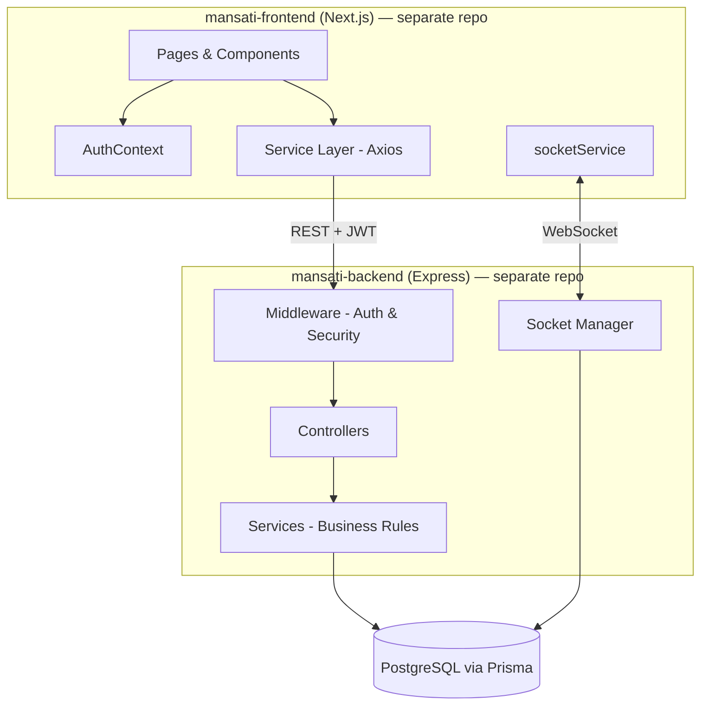
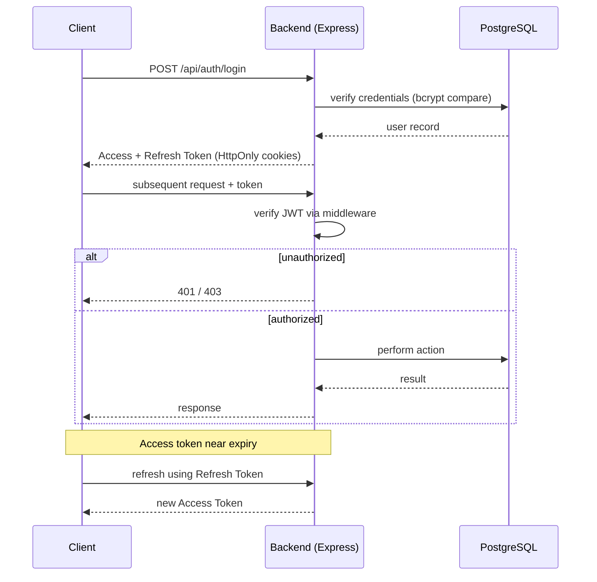
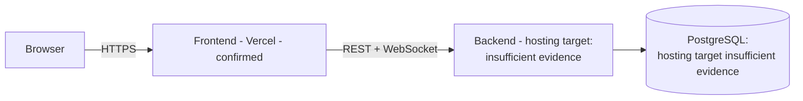

<div align="center">

# منصتي — Mansati

### An Arabic-native social platform, built API-first with a real-time core.

**A full social network for Arabic-speaking users — profiles, messaging, and a working admin console — built RTL-first instead of RTL-retrofitted.**


[Frontend Repository](https://github.com/mohammed-dev-stack/mansati-frontend) · [Backend Repository](https://github.com/mohammed-dev-stack/mansati-backend)

</div>

---

> **How to read this document.** This is a product-level index, not a technical deep-dive — for implementation detail, follow the links into the [frontend](https://github.com/mohammed-dev-stack/mansati-frontend) and [backend](https://github.com/mohammed-dev-stack/mansati-backend) READMEs. Claims below are either stated plainly (confirmed by both sub-repos' own documentation), marked **🔍 Inferred** (implied but not directly confirmed), or marked **⚠️ Insufficient evidence from repository** (a real, unresolved gap — not a guess dressed up as fact).
>
> **Up front, on repository structure:** Mansati ships as **two separate repositories** — `mansati-frontend` and `mansati-backend` — that reference each other, not a monorepo. Anywhere infrastructure, Docker, or CI/CD would normally be described, the honest answer is ⚠️ **insufficient evidence from repository**: neither sub-repo shows a Dockerfile, compose file, or pipeline config.

---

## Table of Contents

1. [Product Overview](#product-overview)
2. [Why Mansati Exists](#why-mansati-exists)
3. [Business Value](#business-value)
4. [Technical Value](#technical-value)
5. [System Architecture](#system-architecture)
6. [Repository Structure](#repository-structure)
7. [Frontend Overview](#frontend-overview)
8. [Backend Overview](#backend-overview)
9. [Security Overview](#security-overview)
10. [Scalability Overview](#scalability-overview)
11. [Development Workflow](#development-workflow)
12. [Local Setup](#local-setup)
13. [Deployment Architecture](#deployment-architecture)
14. [Documentation](#documentation)
15. [Roadmap](#roadmap)
16. [Contributing Guide](#contributing-guide)
17. [License](#license)
18. [Author & Contact](#author--contact)

---

## Product Overview

Mansati (منصتي, "my platform") is a full social-networking product for Arabic-speaking users: profiles, a following graph, a reaction-and-comment post feed, private real-time messaging, live notifications, and content sharing — paired with a genuinely separate admin console for platform operators (user/content moderation, messaging oversight, analytics, system health).

It's split cleanly along a client/server line: a **Next.js frontend** that owns UI, routing, and client-side real-time handling, talking over REST (Axios) and WebSocket (Socket.IO) to an **Express/PostgreSQL backend** that owns persistence, identity, and the authoritative real-time event bus.

## Why Mansati Exists

Two gaps drove this product's shape, both visible directly in how it's built rather than in marketing copy:

1. **RTL as a starting point, not a patch.** Most social-platform code is written English-first and adapted for RTL languages afterward — and it shows, in mirrored icons that weren't actually mirrored, chat bubbles that orient wrong, spacing that assumes LTR reading flow. Mansati's frontend layout, typography, and component set are built RTL-first, which is a different engineering starting point than a `dir="rtl"` wrapper bolted onto an LTR design.
2. **A social app is not deployable without an operator.** A feed, messaging, and notifications solve the *user* problem. They don't solve the problem of "what happens when someone posts something that needs to come down, or a user needs their account disabled." Mansati ships a real, separately-routed admin console (moderation, analytics, system health, role management) alongside the consumer app — not a stubbed-out admin flag.

## Business Value

- **Arabic and RTL as the default, not a locale bolt-on** — a meaningfully different (and harder) starting point than adapting an LTR product after the fact, for any product targeting Arabic-speaking markets.
- **A working moderation surface from day one** — the admin console (user/post/message moderation, role management, analytics, system health) means there's a documented, usable path for a team to actually operate the platform, not just demo it.
- **Real-time is core, not bolted on** — messaging and notifications are built on Socket.IO end-to-end (client `socketService` ↔ backend `socket/` manager), not simulated via polling, which is what perceived product quality in a chat-and-social context actually rests on.

## Technical Value

- **Layered backend architecture** (routes → middleware → controllers → services → data layer) keeps business logic out of route handlers — the difference between a backend that's demoable and one that survives past the first few features without a rewrite.
- **Typed, service-oriented frontend** — a dedicated `services/` layer per domain (posts, follows, messages, notifications, admin, users, sockets) sitting behind custom hooks, so UI components never talk to HTTP/WebSocket transport directly.
- **JWT dual-token auth** (access + refresh) issued by the backend, with route- and role-level gating on both sides — the frontend gates navigation for UX, the backend is the actual authority.
- **A redirect pattern for post permalinks** (`/posts/[id]` → `/posts?highlight=id`) instead of a duplicated detail-page implementation — a small, telling sign of a team optimizing for one source of truth over the easier-looking shortcut.

---

## System Architecture


```mermaid
graph TB
    subgraph Client["mansati-frontend (Next.js) — separate repo"]
        UI[Pages & Components]
        CTX[AuthContext]
        SVC_FE[Service Layer - Axios]
        SOCK_FE[socketService]
    end

    subgraph Server["mansati-backend (Express) — separate repo"]
        MW[Middleware - Auth & Security]
        CTRL[Controllers]
        SVC_BE[Services - Business Rules]
        SOCK_BE[Socket Manager]
    end

    DB[(PostgreSQL via Prisma)]

    UI --> SVC_FE
    UI --> CTX
    SVC_FE -- REST + JWT --> MW
    SOCK_FE <-- WebSocket --> SOCK_BE
    MW --> CTRL --> SVC_BE --> DB
    SOCK_BE --> DB
```

Two independently deployable services, joined by a typed HTTP contract and a live WebSocket channel — no shared runtime, no shared database access from the client. The frontend never touches PostgreSQL directly; every read or write goes through the backend's service layer.

## Repository Structure

```
mansati-frontend/          (separate repository)
├── src/app/                 # Next.js App Router: auth, admin, posts, messages, profile, users
├── src/components/          # Feature-organized: posts, users, messages, notifications, admin, layout
├── src/context/              # AuthContext — session/identity state
├── src/hooks/                 # useAuth, usePosts, useProfile — feature data + local state
├── src/services/               # api.ts + one service module per domain (Axios/WebSocket clients)
├── src/types/                   # Admin, Message, Notification, Post, User
└── src/utils/, src/styles/       # Helpers, CSS Modules, design tokens

mansati-backend/            (separate repository)
├── config/                   # DB connection & CORS configuration
├── controllers/               # Request-handling logic per route
├── middleware/                 # Auth, authorization, error handling
├── prisma/                      # Prisma schema definitions
├── routes/                       # API endpoint definitions
├── socket/                        # WebSocket event management
├── utils/                          # Helper functions
└── server.js                       # Application entry point
```

⚠️ **Insufficient evidence from repository** for: a shared root directory, workspace/monorepo tooling (Turborepo, Nx, npm workspaces), or any file tying both repos together beyond their README cross-links.

## Frontend Overview

Next.js 15 (App Router) + React 19 + TypeScript. Route groups separate unauthenticated flows (`(auth)`), the admin console (`admin/`, its own layout), and the core app (feed, messaging, profiles, user discovery). State is Context (`AuthContext`) plus feature hooks rather than a global store; a dedicated service layer centralizes all HTTP (Axios, with token-attach/refresh interceptors) and WebSocket (`socketService`) access.

**Full detail:** [`mansati-frontend` README](https://github.com/mohammed-dev-stack/mansati-frontend) — covers UI architecture, routing, component structure, and frontend-side security, including a documented discrepancy around token storage worth resolving (see [Security Overview](#security-overview)).

## Backend Overview

Node.js/Express, layered architecture (routes → middleware → controllers → services → PostgreSQL via Prisma). Confirmed capabilities: JWT dual-token auth (access + refresh, HttpOnly cookies), Bcrypt password hashing, Helmet security headers, rate limiting, data sanitization, centralized error handling, Multer file uploads, and a Socket.IO manager for real-time events. Only 5 endpoints are directly documented at source (`/api/auth/register`, `/api/auth/login`, `/api/posts`, `/api/messages`, `/api/admin/stats`) — 🔍 the frontend's eight service modules imply a substantially larger API surface, but only the confirmed subset is asserted as fact.

**Full detail:** [`mansati-backend` README](https://github.com/mohammed-dev-stack/mansati-backend) — covers architecture layering, auth flow, and the honest gap list (logging, validation library, deployment target — all currently undocumented).

---

## Security Overview


```mermaid
sequenceDiagram
    participant Client
    participant BE as Backend (Express)
    participant DB as PostgreSQL

    Client->>BE: POST /api/auth/login
    BE->>DB: verify credentials (bcrypt compare)
    DB-->>BE: user record
    BE-->>Client: Access + Refresh Token (HttpOnly cookies)

    Client->>BE: subsequent request + token
    BE->>BE: verify JWT via middleware
    alt unauthorized
        BE-->>Client: 401 / 403
    else authorized
        BE->>DB: perform action
        DB-->>BE: result
        BE-->>Client: response
    end

    Note over Client,BE: Access token near expiry
    Client->>BE: refresh using Refresh Token
    BE-->>Client: new Access Token
```

Confirmed controls, split by owner:

| Concern | Owner | Mechanism |
|---|---|---|
| Password storage | Backend | Bcrypt hashing |
| Session tokens | Backend (issues) / Frontend (attaches) | JWT access + refresh, HttpOnly cookies |
| HTTP security headers | Backend | Helmet.js |
| Brute-force / flood protection | Backend | Rate limiting (thresholds: ⚠️ insufficient evidence from repository) |
| Injection protection | Backend | Data sanitization (SQL injection) |
| Route/role gating | Both | Backend middleware is authoritative; frontend also gates navigation |
| Client-side input/URL sanitization | Frontend | `sanitizeInput`, `sanitizeImageUrl` utilities |

**Known documentation conflict, unresolved**: the frontend's own docs describe token storage two ways — HttpOnly cookie in one section, `sessionStorage` in another. The backend's docs assert HttpOnly cookies unambiguously. These are materially different security postures (HttpOnly cookies resist JS-based XSS token theft; `sessionStorage` doesn't), and this document does not pick a winner — it should be resolved by checking the actual `Set-Cookie` behavior against what the frontend's Axios interceptor reads, not by trusting whichever sub-repo sounds more confident.

## Scalability Overview

The stack (stateless-friendly JWT auth, PostgreSQL, Socket.IO) is *compatible* with horizontal scaling in principle. ⚠️ **Insufficient evidence from repository** exists for: a Socket.IO multi-instance adapter (a Redis pub/sub adapter is *required*, not optional, the moment more than one backend process runs — raw Socket.IO does not fan out broadcasted events across separate Node processes on its own), database indexing strategy, a caching layer, connection pooling configuration, containerization, or load-test results. For a product where live chat is a core feature, this is a real gap to close before scaling backend instances horizontally — not a cosmetic documentation omission.

---

## Development Workflow

Each repository is developed and run independently:

```bash
# Backend
git clone https://github.com/mohammed-dev-stack/mansati-backend.git
cd mansati-backend && npm install
cp .env.example .env   # set DATABASE_URL and required secrets
npm run dev             # http://localhost:5000

# Frontend
git clone https://github.com/mohammed-dev-stack/mansati-frontend.git
cd mansati-frontend && npm install
# .env.local: NEXT_PUBLIC_API_URL / NEXT_PUBLIC_SOCKET_URL → http://localhost:5000
npm run dev              # http://localhost:3000
```

The backend must be running before the frontend — auth, feed, and real-time features all depend on a live API, and there's no mock/offline mode documented.

## Local Setup

| Step | Command / Action | Notes |
|---|---|---|
| 1. Clone backend | `git clone .../mansati-backend.git` | |
| 2. Install backend deps | `npm install` | Requires Node.js 20+ |
| 3. Configure backend env | Copy `.env.example` → `.env`, set `DATABASE_URL` | See backend README for the full expected variable set |
| 4. Start backend | `npm run dev` | Defaults to `http://localhost:5000` |
| 5. Clone frontend | `git clone .../mansati-frontend.git` | |
| 6. Install frontend deps | `npm install` | |
| 7. Configure frontend env | Create `.env.local` with `NEXT_PUBLIC_API_URL` / `NEXT_PUBLIC_SOCKET_URL` pointed at the backend | See frontend README's env table for the full list, including admin-bootstrap variables |
| 8. Start frontend | `npm run dev` | Opens at `http://localhost:3000` |

⚠️ **Insufficient evidence from repository** for any single-command bootstrap (e.g., a root `docker-compose up` or a setup script spanning both repos) — the two services are set up and run independently, in the order above.

## Deployment Architecture

The frontend has a confirmed live preview on **Vercel**, a natural fit for a Next.js App Router app (zero-config SSR, automatic deploys). ⚠️ **Insufficient evidence from repository** for the backend's deployment target — no Dockerfile, hosting platform, or CI/CD pipeline is documented for `mansati-backend`. Given it's a stateful Node/Express process with WebSocket connections, it is **not** deployable as-is to a pure serverless/edge target the way the frontend is — it needs a persistent process host and a reachable PostgreSQL instance (managed or self-hosted).


```mermaid
graph LR
    User[Browser] -->|HTTPS| Vercel[Frontend - Vercel - confirmed]
    Vercel -->|REST + WebSocket| Backend["Backend - hosting target:\ninsufficient evidence"]
    Backend --> Postgres[("PostgreSQL:\nhosting target insufficient evidence")]
```

## Documentation

- [Frontend README](https://github.com/mohammed-dev-stack/mansati-frontend) — UI architecture, routing, component structure, frontend-side security.
- [Backend README](https://github.com/mohammed-dev-stack/mansati-backend) — layered architecture, auth flow, tech stack, folder structure, and an explicit gap list.
- ⚠️ **Insufficient evidence from repository** for: an API reference (OpenAPI/Swagger), architecture decision records (ADRs), or a contribution guide beyond the frontend repo's basic PR steps.

## Roadmap

Aggregated from both sub-repos' own stated future-work items — presented here as one list for the product, not a claim that a single unified roadmap exists as such:

- [ ] Groups (public/private, membership, in-group posts)
- [ ] Advanced search (date, media type, engagement)
- [ ] Web Push notifications
- [ ] Dark mode
- [ ] WebP image pipeline
- [ ] Automated testing (Jest, Cypress) and CI, both repos
- [ ] Storybook component documentation
- [ ] Formal accessibility pass (ARIA, keyboard navigation)
- [ ] Live streaming (WebRTC)
- [ ] Hashtag system
- [ ] Full OpenAPI documentation for the backend
- [ ] Structured backend logging and a health/monitoring endpoint
- [ ] Redis-backed Socket.IO adapter for horizontal scaling
- [ ] Resolve the frontend/backend token-storage documentation conflict
- [ ] Document the backend's validation library and error-response contract
- [ ] Define and document a real deployment target for the backend

## Contributing Guide

The frontend repo documents a standard flow: fork → feature branch → implement (with tests where the repo has a test suite for the area you're touching) → push → open a PR with a clear description, following existing ESLint/Prettier conventions and the established feature-folder component pattern. ⚠️ **Insufficient evidence from repository** for a backend-specific contributing guide — apply the same fork/branch/PR flow, keeping business logic in the services layer rather than controllers, until one is written.

## License

Both repositories are documented as **MIT licensed** — see each repo's `LICENSE` file for full terms.

## Author & Contact

**Mohammed Qannan**
Full-Stack Developer — Next.js, React, and TypeScript on the client; Node.js, Express, and PostgreSQL on the server. Built and documented both halves of Mansati independently.

**Project links**
- Frontend repository: https://github.com/mohammed-dev-stack/mansati-frontend
- Backend repository: https://github.com/mohammed-dev-stack/mansati-backend
