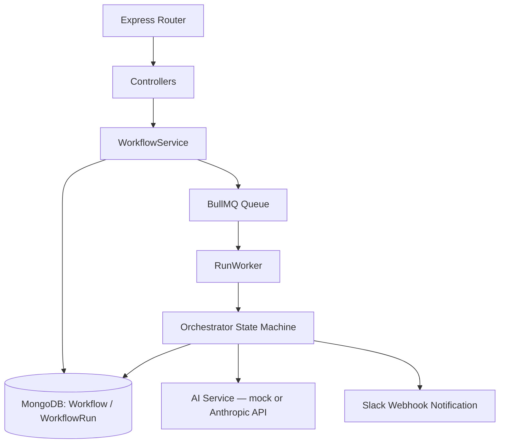

# AI Workflow Orchestrator — Backend

Human-in-the-loop orchestration engine for AI-driven workflows. Executes multi-step workflows via a BullMQ job queue, pauses at steps that require human approval, and persists all state in MongoDB.

[](https://nodejs.org/)
[](https://www.typescriptlang.org/)
[](https://expressjs.com/)
[](https://www.mongodb.com/)
[](https://bullmq.io/)
[](LICENSE)

---

## Table of Contents

- [Overview](#overview)
- [Architecture](#architecture)
- [Tech Stack](#tech-stack)
- [Project Structure](#project-structure)
- [Prerequisites](#prerequisites)
- [Quick Start](#quick-start)
- [Configuration](#configuration)
- [API Reference](#api-reference)
- [Core Systems](#core-systems)
- [Known Limitations](#known-limitations)
- [Troubleshooting](#troubleshooting)
- [License](#license)

---

## Overview

The backend accepts a **workflow template** (an ordered list of steps, each mapped to a tool such as `send_email`, `create_calendar_event`, or `create_jira_ticket`), and executes it as a **run**. Each run is processed asynchronously by a BullMQ worker calling into a state-machine orchestrator.

Two things distinguish this from a plain job queue:

- **Human-in-the-loop approval** — any step flagged `requiresApproval` pauses the run (`waiting_approval`) until a human calls the approve/reject endpoint.
- **Mock / Real AI mode** — the orchestrator can run entirely without calling the Anthropic API (`AI_MODE=mock`), generating deterministic placeholder content, or switch to the real Claude API at runtime via a settings endpoint.

Communication: REST API (Express) for the frontend, MongoDB (Mongoose) for persistence, Redis + BullMQ for the job queue.

---

## Architecture



The codebase separates concerns into distinct layers:

- **`api/`** — Express controllers and routes. Thin: validates input shape, delegates to services, formats the HTTP response.
- **`services/`** — Business logic (`WorkflowService`, `AIService`). No knowledge of `req`/`res`.
- **`core/`** — `Orchestrator`, the state machine that drives a run from step to step.
- **`models/`** — Mongoose schemas (`Workflow`, `WorkflowRun`) with their own validation rules and pre-save hooks.
- **`config/`** — Centralized, Zod-validated environment access. This is the only layer allowed to read `process.env` directly.
- **`queues/` / `workers/`** — BullMQ queue definition and the worker process that consumes jobs.
- **`utils/`** — Logger (Winston), error handling (`AppError`), AI-mode state, redaction helpers.

---

## Tech Stack

| Layer | Technology | Version (package.json) | Notes |
|---|---|---|---|
| Runtime | Node.js | >=20 (engines not pinned in package.json; TS target ES2022) | |
| Language | TypeScript | ^5.6 (installed: 5.9.3) | `strict: true`, `noUncheckedIndexedAccess: true` |
| Framework | Express | ^4.21 (installed: 4.22.2) | |
| Database | MongoDB via Mongoose | mongoose ^8.6 | |
| Queue | BullMQ + ioredis | bullmq ^5.12 (installed 5.79), ioredis ^5.3 | |
| AI | `@anthropic-ai/sdk` | ^0.30.1 | Client is instantiated lazily; only used when `AI_MODE=real` |
| Validation | Zod | ^4.4 (backend `envSchema`); note the root `package.json` devDependencies also lists `zod: ^3.23.8` — see [Known Limitations](#known-limitations) | |
| Logging | Winston | ^3.14 (installed 3.19) | Console + rotating file transports |
| Security headers | Helmet | ^7.1 (installed 7.2) | |
| Compression | `compression` | ^1.8 | |

---

## Project Structure

```
backend/
├── src/
│   ├── api/
│   │   ├── controllers/
│   │   │   ├── workflow.controller.ts   # Workflow/run/approval logic, called by routes
│   │   │   ├── settings.controller.ts   # AI mode get/set/status (current, used by routes.ts)
│   │   │   └── AISettings.ts            # Earlier version of the same controller, not wired into routes.ts
│   │   └── routes.ts                    # All route definitions + inline auth middleware
│   ├── config/
│   │   ├── schema.ts                    # Zod schema — single source of truth for env vars
│   │   ├── env.ts                       # Loads and freezes validated env; throws on invalid config
│   │   ├── ai.config.ts                 # Derives AI config from env
│   │   ├── database.config.ts           # Mongo connect/disconnect/health-check with retry
│   │   ├── redis.config.ts              # Redis client lifecycle + health-check
│   │   ├── types.ts                     # Shared HealthCheckResult type
│   │   └── index.ts                     # Public barrel export for the rest of the app
│   ├── core/
│   │   └── StateMachine.orchestrator.ts # The workflow execution engine
│   ├── models/
│   │   ├── Workflow.model.ts            # Workflow template schema
│   │   └── WorkflowRun.model.ts         # Run instance schema
│   ├── queues/
│   │   └── run.queue.ts                 # BullMQ queue + job helper functions
│   ├── services/
│   │   ├── workflow.service.ts          # CRUD + execution + stats for workflows/runs
│   │   └── ai.service.ts                # Mock/real content generation (separate from the orchestrator's own mock logic)
│   ├── utils/
│   │   ├── logger.ts                    # Winston logger, HTTP logger, redaction
│   │   ├── errorHandler.ts              # AppError, global error handler, catchAsync
│   │   ├── aiMode.ts                    # In-memory AI mode state (mock/real) + mock content generator
│   │   └── redact.ts                    # Generic object/URI credential redaction
│   ├── workers/
│   │   └── run.worker.ts                # BullMQ worker: consumes jobs, calls Orchestrator.process
│   └── app.ts                           # Express bootstrap, health endpoint, graceful shutdown
├── .env.example
├── package.json
└── tsconfig.json
```

**Note on duplication:** `settings.controller.ts` and `AISettings.ts` implement near-identical AI-mode endpoints. Only `settings.controller.ts` is imported by `routes.ts`; `AISettings.ts` appears to be a leftover from an earlier refactor and is currently dead code.

---

## Prerequisites

| Dependency | Version | Verify |
|---|---|---|
| Node.js | >=20.0.0 | `node --version` |
| npm | >=10.0.0 | `npm --version` |
| MongoDB | >=6.0 | `mongod --version` |
| Redis | >=7.0 | `redis-server --version` |

---

## Quick Start

```bash
# 1. Install dependencies (uses the committed package-lock.json)
cd backend
npm ci

# 2. Configure environment
cp .env.example .env
# Edit .env — at minimum set MONGO_URI; leave AI_MODE=mock to avoid API costs

# 3. Start MongoDB and Redis locally (however you normally run them)

# 4. Run in dev mode (nodemon + ts-node)
npm run dev

# 5. Verify
curl http://localhost:5000/health
```

Expected response shape (see `app.ts`):

```json
{
  "status": "ok",
  "timestamp": "2026-07-09T08:30:00.000Z",
  "uptime": 12.3,
  "version": "1.0.0",
  "services": {
    "mongodb": { "status": "connected" },
    "redis": { "status": "connected" },
    "ai": { "mode": "mock", "label": "🧪 Mock (Free - No Cost)", "configured": false }
  },
  "memory": { "rss": "80MB", "heapTotal": "40MB", "heapUsed": "30MB" },
  "requestId": "req_..."
}
```

Build/run commands actually defined in `package.json`:

```bash
npm run build   # tsc -> dist/
npm start       # node dist/app.js
npm run dev     # nodemon src/app.ts
```

There are no `test`, `lint`, or `db:migrate` scripts defined in `package.json` at this time — see [Known Limitations](#known-limitations).

---

## Configuration

All environment variables are declared and validated in `src/config/schema.ts` using Zod. The process **refuses to start** if validation fails (`env.ts` throws before anything else runs) — this is enforced today, not aspirational.

| Variable | Type | Required | Default | Notes |
|---|---|---|---|---|
| `NODE_ENV` | enum | No | `development` | `development \| staging \| production \| test` |
| `MONGO_URI` | string | **Yes** | — | Must start with `mongodb://` or `mongodb+srv://` (format check only) |
| `MONGO_MAX_POOL_SIZE` | number | No | `10` | |
| `MONGO_MIN_POOL_SIZE` | number | No | `2` | |
| `MONGO_SOCKET_TIMEOUT_MS` | number | No | `45000` | |
| `MONGO_SERVER_SELECTION_TIMEOUT_MS` | number | No | `5000` | |
| `MONGO_CONNECT_RETRIES` | number | No | `5` | |
| `MONGO_CONNECT_RETRY_DELAY_MS` | number | No | `2000` | |
| `REDIS_HOST` | string | No | `localhost` | |
| `REDIS_PORT` | number | No | `6379` | |
| `REDIS_PASSWORD` | string | No | — | |
| `REDIS_TLS` | `'true' \| 'false'` | No | `'false'` | Deliberately restricted to a literal enum rather than `z.coerce.boolean()` — see comment in `schema.ts` on why boolean coercion of env strings is unsafe |
| `REDIS_MAX_RETRIES_PER_REQUEST` | number | No | `3` | |
| `REDIS_CONNECT_TIMEOUT_MS` | number | No | `10000` | |
| `ANTHROPIC_API_KEY` | string | Conditional | — | Required only when `AI_MODE=real`, enforced by a Zod `.refine()` on the whole schema |
| `AI_MODEL` | string | No | `claude-3-5-sonnet-20241022` | |
| `AI_MAX_TOKENS` | number | No | `1024` | |
| `AI_TEMPERATURE` | number | No | `0.3` | |
| `AI_MODE` | enum | No | `mock` | `mock \| real` |
| `AI_MOCK_DELAY` | number | No | `500` | Declared in schema; not currently read anywhere in the mock code path |
| `SLACK_WEBHOOK_URL` | string | No | — | Read directly via `process.env` in the orchestrator, not part of `envSchema` |
| `RATE_LIMIT_MAX_REQUESTS` / `RATE_LIMIT_WINDOW_MS` | number | No | — | Present in `.env.example`; no rate-limiting middleware is currently wired into `app.ts` |

Setup:

```bash
cp .env.example .env
# edit values, then restart
```

---

## API Reference

All routes are mounted under `/api` (see `app.use('/api', routes)` in `app.ts`) and pass through a lightweight auth middleware that reads a `user-id` header (defaults to `"system"`) — there is no token verification at this layer yet.

### Workflows

| Method | Endpoint | Description |
|---|---|---|
| GET | `/api/workflows` | List workflows. Query params: `isActive`, `tags` (comma-separated), `createdBy` |
| GET | `/api/workflows/:id` | Get one workflow |
| POST | `/api/workflows` | Create a workflow (`createdBy` is set from the `user-id` header) |
| PUT | `/api/workflows/:id` | Update a workflow — **blocked** (throws) if the workflow has any run in `idle`, `running`, or `waiting_approval` state |
| DELETE | `/api/workflows/:id` | Soft-delete (deactivate) if it has historical runs; hard-delete otherwise |
| POST | `/api/workflows/:id/execute` | Create and enqueue a new run. Body: `{ context: object, idempotencyKey?: string }` |
| GET | `/api/workflows/:id/stats` | Aggregated run statistics for the workflow |

### Runs

| Method | Endpoint | Description |
|---|---|---|
| GET | `/api/runs` | List runs. Query params: `workflowId`, `status`, `limit`, `offset` |
| GET | `/api/runs/:id` | Get one run |
| POST | `/api/runs/:id/cancel` | Mark a non-terminal run as `failed` with `errorMessage: "Cancelled by user"` |

### Approvals

| Method | Endpoint | Description |
|---|---|---|
| GET | `/api/approvals/pending` | List runs currently in `waiting_approval`, capped at 50, oldest first |
| POST | `/api/runs/:id/approve` | Body: `{ approved: boolean }`. Approving executes the pending tool and resumes the run; rejecting sets status to `rejected` |

### Settings

| Method | Endpoint | Description |
|---|---|---|
| GET | `/api/settings/ai-mode` | Current mode + label/description |
| POST | `/api/settings/ai-mode` | Body: `{ mode: 'mock' \| 'real' }`. Changes the **process-wide, in-memory** mode (see [Known Limitations](#known-limitations)) |
| GET | `/api/settings/ai-status` | Mode + whether an API key is configured + model name |

### Health

| Method | Endpoint | Description |
|---|---|---|
| GET | `/health` | Top-level health check (Mongo, Redis, AI mode, memory usage) |
| GET | `/api/health` | Minimal `{ status: "ok" }` check defined inside `routes.ts` — distinct from, and less detailed than, the `/health` route in `app.ts` |

---

## Core Systems

### The Orchestrator (`core/StateMachine.orchestrator.ts`)

`Orchestrator.process(runId)` is the entry point called by the worker for every job. On each invocation it:

1. Loads the run; returns immediately if it's already `completed`, `failed`, or `rejected` (idempotent no-op on terminal states).
2. If `waiting_approval`, sends a Slack notification (if configured) and returns — no state change happens until a human calls the approve endpoint.
3. Otherwise enters a bounded loop (`MAX_LOOP_ITERATIONS = 50`) that:
   - marks the run `completed` once `currentStepIndex` reaches the end of `steps`;
   - transitions to `waiting_approval` if the current step needs approval;
   - advances past already-executed steps;
   - retries failed steps up to `MAX_RETRIES = 3` with exponential backoff (`RETRY_BACKOFF_BASE_MS = 5000`, capped at 30s), scheduled back onto the BullMQ queue rather than looped in-process;
   - for a fresh pending step, asks `callClaude()` for the next tool/arguments, appends a new step, executes the tool, and re-enqueues a `continue-run` job.

The loop guard exists specifically to stop a malformed or cyclic workflow definition from spinning the worker forever; hitting it marks the run `failed` with an explicit `errorMessage`.

```typescript
// Excerpt — idempotency + approval gate, from StateMachine.orchestrator.ts
if (
  run.status === RunStatus.COMPLETED ||
  run.status === RunStatus.FAILED ||
  run.status === RunStatus.REJECTED
) {
  return; // terminal — nothing to do
}

if (run.status === RunStatus.WAITING_APPROVAL) {
  await this.notifyApproval(run, correlationId);
  return; // wait for a human decision via the approve endpoint
}
```

**What "tool execution" actually does today:** `executeTool()` does not call any real external service (no Gmail/Calendar/Jira integration is wired up). It waits a randomized 200–800ms and returns a mock response object per tool name. This is worth knowing before treating the `send_email` / `create_calendar_event` / `create_jira_ticket` tools as production-ready integrations.

### Two independent AI-mock implementations

There are currently **two separate places** that generate mock AI content:

- `Orchestrator.getMockDecision()` — used by the orchestrator's own `callClaude()`, hard-codes a `send_email` decision with a Arabic-language welcome message.
- `AIService` / `utils/aiMode.ts#generateMockContent()` — a more general per-tool mock generator, used by `AIService.generateDecision()` / `generateEmail()`, which is **not currently called from the orchestrator's execution path**.

If you're extending the mock behavior, check both files — a change in one will not affect the other.

### Environment validation (`config/schema.ts`)

The schema does more than type-check — it encodes real operational constraints:

```typescript
REDIS_TLS: z
  .enum(['true', 'false'])
  .default('false')
  .transform((v) => v === 'true'),
```

This exists because `z.coerce.boolean()` on an env string performs `Boolean(value)`, and in JavaScript `Boolean("false")` is `true` — a classic env-var footgun. Restricting the input to the literal strings `'true'`/`'false'` before transforming avoids it.

```typescript
.refine((data) => data.AI_MODE !== 'real' || !!data.ANTHROPIC_API_KEY, {
  message: 'ANTHROPIC_API_KEY is required when AI_MODE=real',
  path: ['ANTHROPIC_API_KEY'],
});
```

This cross-field rule means you cannot start the process in real mode without a key — the failure happens at boot, not on the first API call.

### Error handling (`utils/errorHandler.ts`)

`AppError` carries a `statusCode` and an `isOperational` flag. The global `errorHandler` middleware maps a handful of known error shapes to specific status codes:

| Condition | Status | 
|---|---|
| `AppError` instance | its own `statusCode` |
| Mongoose `ValidationError` | 400 |
| Mongoose `CastError` (bad ObjectId) | 400 |
| Mongo duplicate key (`code: 11000`) | 409 |
| Message contains `ECONNREFUSED` | 503 |
| Message contains `BullMQ` or `Redis` | 503 |
| Message contains `timeout` | 504 |
| Anything else | 500 |

Stack traces are only included in the response outside of production (`NODE_ENV !== 'production'`).

### Logging (`utils/logger.ts`)

Winston is configured with three transports: colorized console (JSON in production), `logs/error.log` (5MB × 5 files, `error` level only), and `logs/combined.log` (10MB × 10 files, all levels). A separate `httpLogger` records one line per request/response with status, method, URL, and duration. Both the console formatter and the generic `redactSensitiveData()` helper strip keys matching `password`, `token`, `secret`, `apiKey`, `authorization`, `cookie`, `session`, `creditCard`, `cvv`, `ssn` before logging.

### Graceful shutdown (`app.ts`)

On `SIGTERM`/`SIGINT`/`SIGHUP`, the process: stops accepting new HTTP connections → closes the Mongo connection → closes the Redis client → calls `RunWorker.shutdown()`, which pauses the worker and polls for active BullMQ jobs to finish (up to 30s) before closing it → exits. A separate 30s hard-timeout timer forces `process.exit(1)` if the graceful path hangs.

---

## Known Limitations

Documented here deliberately, instead of glossed over, because they matter if you're deciding whether to build on top of this as-is:

- **AI mode is process-global, in-memory state.** `POST /api/settings/ai-mode` mutates a module-level variable in `utils/aiMode.ts`. It is not persisted, not per-user, and will reset on restart or diverge across multiple worker/API instances if you scale horizontally.
- **No test suite is wired up.** `vitest` is a devDependency and `@types/jest` is also present, but `package.json` has no `test` script and no test files were provided. Treat any "80% coverage" claim for this codebase as aspirational, not current.
- **No authentication or authorization.** The `user-id` header is trusted as-is; there's no JWT verification, no session handling, and no rate limiting middleware currently mounted in `app.ts` despite `RATE_LIMIT_*` variables existing in `.env.example`.
- **Tool execution is mocked.** `send_email`, `create_calendar_event`, and `create_jira_ticket` do not call Gmail/Calendar/Jira — they return synthetic success payloads after a short delay.
- **Duplicate/dead code:** `api/controllers/AISettings.ts` duplicates `settings.controller.ts` and is not imported by `routes.ts`. Two independent mock-AI-content code paths exist (see [Core Systems](#core-systems)).
- **Dependency version mismatch:** the root `package.json` lists `zod: ^3.23.8` in devDependencies, while the backend's actual runtime dependency (used by `config/schema.ts`) is `zod: ^4.4.3`. Confirm which one resolves in your environment before relying on Zod v4-only APIs.
- **`/health` and `/api/health` are two different endpoints** with different response shapes — the former (in `app.ts`) is the detailed one; the latter (in `routes.ts`) just returns `{ status: "ok" }`.

---

## Troubleshooting

| Problem | Likely Cause | Solution |
|---|---|---|
| `Invalid environment configuration. The process will not start.` | A required env var is missing or malformed | Read the printed Zod issue list — it names the exact field and rule that failed |
| `MONGO_URI must start with mongodb:// or mongodb+srv://` | Malformed connection string | Fix `MONGO_URI` in `.env` |
| `ANTHROPIC_API_KEY is required when AI_MODE=real` | Real mode requested without a key | Set the key, or set `AI_MODE=mock` |
| `Redis not initialized — call initializeRedis() during app bootstrap first` | Something called `getRedisClient()` before `initializeRedis()` ran | Should not happen via the normal `startServer()` path; check for out-of-order imports |
| Approve/reject returns `Run is not waiting for approval` | The run already moved past that step, or was never paused | Re-fetch run status via `GET /api/runs/:id` before acting on stale UI state |
| Workflow update throws `Cannot update workflow with N pending runs` | Update blocked by design while runs are in flight | Wait for runs to finish, or create a new workflow instead of mutating this one |

---

## License

MIT
