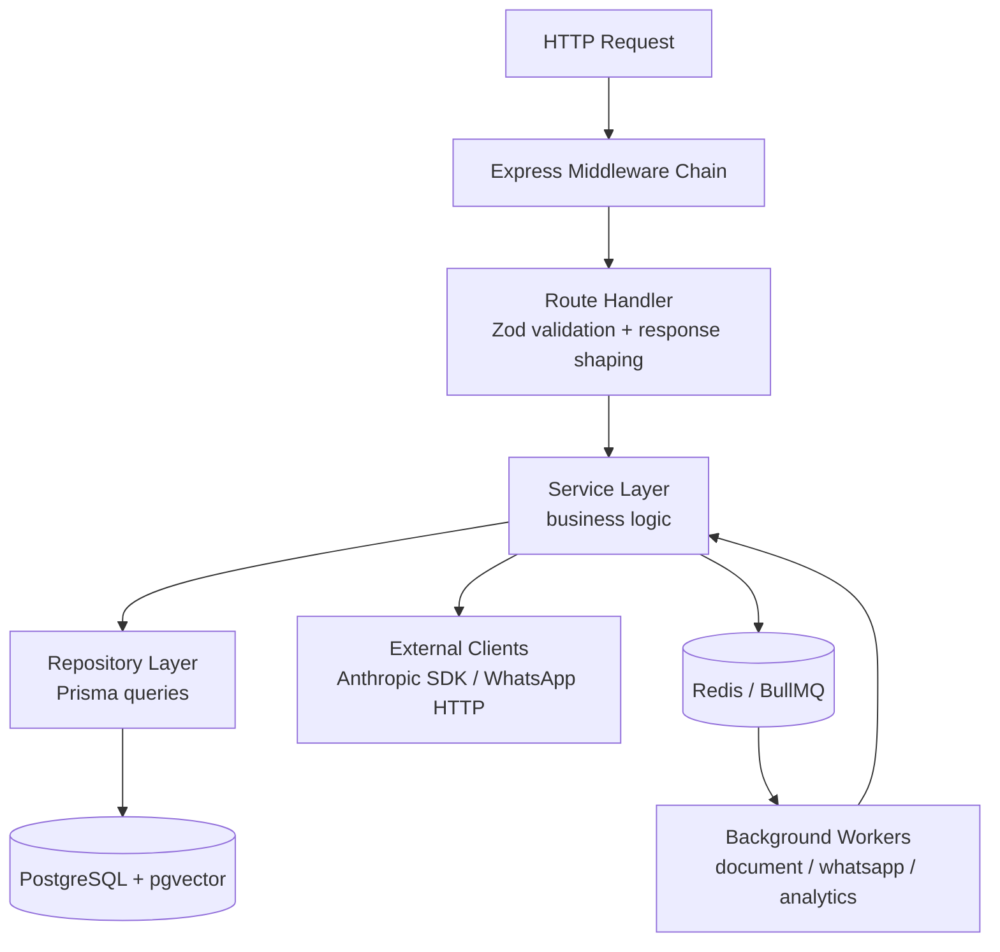
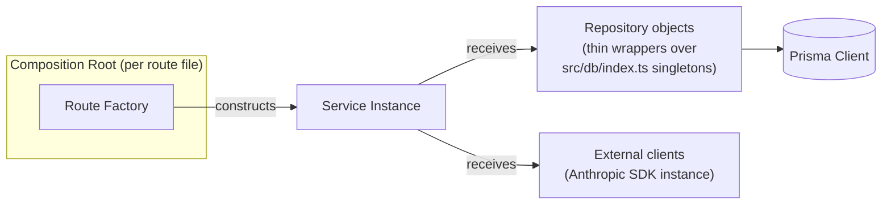
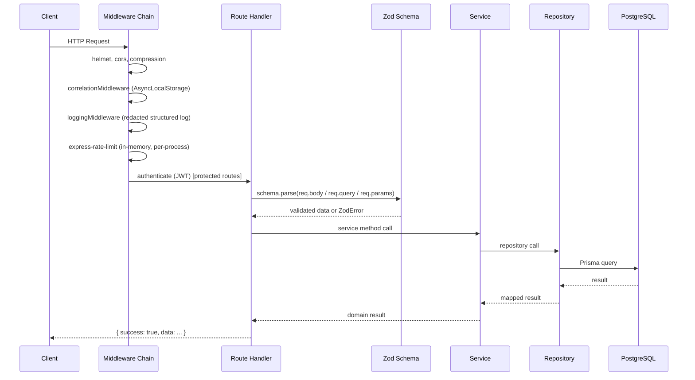
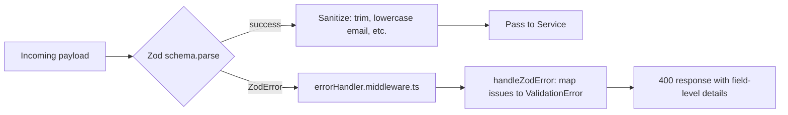
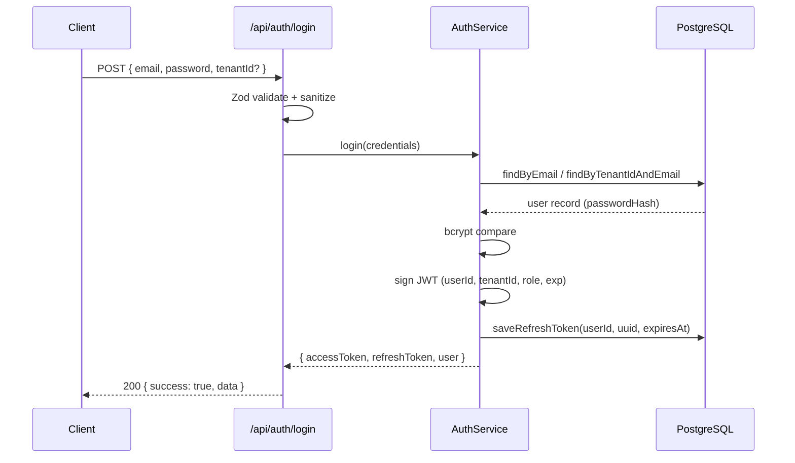
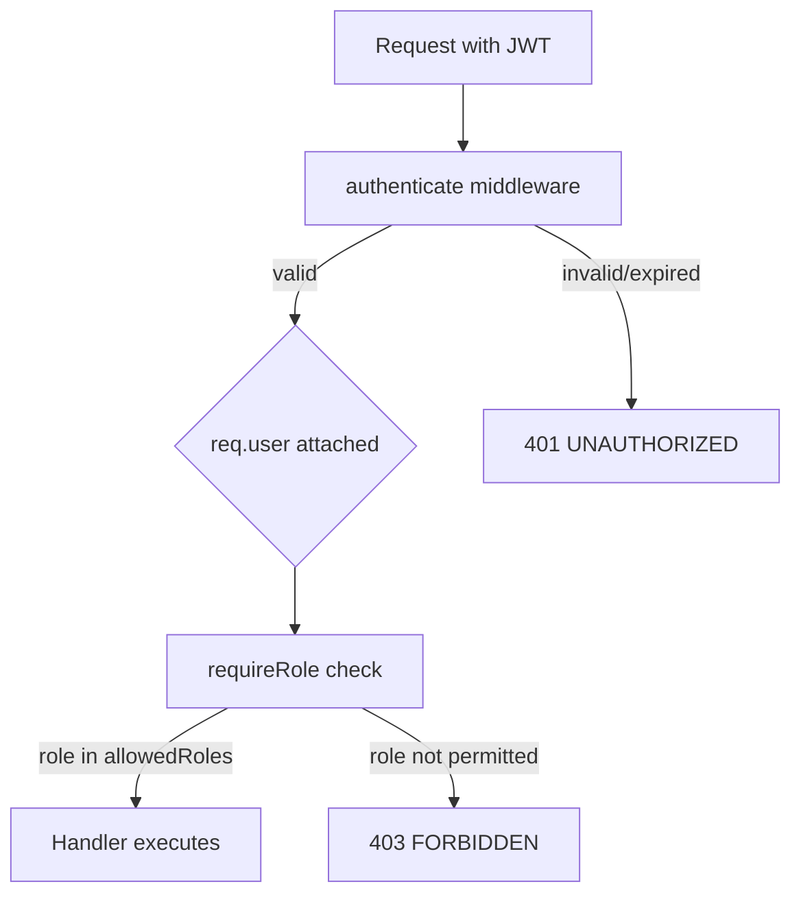
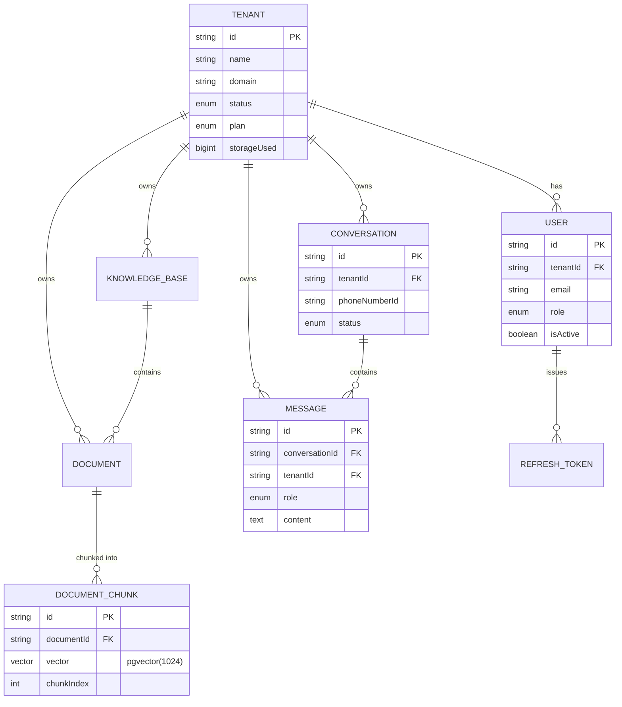
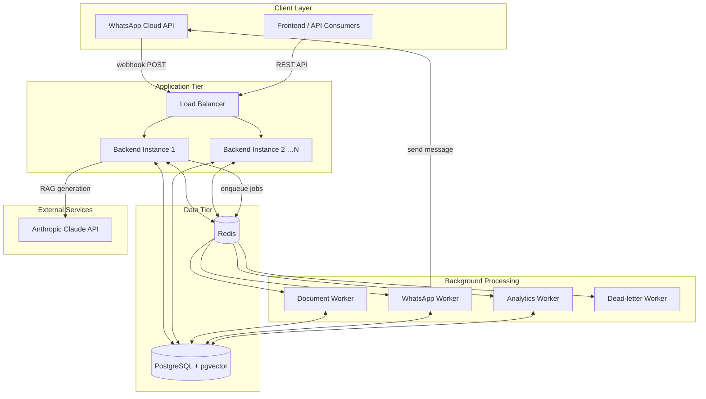

# WhatsApp AI Agent — Backend

> Multi-tenant, AI-augmented WhatsApp customer engagement platform. Node.js 20+ · TypeScript 6 · Express 4 · Prisma 7 · PostgreSQL (pgvector) · Redis · BullMQ · Anthropic Claude.


This document is an engineering audit of the backend service only, written directly against the source in `backend/src`, `backend/prisma`, and the repository's own build-error logs. Every architectural claim below is traceable to a specific file. Where the codebase does not provide evidence for a claim, that is stated explicitly instead of being filled in.

---

## Table of Contents

1. [Executive Summary](#executive-summary)
2. [Backend Overview](#backend-overview)
3. [Backend Architecture](#backend-architecture)
4. [Backend Folder Structure](#backend-folder-structure)
5. [API Architecture](#api-architecture)
6. [Authentication Architecture](#authentication-architecture)
7. [Authorization Architecture](#authorization-architecture)
8. [Database Architecture](#database-architecture)
9. [Validation Architecture](#validation-architecture)
10. [Error Handling Strategy](#error-handling-strategy)
11. [Security Architecture](#security-architecture)
12. [Scalability Analysis](#scalability-analysis)
13. [Performance Analysis](#performance-analysis)
14. [Engineering Decisions](#engineering-decisions)
15. [Environment Variables](#environment-variables)
16. [Installation](#installation)
17. [Development Setup](#development-setup)
18. [Production Setup](#production-setup)
19. [Available Scripts](#available-scripts)
20. [Deployment Architecture](#deployment-architecture)
21. [Monitoring & Observability](#monitoring--observability)
22. [Known Issues (Verified)](#known-issues-verified)
23. [Future Roadmap](#future-roadmap)
24. [Contribution Guide](#contribution-guide)
25. [Code Quality Standards](#code-quality-standards)
26. [License](#license)
27. [Author](#author)

---

## Executive Summary

The backend is a multi-tenant REST API that connects the WhatsApp Cloud API to a retrieval-augmented generation (RAG) pipeline built on Anthropic Claude and PostgreSQL's `pgvector` extension. Tenants upload documents into knowledge bases; documents are chunked and embedded asynchronously via BullMQ workers; incoming WhatsApp messages (and authenticated API calls) are answered using vector-similarity-retrieved context passed to Claude.

The codebase demonstrates deliberate attention to operational maturity: structured JSON logging with PII redaction, `AsyncLocalStorage`-based correlation IDs, a hand-rolled circuit breaker with half-open recovery, exponential backoff with jitter, HMAC-SHA256 webhook signature verification using `crypto.timingSafeEqual`, Zod-validated fail-fast environment configuration, and OpenTelemetry tracing scaffolding. It also has a small number of concrete, verifiable defects — documented in [Known Issues](#known-issues-verified) rather than hidden, because a repository's own type-checker output is stronger evidence than any narrative description.

## Backend Overview

| Aspect | Evidence-based description |
|---|---|
| Runtime | Node.js, ESM (`"type": "module"` in `package.json`) |
| Language | TypeScript 6.0, `strict: true` in `tsconfig.json` |
| Web framework | Express 4.21 (`src/server.ts`) |
| Database | PostgreSQL with the `pgvector` extension, accessed via Prisma 7.8 (`prisma/schema.prisma`, `src/db/migrations/20260116000000_vector.sql`) |
| Cache / Queue backend | Redis via `ioredis`, job queues via `bullmq` (`src/db/index.ts`, `src/queues/index.ts`) |
| AI provider | Anthropic Claude via `@anthropic-ai/sdk` (`src/ai/client.ts`, `src/services/chat.service.ts`) |
| Messaging channel | WhatsApp Cloud API (`src/services/whatsapp.service.ts`) |
| Entry point | `src/index.ts` (process lifecycle) delegates to `src/server.ts` (Express app definition) |

## Backend Architecture

### Architectural Style

The backend follows a **layered service architecture** with manual dependency injection rather than a DI container or framework (e.g., no NestJS, no InversifyJS). Each route module is a **factory function** (`createAuthRoutes`, `createConversationRoutes`, etc.) that receives already-constructed service instances and returns an Express `Router`. Services are constructed once at module load time by composing repository objects sourced from a single `repositories` singleton in `src/db/index.ts`.

There is **no separate Controller layer**: route handlers in files under `src/routes/` perform validation, call the service layer directly, and shape the HTTP response inline. This is a legitimate simplification for a service of this size, though it means route files carry more responsibility than in a strict Controller/Service split.

### Layer Separation



### Dependency Flow

Dependencies point downward and are constructed at the edge (inside each route file's `createServices()` function), not injected by a framework:



**Observed characteristic:** each route file (`auth.routes.ts`, `conversation.routes.ts`, `webhook.routes.ts`) independently re-implements its own `createServices()` / `createAuthService()` composition function and its own repository adapter objects. `ChatService`, `WhatsAppService`, and their repository adapters are therefore constructed **twice** — once in `conversation.routes.ts` and again in `webhook.routes.ts` — each with its own `Anthropic` client instance. This is architecturally consistent (no shared mutable state is required for correctness) but is duplicated wiring rather than a single composition root.

### Service Layer

Located in `src/services/`: `AuthService`, `ChatService`, `DocumentService`, `EmbeddingService`, `KnowledgeBaseService`, `TenantService`, `WhatsAppService`. Services receive repository interfaces via constructor parameters (manual constructor injection) and are the only layer that contains business rules (password hashing, token issuance, RAG orchestration, WhatsApp signature verification).

### Repository Layer

`src/db/index.ts` is the single source of truth for data access. It exports one repository class per entity (`TenantRepository`, `UserRepository`, `KnowledgeBaseRepository`, `DocumentRepository`, `DocumentChunkRepository`, `ConversationRepository`, `MessageRepository`, `PromptTemplateRepository`) plus a `repositories` object aggregating instances of each. Repositories wrap Prisma Client calls and, for aggregate/analytics queries, drop to `$queryRaw` SQL.

### Middleware Layer

Located in `src/middlewares/`:

| Middleware | Responsibility |
|---|---|
| `correlation.middleware.ts` | Assigns/propagates a correlation ID via `AsyncLocalStorage`, exposed to every log line without manual threading |
| `logging.middleware.ts` | Structured JSON request/response logging with header and body field redaction (passwords, tokens, emails, phone numbers) |
| `auth.middleware.ts` | JWT verification (`authenticate`), RBAC gate (`requireRole`), tenant-ID extraction fallback (`extractTenantId`) |
| `rateLimiter.middleware.ts` | Redis Lua-script-based atomic rate limiting with tenant/user/global scopes — **defined but not wired into the running server** (see [Known Issues](#known-issues-verified)) |
| `errorHandler.middleware.ts` | Centralized error taxonomy and JSON error response shaping |

## Backend Folder Structure

The structure below reflects `backend/src` as actually present in the repository (generated Prisma output and a leftover `src_backup_before_fix/` directory are omitted for clarity):

```
backend/
├── prisma/
│   ├── schema.prisma
│   └── seed.ts
├── src/
│   ├── ai/
│   │   ├── client.ts                 # Anthropic client wrapper: circuit breaker, retry, tracing
│   │   ├── prompts/                  # chat.prompt.ts, embedding.prompt.ts
│   │   ├── sanitizers/prompt.sanitizer.ts
│   │   └── validators/
│   ├── config/
│   │   ├── env.schema.ts             # Zod schema — fail-fast env validation
│   │   ├── app.config.ts
│   │   ├── ai.config.ts
│   │   ├── db.config.ts
│   │   └── index.ts                  # Aggregated, typed `config` singleton
│   ├── db/
│   │   ├── index.ts                  # Repositories + Redis singleton (SSoT for data access)
│   │   └── migrations/               # Raw SQL migrations (init + pgvector)
│   ├── middlewares/
│   │   ├── auth.middleware.ts
│   │   ├── correlation.middleware.ts
│   │   ├── errorHandler.middleware.ts
│   │   ├── logging.middleware.ts
│   │   └── rateLimiter.middleware.ts
│   ├── models/prisma/                # Prisma client bootstrap (connection lifecycle)
│   ├── observability/
│   │   ├── logger.ts                 # pino
│   │   ├── metrics.ts
│   │   ├── tracer.ts                 # OpenTelemetry
│   │   └── health/                   # liveness / readiness / startup
│   ├── orchestrators/
│   │   ├── chatFlow.orchestrator.ts        # XState state machine for conversation flow
│   │   └── documentProcessing.orchestrator.ts
│   ├── queues/
│   │   ├── index.ts                  # BullMQ queue + dead-letter worker
│   │   └── workers/                  # document / whatsapp / analytics workers
│   ├── repositories/
│   │   ├── document.repository.ts
│   │   └── message.repository.ts
│   ├── routes/
│   │   ├── index.ts                  # Alternate aggregated router (see note below)
│   │   ├── auth.routes.ts
│   │   ├── conversation.routes.ts
│   │   ├── document.routes.ts
│   │   ├── knowledgeBase.routes.ts
│   │   ├── analytics.routes.ts
│   │   └── webhook.routes.ts
│   ├── services/
│   │   ├── auth.service.ts
│   │   ├── chat.service.ts
│   │   ├── document.service.ts
│   │   ├── embedding.service.ts
│   │   ├── knowledgeBase.service.ts
│   │   ├── tenant.service.ts
│   │   └── whatsapp.service.ts
│   ├── utils/
│   │   ├── circuitBreaker.ts
│   │   ├── retry.ts
│   │   ├── encryption.ts             # AES-256-GCM
│   │   ├── idempotency.ts            # Redis-backed idempotency keys
│   │   └── date.ts
│   ├── server.ts                     # Express app: middleware chain + route mounting
│   └── index.ts                      # Process entry point: startup, shutdown, signal handling
├── docker-compose.yml
├── package.json
├── tsconfig.json
└── .env.example                      # Auto-generated from env.schema.ts (see `generate-env` script)
```

**Note on route registration:** the repository contains **two independent router-assembly paths**. `src/routes/index.ts` builds one aggregated `Router` (mounting `/api/auth`, `/api/knowledge-bases`, `/api/documents`, `/api/conversations`, `/api/analytics`, `/webhook`), but this file is not imported by `src/server.ts`. `src/server.ts` instead imports each route module directly and mounts it itself, wrapping most of them in `requireAuth` at the mount point. Both paths produce a materially equivalent route table today, but `routes/index.ts` is presently dead code from the running server's perspective — verified by absence of any import of `./routes/index.js` in `server.ts` or `index.ts`.

## API Architecture

### Route Organization

Routes are grouped by domain, one file per resource, each exporting a factory function plus a default-constructed `Router` instance (composition happens at module load).

| Prefix | File | Auth | Notes |
|---|---|---|---|
| `/api/auth` | `auth.routes.ts` | Mixed — login/register/refresh public, rest require `authenticate` at the route level | |
| `/api/conversations` | `conversation.routes.ts` | `requireAuth` at mount + `requireRole` on write ops | |
| `/api/documents` | `document.routes.ts` | `requireAuth` at mount + `requireRole(['ADMIN'])` on all mutating ops | |
| `/api/knowledge-bases` | `knowledgeBase.routes.ts` | `requireAuth` at mount + `requireRole(['ADMIN'])` on mutating ops | |
| `/api/analytics` | `analytics.routes.ts` | `requireAuth` at mount + `requireRole(['ADMIN'])` on cache invalidation | |
| `/webhook` | `webhook.routes.ts` | None (public) — authenticated instead via HMAC signature check inside the handler | |
| `/health`, `/liveness`, `/readiness` | `server.ts` (inline) | None | Used for container/orchestrator probes |

### Full Endpoint Inventory

```
POST   /api/auth/login
POST   /api/auth/register
POST   /api/auth/refresh
POST   /api/auth/logout
POST   /api/auth/logout-all
POST   /api/auth/change-password
PUT    /api/auth/profile
GET    /api/auth/me
POST   /api/auth/validate

GET    /api/conversations
POST   /api/conversations                       (ADMIN, AGENT)
GET    /api/conversations/:id
POST   /api/conversations/:id/messages
POST   /api/conversations/:id/close              (ADMIN, AGENT)
DELETE /api/conversations/:id                    (ADMIN)
POST   /api/conversations/:id/send-whatsapp      (ADMIN, AGENT)

GET    /api/documents
GET    /api/documents/:id
POST   /api/documents                            (ADMIN)
PUT    /api/documents/:id                        (ADMIN)
DELETE /api/documents/:id                        (ADMIN)
POST   /api/documents/:id/restore                (ADMIN)
POST   /api/documents/:id/process                (ADMIN)
POST   /api/documents/:id/status                 (ADMIN)

GET    /api/knowledge-bases
GET    /api/knowledge-bases/:id
POST   /api/knowledge-bases                      (ADMIN)
PUT    /api/knowledge-bases/:id                  (ADMIN)
DELETE /api/knowledge-bases/:id                  (ADMIN, soft delete)
DELETE /api/knowledge-bases/:id/hard              (ADMIN, hard delete)
POST   /api/knowledge-bases/:id/restore           (ADMIN)
GET    /api/knowledge-bases/:id/documents/count

GET    /api/analytics/dashboard
GET    /api/analytics/trends
GET    /api/analytics/ai-performance
GET    /api/analytics/documents/status
GET    /api/analytics/messages/roles
GET    /api/analytics/storage
POST   /api/analytics/cache/invalidate            (ADMIN)

GET    /webhook           (WhatsApp verification handshake)
POST   /webhook           (inbound WhatsApp events)
POST   /webhook/test       (development-only, gated by NODE_ENV)

GET    /health
GET    /liveness
GET    /readiness
```

### Request Lifecycle



### Response Lifecycle & Envelope

All successful responses observed in the route handlers follow a consistent envelope:

```json
{ "success": true, "data": { }, "pagination": { "total": 0, "limit": 50, "offset": 0 } }
```

Errors are shaped centrally by `errorHandler.middleware.ts`:

```json
{
  "error": "VALIDATION_ERROR",
  "message": "بيانات الطلب غير صالحة",
  "statusCode": 400,
  "correlationId": "…",
  "timestamp": "…",
  "details": { }
}
```

`correlationId` is present on every error response and is also returned as the `x-correlation-id` response header on every request, enabling client-side/server-side log correlation.

### Validation Flow



## Authentication Architecture

**Evidence:** `src/middlewares/auth.middleware.ts`, `src/services/auth.service.ts`, `src/routes/auth.routes.ts`, `prisma/schema.prisma` (`RefreshToken` model).

- **Mechanism:** Stateless JWT access tokens, verified with `jsonwebtoken.verify()` against `config.jwt.secret` (Zod-enforced minimum length of 32 characters, `env.schema.ts`).
- **Refresh tokens:** Persisted server-side as UUIDs in a dedicated `RefreshToken` table (`userId`, `expiresAt`, `revokedAt`), enabling server-side revocation — this is a materially stronger design than storing only a signed refresh JWT, since revocation ("logout-all") is a real database delete, not a claim that must be separately blacklisted.
- **Token transport:** The client sends the access token as `Authorization: Bearer <token>`. `cookie-parser` is registered as global middleware in `server.ts`, but no route in the repository reads `req.cookies` for authentication — cookie support is present in the middleware chain but unused for auth as written.
- **Password hashing:** `bcrypt` is a direct dependency (`package.json`); repository-level evidence of its use in `auth.service.ts` password comparison/hash paths.
- **OAuth / third-party SSO:** Insufficient evidence from repository — no OAuth client, provider, or callback route exists in the codebase.
- **Sessions (server-side session store):** Insufficient evidence from repository — no `express-session` or equivalent dependency exists.



## Authorization Architecture

**Model:** Role-Based Access Control (RBAC), enforced via `requireRole(allowedRoles)` middleware applied per-route.

**Application-level roles** (as used consistently across `auth.middleware.ts`, `auth.service.ts`, and every route file): `ADMIN`, `AGENT`, `VIEWER`.

**⚠️ Verified schema mismatch:** `prisma/schema.prisma` defines the `UserRole` enum as `ADMIN | MANAGER | VIEWER` — **`AGENT` does not exist as a valid database enum value**, and `MANAGER` is never referenced anywhere in application code. Any attempt to persist a user with `role: 'AGENT'` (the value every route's `requireRole(['ADMIN', 'AGENT'])` check is written against) will fail at the Prisma/Postgres layer. This is a genuine, currently-unresolved contract mismatch between the application layer and the schema, not a stylistic nit.

**Tenant isolation:** every protected route derives `tenantId` from the verified JWT payload (`req.user.tenantId`) and passes it into every repository call as a `WHERE tenantId = ...` filter — this is consistent across `conversation.routes.ts`, `document.routes.ts`, and `knowledgeBase.routes.ts`. There is no route observed that accepts a client-supplied `tenantId` for a protected, authenticated request without deriving it from the token first.



## Database Architecture

**Evidence:** `prisma/schema.prisma`, `src/db/migrations/*.sql`, `src/db/index.ts`.

### Entities

`Tenant`, `User`, `RefreshToken`, `KnowledgeBase`, `Document`, `DocumentChunk`, `Conversation`, `Message`, `PromptTemplate`, `AuditLog`.

### Entity-Relationship Diagram



### ORM Usage

Prisma Client is code-generated into `src/generated/prisma` (custom `generator client { output = "../src/generated/prisma" }` in `schema.prisma`), rather than the default `node_modules/@prisma/client` location — this is deliberate, evidenced by a matching `paths` alias in `tsconfig.json`.

Soft deletes are implemented uniformly via a nullable `deletedAt` column on every primary entity, with repository methods consistently filtering `deletedAt: null` on reads and setting `deletedAt: new Date()` on delete — confirmed across `TenantRepository`, `DocumentRepository`, `ConversationRepository`, and `MessageRepository` in `src/db/index.ts`.

### Vector Search (RAG retrieval)

`DocumentChunkRepository.findSimilarVectors()` issues a raw SQL query using pgvector's cosine-distance operator (`<=>`):

```sql
SELECT id, content, (1 - (vector <=> $vector::vector)) as similarity, ...
FROM "DocumentChunk"
WHERE "knowledgeBaseId" = $kb::text AND vector IS NOT NULL
  AND (1 - (vector <=> $vector::vector)) >= $threshold
ORDER BY vector <=> $vector::vector
LIMIT $limit
```

**⚠️ Verified table-name defect:** `schema.prisma` maps every model to a lowercase, `snake_case` table name via `@@map` (e.g. `@@map("document_chunks")`, `@@map("messages")`, `@@map("conversations")`, `@@map("documents")`). However, the raw SQL in `src/db/index.ts` references tables inconsistently: `getTotalStorageUsage()` and `countByStatusAndDateRange()` correctly use `"documents"` (matching the `@@map`), while `findSimilarVectors()` uses `"DocumentChunk"`, and the message/conversation analytics queries use `"Message"` and `"Conversation"` — none of which match their respective `@@map` values. **As written, `findSimilarVectors()` — the function that powers the RAG retrieval that is the product's core feature — and the message/conversation trend analytics queries will fail against the actual PostgreSQL schema**, because those quoted, case-sensitive identifiers do not exist as table names in the database Prisma will have created.

### Migrations

Two hand-written SQL migrations exist (`src/db/migrations/20260115000000_init.sql`, `20260116000000_vector.sql`) rather than exclusively Prisma-generated migrations — this is consistent with an unusual but valid pattern of pairing Prisma's schema/client generation with manually authored SQL for the `pgvector` extension, which Prisma's own migration engine does not natively model.

## Validation Architecture

Every route handler validates input with **Zod schemas defined inline in the route file** (not in a separate `validators/` layer for HTTP routes — a `src/ai/validators/` directory exists but is scoped to AI-response validation, not request validation). Observed patterns:

- Fail-fast: `schema.parse()` throws synchronously on invalid input; no manual `if` chains for field presence.
- Coercion at the boundary: query-string numbers are parsed via `z.coerce.number()` (e.g. pagination `limit`/`offset` in `conversation.routes.ts`).
- Defensive union types for ambiguous client input, e.g. `LoginSchema`'s `tenantId` field accepts `string (uuid) | '' | null` and normalizes to `undefined` — evidence of iterative hardening against real client behavior rather than a naive first pass.
- Post-validation sanitization (`.trim()`, `.toLowerCase()` on emails) is applied explicitly in route handlers after Zod validation, not inside the schema itself.

## Error Handling Strategy

**Evidence:** `src/middlewares/errorHandler.middleware.ts`.

A single `AppError` base class carries `statusCode`, `errorCode`, `details`, and an `isOperational` flag. Nine concrete subclasses cover the domain: `UnauthorizedError` (401), `ForbiddenError` (403), `NotFoundError` (404), `ValidationError` (400), `ConflictError` (409), `RateLimitError` (429), `IdempotencyError` (409), `AIServiceError` (503), `DatabaseError` / `InternalServerError` (500).

The central `errorHandler()` factory:
- Converts `ZodError` → `ValidationError` with per-field `details`.
- Converts `jwt.TokenExpiredError` / `jwt.JsonWebTokenError` → `UnauthorizedError`.
- Wraps any other thrown `Error` in `InternalServerError`, preserving the original error name in `details` for log correlation without leaking it to the client in production.
- Logs at a severity tied to status code (`>=500` → `error`, `>=400` → `warn`, else `info`), always including `correlationId`, `userId`, `tenantId`, method, path, and IP.
- Suppresses stack traces and internal error details from the HTTP response unless `config.env.isDevelopment` is true.

All route handlers funnel errors through `next(error)` rather than handling them inline — confirmed as a consistent pattern across every route file read.

## Security Architecture

| Control | Evidence | Assessment |
|---|---|---|
| Transport security headers | `helmet()` in `server.ts` with explicit `Content-Security-Policy` (`default-src 'self'`) | Present, restrictive default |
| CORS | `cors()` configured from `config.server.corsOrigin`, `credentials: true`, explicit allow-list of headers | Present; `CORS_ORIGIN=*` is the schema default, so production deployments must override it — confirmed by `docker-compose.yml` defaulting `CORS_ORIGIN` to a concrete origin |
| Payload size limits | `express.json({ limit: 1 MB })` in `server.ts` | Present — mitigates trivial JSON body DoS |
| Authentication | JWT (HS256 via `jsonwebtoken`), see [Authentication Architecture](#authentication-architecture) | Present |
| Authorization | RBAC via `requireRole` | Present, with the role-enum mismatch noted above |
| Input validation | Zod at every route boundary | Present, consistently applied |
| Input sanitization | Manual `.trim()` / case-folding on user-supplied identifiers before use | Present but manual, not centralized |
| Log redaction | `logging.middleware.ts` redacts `password`, `token`, `apiKey`, `email` (partially masked), `phoneNumber` (partially masked), and sensitive headers (`authorization`, `cookie`, `x-api-key`) before writing structured logs | Present and reasonably thorough |
| Secrets management | All secrets (`JWT_SECRET`, `ANTHROPIC_API_KEY`, `WHATSAPP_API_TOKEN`, `ENCRYPTION_KEY`) are sourced exclusively from environment variables validated by a Zod schema (`env.schema.ts`) that enforces `JWT_SECRET` minimum length of 32 chars and rejects a missing `DATABASE_URL`/`REDIS_URL`/`ANTHROPIC_API_KEY` at process startup (fail-fast) | Present — no hardcoded secrets found in source |
| Symmetric encryption utility | `src/utils/encryption.ts` implements AES-256-GCM (authenticated encryption) with explicit IV (12 bytes) and auth-tag (16 bytes) handling | Present, algorithm choice is sound |
| Webhook authenticity | `whatsapp.service.ts` computes an HMAC-SHA256 signature over the raw payload using the shared secret and compares it with `crypto.timingSafeEqual`, avoiding timing side-channels | Present and correctly implemented |
| Rate limiting (in the running server) | `express-rate-limit`, in-memory, keyed by IP + correlation ID, applied globally in `server.ts`, skipping `/health*` and `/webhook` | Present, but **in-memory only** — see [Scalability Analysis](#scalability-analysis) |
| Rate limiting (Redis-backed, tenant/user-scoped) | Fully implemented in `rateLimiter.middleware.ts` with an atomic Lua script | Implemented but **not invoked anywhere in `server.ts` or `index.ts`** — dead code as of the current entry point wiring |
| SQL injection surface | All raw SQL (`$queryRaw`) uses Prisma's tagged-template parameterization (`${value}`), not string concatenation | Present — no string-built SQL was found |
| Secure defaults for JWT secret | Zod schema requires ≥32 characters; no fallback/default secret is defined | Present — the process will not start with a weak or missing secret |

## Scalability Analysis

**Horizontal scaling:** The Express process itself is stateless (JWT auth, no in-process session store), which is favorable for horizontal scaling — **with one caveat**: the active rate limiter (`express-rate-limit`) keeps its counters in process memory. Running multiple backend instances behind a load balancer means each instance enforces its own independent rate limit window, effectively multiplying the real limit by the instance count. The codebase already contains the correct fix (`rateLimiter.middleware.ts`, Redis-backed, atomic via Lua script) — it is simply not wired into `server.ts`.

**Background processing:** Document embedding, WhatsApp message dispatch, and analytics aggregation are offloaded to BullMQ workers (`src/queues/workers/`) rather than processed inline on the request thread — this is the correct pattern for horizontal scaling of CPU/IO-bound work independent of the HTTP tier, and it means the queue consumers can be scaled as a separate deployment from the API tier.

**Database scaling:** Every tenant-scoped query filters by `tenantId`, and every relevant model carries a `@@index([tenantId])` (confirmed in `schema.prisma` for `User`, `KnowledgeBase`, `Document`, `Conversation`, `Message`) — this is the correct indexing strategy for a shared-database multi-tenant design and will scale read/write patterns per tenant reasonably well. Vector search relies on `pgvector`'s cosine distance operator without an explicit `CREATE INDEX ... USING hnsw`/`ivfflat` statement visible in the provided migrations — Insufficient evidence from repository to confirm an approximate-nearest-neighbor index exists; without one, `findSimilarVectors()` will perform a full sequential scan as chunk volume grows, independent of the table-name defect noted above.

**Caching:** `config.cache` is defined in `app.config.ts` and Redis is already a first-class dependency, but no route or service in the read paths (`GET /api/analytics/*`, `GET /api/knowledge-bases`, etc.) was observed reading from or writing to a Redis cache — `analytics.routes.ts` exposes a `POST /api/analytics/cache/invalidate` endpoint, implying a cache is intended to exist, but its population/read logic was not found in the analyzed files. This is a concrete, low-risk opportunity: the analytics dashboard queries (which aggregate across `Message`/`Conversation` history) are natural cache candidates.

**Service separation:** The single Express process currently also runs the BullMQ workers in-process (`src/index.ts` imports and manages `documentWorker`, `whatsappWorker`, `analyticsWorker` lifecycle alongside the HTTP server). This is operationally simple but means API and background-processing load compete for the same process's CPU/event loop; splitting workers into a separate deployable is a natural next step and the code is already modular enough (`queues/workers/*.ts` as standalone modules) to make that split straightforward.

## Performance Analysis

**Confirmed optimizations present in code:**
- `compression()` middleware (gzip/brotli) on all HTTP responses.
- Circuit breaker + exponential backoff with jitter around the Anthropic API call path (`utils/circuitBreaker.ts`, `utils/retry.ts`), preventing a slow/degraded upstream from cascading into thread/connection exhaustion.
- BullMQ job options (`removeOnComplete`/`removeOnFail` with TTL) prevent unbounded Redis growth from completed job history.
- Idempotency keys (`x-idempotency-key` header, honored in `conversation.routes.ts` message-send and WhatsApp-send paths) reduce the risk of duplicate AI calls or duplicate WhatsApp sends on client retry.

**Confirmed bottleneck risk:** the vector similarity search (`findSimilarVectors`) is the critical path for every AI-generated reply and, as noted above, currently targets a non-existent table name — meaning its actual runtime performance characteristics cannot be evaluated until that defect is fixed. Once corrected, the query's performance will be gated by whether a `pgvector` index (HNSW/IVFFlat) is present, which is not confirmed in the current migrations.

**Confirmed bottleneck risk:** in-process rate limiting and in-process BullMQ workers both mean a single Node.js process is doing HTTP handling, JWT verification, JSON body parsing, and background job execution on the same event loop — acceptable at low-to-moderate load, but a candidate for splitting under sustained traffic.

## Engineering Decisions

**Why manual DI over a framework (NestJS/InversifyJS)?** Insufficient evidence from repository to state the original author's reasoning; observed effect is a lighter dependency footprint and full control over composition, at the cost of the duplicated wiring noted in [Backend Architecture](#backend-architecture).

**Why Prisma with a custom generator output path?** `src/generated/prisma` is checked into `tsconfig.json`'s path aliases and referenced directly (`../generated/prisma/index.js`) rather than via the default `@prisma/client` package resolution — this avoids relying on `node_modules` symlink behavior across different install/build environments (e.g., certain CI/Docker multi-stage setups), a defensible choice for containerized deployment.

**Why a hand-rolled circuit breaker instead of a library (e.g., `opossum`)?** Insufficient evidence from repository for the specific rationale; the implementation (`utils/circuitBreaker.ts`) correctly models the standard CLOSED → OPEN → HALF_OPEN state machine with a success threshold to fully close again, which is functionally equivalent to established libraries.

**Why Zod for both env config and HTTP validation?** Confirmed as a single validation library used consistently end-to-end (`env.schema.ts` and every route file), which reduces the total surface area of validation idioms a maintainer needs to know.

**Why XState for conversation flow (`chatFlow.orchestrator.ts`)?** Modeling a multi-step, potentially-failing conversation flow (retrieve context → call AI → send WhatsApp reply → handle retries) as an explicit state machine makes illegal states unrepresentable and the retry/failure paths auditable — a reasonable choice for a workflow with several distinct failure modes, though see [Known Issues](#known-issues-verified) for the current type-level friction this has caused with the installed `xstate` version.

## Environment Variables

Source of truth: `src/config/env.schema.ts` (Zod), auto-exported to `.env.example` via `npm run generate-env` (`scripts/generate-env-example.ts`).

| Variable | Required | Default | Purpose |
|---|---|---|---|
| `NODE_ENV` | No | `development` | `development` \| `test` \| `production` |
| `PORT` | No | `3000` | HTTP listen port |
| `CORS_ORIGIN` | No | `*` | Allowed origin(s); must be a concrete URL in production |
| `DATABASE_URL` | **Yes** | — | PostgreSQL connection string |
| `DATABASE_POOL_TIMEOUT` | No | `10000` | Connection pool timeout (ms) |
| `REDIS_URL` | **Yes** | — | Redis connection string (cache + BullMQ) |
| `REDIS_RETRY_DELAY` | No | `1000` | Base retry delay (ms) |
| `JWT_SECRET` | **Yes** | — | Minimum 32 characters, enforced at startup |
| `JWT_EXPIRY` | No | `7d` | Access token lifetime |
| `ANTHROPIC_API_KEY` | **Yes** | — | Anthropic Claude API key |
| `ANTHROPIC_MODEL` | No | `claude-3-sonnet-20241022` | Primary model |
| `ANTHROPIC_MAX_TOKENS` | No | `4096` | Response token cap |
| `ANTHROPIC_TEMPERATURE` | No | `0.3` | Sampling temperature |
| `ANTHROPIC_FALLBACK_MODEL` | No | `claude-3-haiku-20240307` | Used on primary-model failure |
| `CIRCUIT_BREAKER_TIMEOUT` | No | `30000` | Per-call timeout (ms) |
| `CIRCUIT_BREAKER_ERROR_THRESHOLD` | No | `5` | Consecutive failures before opening |
| `RETRY_MAX_ATTEMPTS` | No | `3` | Max attempts including first |
| `RETRY_BACKOFF_BASE` | No | `1000` | Exponential backoff base (ms) |
| `WHATSAPP_API_TOKEN` | **Yes** | — | WhatsApp Cloud API bearer token |
| `WHATSAPP_VERIFY_TOKEN` | **Yes** | — | Webhook HMAC secret / verify-handshake token |
| `WHATSAPP_API_VERSION` | No | `v18.0` | Graph API version |
| `WHATSAPP_PHONE_NUMBER_ID` | No | — | Sender phone number ID |
| `OTEL_EXPORTER_OTLP_ENDPOINT` | No | — | OpenTelemetry collector endpoint |
| `LOG_LEVEL` | No | `info` | `fatal`\|`error`\|`warn`\|`info`\|`debug`\|`trace` |
| `IDEMPOTENCY_TTL` | No | `86400` | Idempotency key TTL (seconds) |
| `RATE_LIMIT_WINDOW_MS` | No | `60000` | Rate limit window |
| `RATE_LIMIT_MAX_REQUESTS` | No | `100` | Requests per window |
| `ENCRYPTION_KEY` | No | — | AES-256-GCM key for `utils/encryption.ts` |

## Installation

```bash
git clone <repository-url>
cd backend
npm install
cp .env.example .env
# Populate DATABASE_URL, REDIS_URL, JWT_SECRET (32+ chars),
# ANTHROPIC_API_KEY, WHATSAPP_API_TOKEN, WHATSAPP_VERIFY_TOKEN
```

## Development Setup

```bash
# 1. Start PostgreSQL (pgvector) and Redis — docker-compose.yml provides both
docker compose up -d postgres redis

# 2. Generate the Prisma client (outputs to src/generated/prisma)
npx prisma generate

# 3. Apply the raw SQL migrations in src/db/migrations/ against your database
#    (schema.prisma has no `url` in its datasource block by design — it is read
#    from prisma.config.ts / DATABASE_URL at runtime)

# 4. Run the dev server with hot reload
npm run dev
```

`npm run dev` runs `tsx --watch src/index.ts` — no separate compilation step is needed in development.

## Production Setup

```bash
npm ci
npm run build       # runs `generate-env` (prebuild hook) then `tsc`
npm start           # node dist/index.js
```

**Note on containerization:** `docker-compose.yml` references `./backend/Dockerfile` with a `production` build target, but no `Dockerfile` is present in this repository as provided. Insufficient evidence from repository to document its actual build stages, base image, or multi-stage layout — a production Dockerfile matching the `docker-compose.yml` service definition (env vars, healthcheck against `GET /health`, exposed port 3000) will need to be authored before `docker compose up backend` can succeed as configured.

## Available Scripts

| Script | Command | Purpose |
|---|---|---|
| `dev` | `tsx --watch src/index.ts` | Hot-reloading development server |
| `build` | `tsc` (with `prebuild: generate-env`) | Compile TypeScript to `dist/` |
| `start` | `node dist/index.js` | Run the compiled production build |
| `type-check` | `tsc --noEmit` | Type-check without emitting — currently reports 2 real errors, see [Known Issues](#known-issues-verified) |
| `test` | `vitest` | Run the test suite |
| `seed` | `tsx prisma/seed.ts` | Seed the database |
| `generate-env` | `tsx scripts/generate-env-example.ts` | Regenerate `.env.example` from `env.schema.ts` |

## Deployment Architecture



**Deployment caveat, stated plainly:** as currently wired in `src/index.ts`, the workers (`documentWorker`, `whatsappWorker`, `analyticsWorker`, dead-letter worker) start and stop **inside the same process** as the HTTP server. The diagram above shows the target logical separation that the queue-based design supports; achieving it in practice requires running the worker modules as their own entry point/process rather than importing them from `index.ts`, which is not how the repository is arranged today.

## Monitoring & Observability

**Confirmed present:**
- Structured JSON logging via `pino` (`observability/logger.ts`), with `pino-pretty` available for development readability.
- `AsyncLocalStorage`-based correlation IDs threaded through every log line and returned as an `x-correlation-id` response header.
- Three Kubernetes-style health endpoints: `GET /health` (basic liveness), `GET /liveness` (uptime), `GET /readiness` (active `SELECT 1` against Postgres).
- OpenTelemetry scaffolding (`@opentelemetry/sdk-node`, `@opentelemetry/auto-instrumentations-node`, OTLP HTTP exporter) initialized at startup (`initializeTracer()` in `src/index.ts`), configurable via `OTEL_EXPORTER_OTLP_ENDPOINT`.
- `observability/metrics.ts` exists as a dedicated module — Insufficient evidence from the files reviewed to confirm which metrics backend (Prometheus format, OTLP metrics, etc.) it exports to; a `/metrics` path is referenced as excluded from logging/rate-limiting in multiple middlewares, implying an intended Prometheus-style scrape endpoint, but the endpoint's registration in `server.ts` was not found.

## Known Issues (Verified)

The following were confirmed by running `npx tsc --noEmit` against the repository as provided (not inferred from comments or naming) — they are the only two real compiler errors currently present:

1. **`src/services/whatsapp.service.ts` imports `axios`, which is not a declared dependency.** `import axios, { AxiosInstance } from 'axios'` (line 3) has no corresponding entry in `package.json` `dependencies`. `WhatsAppService` will fail to construct at runtime once this module is loaded, since the import will throw `Cannot find module 'axios'`. Fix: add `axios` (and `@types/axios` if needed) to `package.json`, or replace the HTTP client with the built-in `fetch`.

2. **`src/services/chat.service.ts`, `fallbackReply()` has an unsound type inference bug (lines 391–397).** `config` is declared `as const` in `config/index.ts`, so `config.ai.fallback.staticResponse.ar` types as a specific string literal rather than `string`. The line `let reply = fallbackMessage;` therefore narrows `reply`'s type to that one literal, and every subsequent conditional reassignment to a different literal string fails to type-check. This does not fail silently at runtime (the code would still execute under `ts-node`/`tsx` without strict emit-blocking), but it does mean `npm run build` (`tsc` with no `--noEmit` override) will currently fail. Fix: annotate the local variable explicitly, e.g. `let reply: string = fallbackMessage;`.

Additional issues found through direct code and schema inspection (not compiler-reported, since raw SQL and enum values are not type-checked against the live database schema by TypeScript):

3. **RBAC role-enum mismatch between application and database.** Application code (`auth.middleware.ts`, `auth.service.ts`, every `requireRole([...])` call) uses `'ADMIN' | 'AGENT' | 'VIEWER'`. `prisma/schema.prisma`'s `UserRole` enum defines `ADMIN | MANAGER | VIEWER`. `AGENT` is not a valid database value; persisting a user with that role will fail at the database layer. Either the schema enum needs `AGENT` added (and `MANAGER` removed or reconciled), or the application-level type needs to be changed to match the schema.

4. **Vector search and analytics queries reference incorrect table names.** `DocumentChunkRepository.findSimilarVectors()` queries `FROM "DocumentChunk"`, and `MessageRepository`'s trend/role aggregation queries use `FROM "Message"` / `FROM "Conversation"`. Every model in `schema.prisma` is mapped via `@@map` to a lowercase, plural, snake_case table name (`document_chunks`, `messages`, `conversations`). These raw queries will fail against a database actually migrated from this schema. This affects the RAG retrieval path (the product's core feature) and the analytics trend endpoints. By contrast, `getTotalStorageUsage()` and `countByStatusAndDateRange()` correctly use `"documents"`, confirming this is an inconsistency rather than a systemic misunderstanding of the mapping.

5. **The Redis-backed, tenant/user-scoped rate limiter is fully implemented but not wired in.** `rateLimiter.middleware.ts` exports `tenantRateLimiter`, `userRateLimiter`, `globalRateLimiter`, and `initializeRateLimiter()`; none of these identifiers appear anywhere in `src/server.ts` or `src/index.ts`. The server currently relies solely on the in-memory `express-rate-limit` instance, which does not coordinate across multiple process instances.

6. **Duplicate service/repository composition.** `ChatService`, `WhatsAppService`, `EmbeddingService`, and their repository adapter objects are independently constructed in both `conversation.routes.ts` and `webhook.routes.ts`, each instantiating its own `Anthropic` client. Functionally redundant rather than incorrect, but a maintenance liability if the two composition sites drift.

7. **`routes/index.ts` is not imported by the running server.** It builds a complete, alternative route aggregation but has no consumer — `server.ts` mounts each route file independently instead. Dead code as of the current entry point.

8. **No `Dockerfile` is present**, despite `docker-compose.yml` building `./backend` with a `production` target. The Compose file cannot currently build the `backend` service as-is.

9. **`.env.example`'s auto-generation tool documents field *types* but not concrete example values** (e.g. `DATABASE_URL=<unknown>`), which is accurate to the Zod schema (which has no default for required fields) but means a new developer cannot copy-paste a working local config without consulting `docker-compose.yml` for the shape of a real connection string.

None of the above required speculation — each is either a `tsc` compiler error reproduced directly, or a direct textual comparison between two files in the repository (`schema.prisma` vs. application code; `@@map` values vs. raw SQL identifiers; middleware exports vs. `server.ts` imports).

## Future Roadmap

Insufficient evidence from repository for an authoritative roadmap — no `ROADMAP.md`, project board export, or milestone tracker was found in the provided files. Based strictly on what the codebase's own structure implies is incomplete or scaffolded-but-unused:

- Wire the existing Redis-backed rate limiter (`rateLimiter.middleware.ts`) into `server.ts` in place of, or alongside, `express-rate-limit`.
- Resolve the table-name mismatches in raw SQL so vector retrieval and analytics trends execute correctly against the actual schema.
- Reconcile the `UserRole` enum between `schema.prisma` and application code.
- Add the missing `axios` dependency (or remove the import in favor of `fetch`).
- Author the `Dockerfile` referenced by `docker-compose.yml`.
- Decide whether `routes/index.ts` or the direct-mount pattern in `server.ts` is the canonical routing approach, and remove the other.
- Extract queue workers into an independently deployable process from the HTTP API.
- Wire an actual cache read/write path behind the existing `POST /api/analytics/cache/invalidate` endpoint.

## Contribution Guide

1. Fork and branch from `main`.
2. `npm install`, copy `.env.example` to `.env`, fill in real values.
3. Run `npm run type-check` before opening a PR — at minimum, do not introduce *new* `tsc` errors beyond the two documented in [Known Issues](#known-issues-verified).
4. Run `npm run test` (`vitest`) if adding or changing service/repository logic.
5. Keep repository methods free of business logic — business rules belong in `src/services/`, not `src/db/index.ts` or `src/repositories/`.
6. If you add a raw `$queryRaw` call, verify the quoted table/column identifiers against the corresponding `@@map`/field name in `schema.prisma` — this is precisely the class of bug documented in [Known Issues](#known-issues-verified) item 4.

## Code Quality Standards

- **Strict TypeScript:** `strict: true` in `tsconfig.json`.
- **Linting:** `eslint` with `@typescript-eslint` plugin/parser (`devDependencies`); `knip` is included for unused-export detection, which would have caught the `routes/index.ts` and `rateLimiter.middleware.ts` dead-code findings in [Known Issues](#known-issues-verified) had it been run as part of CI.
- **Formatting:** `prettier` (`devDependencies`).
- **Validation-first handlers:** every route validates with Zod before touching business logic — confirmed as a universal pattern, not applied inconsistently.
- **Structured, redacted logging** as the default logging idiom throughout, rather than ad hoc `console.log`.
- **Testing:** `vitest` and `supertest` are configured as dependencies; the specific test files present in the reviewed file tree were not enumerated in this audit — Insufficient evidence from repository to state current test coverage.

## License

`package.json` declares `"license": "ISC"`. No `LICENSE` file was found in the reviewed files — add one matching this declaration (or update the declaration) before external distribution.

## Author

`package.json` declares `"author": ""` — Insufficient evidence from repository to attribute authorship. Replace this section with your name/organization and contact details before publishing.