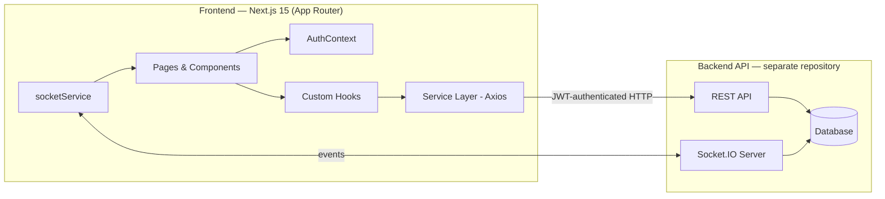
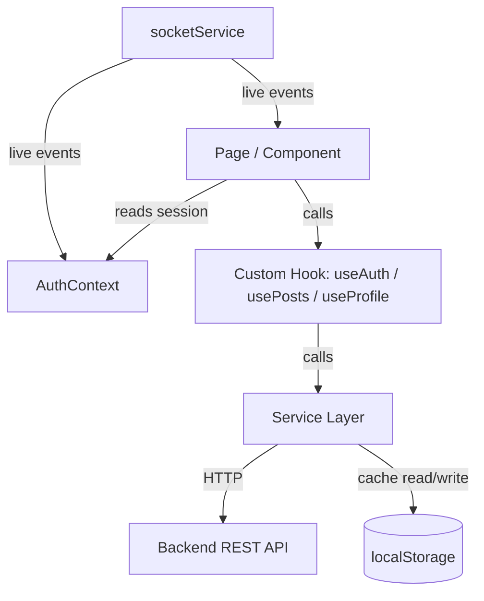
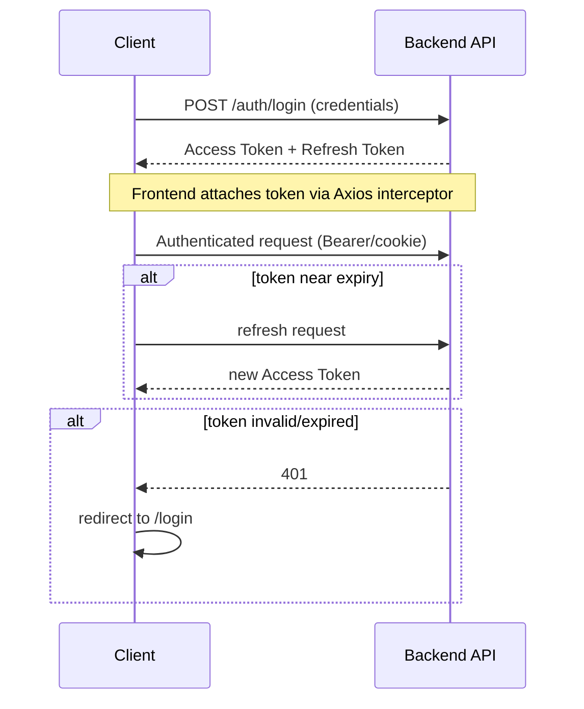
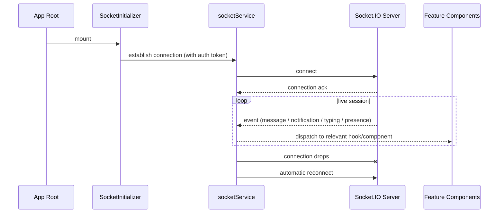

<div align="center">

# منصتي — Mansati

### An Arabic-first, RTL-native social platform frontend.


*Frontend repository — pairs with a separate backend API. Live preview and CI/test-coverage badges are not included below because no CI pipeline or test suite is documented in this repository yet (see [Future Improvements](#future-improvements)).*

</div>

---

## Table of Contents

1. [Project Overview](#project-overview)
2. [Why This Project Exists](#why-this-project-exists)
3. [Key Features](#key-features)
4. [Architecture Overview](#architecture-overview)
5. [Design System & UI/UX Philosophy](#design-system--uiux-philosophy)
6. [State Management Architecture](#state-management-architecture)
7. [Security Architecture](#security-architecture)
8. [Real-time Architecture (Socket.IO)](#real-time-architecture-socketio)
9. [Performance Strategy](#performance-strategy)
10. [Folder Structure](#folder-structure)
11. [Technology Stack](#technology-stack)
12. [Environment Variables](#environment-variables)
13. [Installation & Setup](#installation--setup)
14. [Development Workflow](#development-workflow)
15. [Build & Deployment](#build--deployment)
16. [Screenshots / Gallery](#screenshots--gallery)
17. [Future Improvements](#future-improvements)
18. [Contributing Guide](#contributing-guide)
19. [License](#license)
20. [Author & Contact](#author--contact)

---

## Project Overview

Mansati (منصتي — "my platform") is the frontend client for an Arabic-language social platform: profiles, a following graph, a reaction-and-comment post feed, private real-time messaging, live notifications, content sharing, and a full admin console. It's built on Next.js 15 (App Router), React 19, and TypeScript, and communicates with a separate backend over REST (Axios) and WebSocket (Socket.IO).

This document covers the **frontend only**. The backend, database, and infrastructure are out of scope here and live in a companion repository.

## Why This Project Exists

Most social-platform templates and starters are designed English-first and adapted for RTL languages after the fact — the layout, spacing, and interaction patterns often betray that origin (icons that don't mirror, text that clips, chat bubbles that orient wrong). Mansati's frontend takes the opposite starting point: Arabic and RTL are the default layout direction, not a locale switch layered on top.

The product problem being solved is a standard one — people need a place to post, follow, message, and get notified in real time — but the frontend also has to serve a second, distinct audience: platform operators. Rather than treating moderation as an afterthought bolted onto an admin flag, the app ships a parallel, fully-routed admin experience (`/admin/*`) with its own layout, navigation shell, and screens for user/content/message moderation, analytics, and system health — because a social product without an operational lever isn't really deployable.

## Key Features

### For Standard Users
- **Authentication** — login/registration with email and password validation; two-factor authentication support.
- **Profile management** — avatar and cover photo editing with instant preview before upload.
- **Follow graph** — follow/unfollow other users with live counter updates and instant notifications.
- **Posts** — text posts with multi-image/video upload and basic Markdown support.
- **Engagement** — seven reaction types, comments, and shares, with counters that update live.
- **Post sharing** — a dedicated `ShareModal` for copying a post link or sending it to another user via direct message.
- **Direct messaging** — real-time conversations via WebSocket, with typing indicators and read receipts.
- **Notifications** — live alerts for posts, messages, and reactions via a dynamic notification bell, with mark-all-as-read.
- **User search** — debounced, dynamic search by name with online-status indicators.
- **User discovery** — a browsable user directory with follow actions, name filtering, and live stats.
- **Shareable post permalinks** — `/posts/[id]` redirects to the main feed with auto-scroll and highlight of the target post, rather than duplicating a detail-page implementation.

### For Admins (Full Console)
- **Dashboard** — live stat cards (users, posts, messages, notifications).
- **User management** — search, filter by role/status, delete, enable/disable, edit roles, and bulk actions.
- **Post management** — filter by media presence or report count, individual or bulk deletion.
- **Message management** — view all conversations and messages, individual or bulk deletion, conversation search.
- **Analytics** — interactive charts for daily activity, content distribution, and user growth, with configurable time ranges.
- **System monitoring** — service status (database, API, Socket.IO), resource usage (CPU/RAM/disk), and threshold alerts.
- **Advanced settings** — general, security, notification, privacy, and appearance settings with instant save/reset.
- **First-admin bootstrap** — a dedicated flow for creating the first super-admin account from environment-provided credentials.

### Security
- JWT-based authentication (see [Security Architecture](#security-architecture) for the full, evidence-based breakdown, including a documentation discrepancy worth resolving).
- Password hashing via bcrypt *(backend-owned — noted here because it's part of the end-to-end auth story, not a frontend implementation detail)*.
- Route protection middleware for admin vs. standard-user access.
- Input sanitization to guard against injection.
- Rate limiting *(backend-owned)*.
- Strict CORS configuration *(backend-owned)*.
- Helmet.js HTTP security headers *(backend-owned)*.
- Automatic token refresh ahead of expiry.

### Performance
- Progressive loading via `React.lazy` and `Suspense`.
- Re-render minimization via `useCallback`, `useMemo`, and `memo`.
- `localStorage` caching for user/post data with a smart refresh strategy.
- Automatic image optimization via Next.js `Image`, resolved against full backend URLs.
- Persistent WebSocket connection with automatic reconnection on network loss.

---

## Architecture Overview



**Architectural decisions and their rationale, as evidenced by the documented structure:**

- **Next.js App Router** — chosen for file-system routing with nested layouts, which maps cleanly onto the app's two distinct experiences (standard user vs. admin) via route groups and a dedicated `admin/layout.tsx`, without duplicating shell markup per page.
- **Socket.IO over raw WebSocket** — gives automatic reconnection and a room/event abstraction for free, which the app leans on for messages, notifications, and presence rather than implementing reconnection logic manually.
- **JWT with HttpOnly cookies** — keeps tokens out of reach of JavaScript-based XSS, at the cost of some complexity in cross-origin request handling (`withCredentials`), which the security section below covers in more detail — including a discrepancy in this repository's own documentation that should be resolved.
- **Service-layer indirection** (`services/*.ts`) — every HTTP/WebSocket call is centralized behind a typed module per domain, so components and hooks never construct requests directly. This is what makes the token-refresh and error-normalization logic in `api.ts` a single choke point instead of scattered try/catch blocks.

The database technology behind the backend is not part of this repository's documentation — see the companion backend repository for that detail.

## Design System & UI/UX Philosophy

- **RTL as the default direction.** The component set — Navbar, Footer, post cards, chat UI, modals — is designed direction-aware from the start; RTL is not a `dir="rtl"` wrapper applied after an LTR design pass.
- **CSS Modules** scope styles per component, avoiding class collisions across the admin and consumer-facing surfaces, backed by two shared stylesheets (`globals.css`, `variables.css`) for design tokens.
- **Feature-based component organization**, not strict atomic design — `components/posts`, `components/users`, `components/messages`, `components/notifications`, `components/admin`, `components/layout`. Card/list/form is a repeating pattern within each domain folder, which keeps the codebase's shape predictable without imposing an atoms/molecules/organisms taxonomy that this codebase doesn't otherwise use.
- **Iconography** mixes React Icons and Font Awesome, chosen per context rather than standardized on a single set.
- **Data visualization** for admin analytics is handled by Recharts.
- **Accessibility** is not yet a systematized part of the design system — ARIA labeling and keyboard-navigation work are listed explicitly under [Future Improvements](#future-improvements) rather than claimed as done.

## State Management Architecture



State is deliberately kept to three layers rather than a global store:

1. **`AuthContext`** (React Context) — the single source of truth for session/identity and role.
2. **Custom hooks** (`useAuth`, `usePosts`, `useProfile`) — wrap each feature's data-fetching and local UI state, so components stay declarative and never call `services/` directly.
3. **Local component state** (`useState`) — ephemeral concerns: modal visibility, form inputs, typing indicators.

**Why Context + hooks instead of Redux or Zustand?** No global-store library is present in the documented dependency set. At this app's scope — one authenticated identity, and a handful of feature-scoped data domains that each already have a natural owner (a hook) — a global store would mostly duplicate what Context and the hook layer already provide, at the cost of more boilerplate and another dependency to reason about. The trade-off worth watching: as more components need to *share* feature state across route boundaries (e.g., a global unread-message count consumed by both the navbar and the messages page), the hook-per-feature pattern will need either prop-drilling or its own lightweight context per feature — which is a real limitation of this approach, not a hypothetical one.

`localStorage` supplements this as a caching layer for user/post data, reducing redundant fetches on repeat views.

## Security Architecture



**Documented, frontend-relevant security measures:**

| Concern | Mechanism |
|---|---|
| Token handling | Axios interceptors in `api.ts` attach the token to requests and proactively refresh it ahead of expiry |
| Route protection | Middleware-style checks gate role-restricted routes (e.g., `/admin/*`) before rendering |
| Input sanitization | A shared `sanitizeInput` utility strips malicious input client-side, as defense-in-depth (not a replacement for backend validation) |
| Safe media URLs | A `sanitizeImageUrl` utility constrains how uploaded/user-referenced image URLs are constructed before rendering |
| File uploads | File type and size are validated before upload |
| Authenticated WebSocket | The Socket.IO client sends the auth token on connection, so real-time channels are subject to the same identity checks as REST |
| CSRF | `withCredentials` combined with HttpOnly cookies, per the source documentation |

**⚠️ A discrepancy worth resolving before this is treated as authoritative:** this repository's own documentation describes token storage two different ways in two different places — the features list says tokens live in **HttpOnly cookies**, while the dedicated security section says tokens are stored in **`sessionStorage`**, with cookies as a backend-provided fallback. These are materially different security postures (HttpOnly cookies are inaccessible to JavaScript and thus resistant to XSS-based token theft; `sessionStorage` is readable by any script running on the page). This README does not resolve the contradiction — it flags it, because picking one to state confidently without checking `api.ts` and the login flow against actual `Set-Cookie`/storage calls would be documenting a guess as fact.

Backend-owned security measures referenced in the frontend's own feature list (bcrypt hashing, Helmet headers, rate limiting, CORS policy) are **not** frontend implementation details and are documented in the backend repository, not here.

## Real-time Architecture (Socket.IO)



- **`SocketInitializer`** establishes the WebSocket connection once, at app bootstrap, rather than per-component — avoiding duplicate connections across the messaging, notification, and presence surfaces.
- **`socketService`** is the single module responsible for the connection lifecycle: connect (with the auth token attached), event subscription, and automatic reconnection on network interruption.
- **Consumers documented in the source**: `ChatBox` (messages, typing state), `NotificationBell` (live notification delivery and unread counts), and follow/engagement counters (live count updates on the feed).
- Exact event names and payload shapes are not enumerated in this repository's documentation — treat the event list above as functionally confirmed, not as a wire-protocol reference.

## Performance Strategy

- **Code-splitting**: `React.lazy` + `Suspense` for progressive component loading.
- **Render minimization**: `useCallback`, `useMemo`, and `memo` applied to list-heavy, frequently-updating views (feed, user lists, chat).
- **Client-side caching**: `localStorage` caching of user/post data with an update strategy to reduce redundant network calls. No SWR or TanStack Query is documented in this repository — caching is hand-rolled at the hook/service layer.
- **Image optimization**: `next/image`, with URLs resolved against the backend's full media path via `sanitizeImageUrl`.
- **Resilient real-time connection**: automatic Socket.IO reconnection rather than requiring a manual page refresh after a network drop.

---

## Folder Structure

```
frontend/
├── public/                          # Static assets (default avatars, icons)
├── src/
│   ├── app/                         # Next.js App Router
│   │   ├── (auth)/                  # login, register, admin-login
│   │   ├── admin/                   # Admin console (own layout.tsx)
│   │   │   ├── analytics/
│   │   │   ├── messages/
│   │   │   ├── posts/
│   │   │   ├── settings/
│   │   │   ├── system/
│   │   │   └── users/
│   │   │       └── create/
│   │   ├── messages/
│   │   │   └── [userId]/
│   │   ├── posts/
│   │   │   └── [id]/                # Redirects to /posts?highlight=id
│   │   ├── profile/[id]/
│   │   ├── users/
│   │   ├── error.tsx
│   │   ├── layout.tsx
│   │   └── not-found.tsx
│   ├── components/
│   │   ├── admin/                   # AdminHeader, AdminSidebar, RecentUsers, RecentPosts, SystemHealth
│   │   ├── layout/                  # Navbar, Footer
│   │   ├── messages/                # ChatBox
│   │   ├── notifications/           # NotificationBell
│   │   ├── posts/                   # PostCard, PostForm, PostsList, ShareModal
│   │   ├── users/                   # ProfileCard, UserCard, UserList
│   │   └── SocketInitializer.tsx
│   ├── context/
│   │   └── AuthContext.tsx
│   ├── hooks/
│   │   ├── useAuth.ts
│   │   ├── usePosts.ts
│   │   └── useProfile.ts
│   ├── services/
│   │   ├── api.ts                   # Axios instance, interceptors, token refresh
│   │   ├── adminService.ts
│   │   ├── followService.ts
│   │   ├── messageService.ts
│   │   ├── notificationService.ts
│   │   ├── postService.ts
│   │   ├── socketService.ts
│   │   └── userService.ts
│   ├── types/                       # Admin, Message, Notification, Post, User
│   ├── utils/                       # constants, formatDate, security
│   └── styles/                      # globals.css, variables.css
├── .env.local
├── next.config.js
└── package.json
```

## Technology Stack

| Category | Technology | Role |
|---|---|---|
| Framework |  15.2 | App Router, SSR, routing, build pipeline |
| UI Library |  19.0 | Component model |
| Language |  5.0 | Type safety |
| Real-time |  4.7 (client) | Live messages, notifications, presence |
| HTTP client | Axios (with interceptors) | REST calls, token attachment/refresh |
| Styling | CSS Modules | Scoped component styling |
| Charts | Recharts | Admin analytics visualizations |
| Icons | React Icons, Font Awesome | UI iconography |
| Dates | date-fns | Arabic-friendly date/time formatting |
| Auth utilities | jwt-decode | Client-side token inspection |
| Tooling | ESLint, Prettier | Code style and consistency |

## Environment Variables

| Variable | Required | Description | Example |
|---|---|---|---|
| `NEXT_PUBLIC_API_URL` | Yes | Backend REST API base URL | `http://localhost:5000` |
| `NEXT_PUBLIC_SOCKET_URL` | Yes | Backend WebSocket (Socket.IO) URL | `http://localhost:5000` |
| `NEXT_PUBLIC_ADMIN_USER` | Yes (for first-admin bootstrap only) | Super-admin username used by `/admin-login` to create the first admin account | `admin` |
| `NEXT_PUBLIC_ADMIN_PASS` | Yes (for first-admin bootstrap only) | Super-admin password for the same flow | `123456` |
| `NEXT_PUBLIC_ADMIN_EMAIL` | Yes (for first-admin bootstrap only) | Super-admin email for the same flow | `admin@example.com` |

> **Security note**: the `NEXT_PUBLIC_ADMIN_*` variables exist solely to bootstrap the first super-admin account and are exposed to the client bundle (as all `NEXT_PUBLIC_*` variables are, by Next.js convention). Rotate these before any non-local deployment, and do not treat them as a durable credential store.

## Installation & Setup

**Prerequisites**: Node.js v20+, npm/yarn/pnpm, and a running backend reachable at the URL configured below.

```bash
git clone https://github.com/bzbsndndjnd/mansati-frontend.git
cd mansati-frontend
npm install
```

Create `.env.local` in the project root using the table above, then start the dev server:

```bash
npm run dev
```

The app opens automatically at `http://localhost:3000`.

**Troubleshooting**

| Symptom | Likely cause | Fix |
|---|---|---|
| Requests fail immediately / network errors on every page | Backend not running, or `NEXT_PUBLIC_API_URL` mismatched | Confirm the backend is up at the configured URL and the port matches |
| Login succeeds but subsequent requests 401 | Token not attached, or expired without refresh firing | Check `api.ts` interceptor configuration and confirm the backend issues a working refresh token |
| Messages/notifications never arrive live | `NEXT_PUBLIC_SOCKET_URL` unset or unreachable | Confirm the Socket.IO server is reachable at that URL and the browser console shows a successful connection |
| `/admin-login` doesn't create an admin | `NEXT_PUBLIC_ADMIN_*` variables missing or don't match backend expectations | Verify all three admin bootstrap variables are set and match what the backend validates against |

## Development Workflow

```bash
npm run dev
```

The dev server expects a live backend at the configured API/Socket URLs — there is no documented mock or offline mode, so auth, feed, and real-time features will fail without a running backend. Code style is enforced via ESLint + Prettier; new components should follow the existing feature-folder pattern (see [Folder Structure](#folder-structure)) rather than introducing a new organizational convention.

## Build & Deployment

```bash
npm run build
npm start
```

`next build` produces an optimized production build (route/image optimization, SSR compilation); `next start` serves it. A live preview is hosted on **Vercel**, which fits a Next.js App Router project's zero-config SSR/edge deployment model. Any deployment target needs `NEXT_PUBLIC_API_URL` and `NEXT_PUBLIC_SOCKET_URL` pointed at a reachable backend, and rotated admin-bootstrap credentials.

---

## Screenshots / Gallery

<details open>
  <summary><b>🔹 Part 1: User Experience & Public Interfaces (sh1–sh8)</b></summary>
  <br/>
  <div align="center">
    <table>
      <tr>
        <td align="center" width="50%"><br/><sub><strong>sh1 – Login screen</strong>: modern design with input fields and sign-in action.</sub></td>
        <td align="center" width="50%"><br/><sub><strong>sh2 – Home timeline</strong>: post feed rendered in a clean card layout.</sub></td>
      </tr>
      <tr>
        <td align="center"><br/><sub><strong>sh3 – Reaction system</strong>: the seven-reaction picker (like, love, etc.).</sub></td>
        <td align="center"><br/><sub><strong>sh4 – User profile</strong>: avatar, cover photo, and follow stats.</sub></td>
      </tr>
      <tr>
        <td align="center"><br/><sub><strong>sh5 – Edit profile</strong>: personal info editing and image upload.</sub></td>
        <td align="center"><br/><sub><strong>sh6 – Conversation list</strong>: available chat contacts.</sub></td>
      </tr>
      <tr>
        <td align="center"><br/><sub><strong>sh7 – Active chat</strong>: message bubbles and online status.</sub></td>
        <td align="center"><br/><sub><strong>sh8 – Share modal</strong>: send a post to a friend or copy its link.</sub></td>
      </tr>
    </table>
  </div>
</details>

<details>
  <summary><b>🔹 Part 2: Admin Dashboard & Oversight (sh9–sh20)</b></summary>
  <br/>
  <div align="center">
    <table>
      <tr>
        <td align="center"><br/><sub><strong>sh9 – Admin dashboard</strong>: stat cards overview.</sub></td>
        <td align="center"><br/><sub><strong>sh10 – User management</strong>: control table for users.</sub></td>
      </tr>
      <tr>
        <td align="center"><br/><sub><strong>sh11 – 404 page</strong>: styled not-found route.</sub></td>
        <td align="center"><br/><sub><strong>sh12 – User analytics</strong>: interactive charts.</sub></td>
      </tr>
      <tr>
        <td align="center"><br/><sub><strong>sh13 – Post management</strong>: filtering and bulk delete.</sub></td>
        <td align="center"><br/><sub><strong>sh14 – Message management</strong>: full conversation overview.</sub></td>
      </tr>
      <tr>
        <td align="center"><br/><sub><strong>sh15 – System health</strong>: CPU/memory usage.</sub></td>
        <td align="center"><br/><sub><strong>sh16 – Advanced settings</strong>: security and privacy customization.</sub></td>
      </tr>
      <tr>
        <td align="center"><br/><sub><strong>sh17 – Create user</strong>: manual member addition.</sub></td>
        <td align="center"><br/><sub><strong>sh18 – Advanced search</strong>: complex database filtering.</sub></td>
      </tr>
      <tr>
        <td align="center"><br/><sub><strong>sh19 – Admin sidebar</strong>: navigation and color consistency.</sub></td>
        <td align="center"><br/><sub><strong>sh20 – System logs</strong>: event tracking.</sub></td>
      </tr>
    </table>
  </div>
</details>

<details>
  <summary><b>🔹 Part 3: Advanced Settings & Infrastructure (sh21–sh33)</b></summary>
  <br/>
  <div align="center">
    <table>
      <tr>
        <td align="center"><br/><sub><strong>sh21 – Confirmation dialogs</strong>: safe-delete popups.</sub></td>
        <td align="center"><br/><sub><strong>sh22 – User details</strong>: history, role, and posts.</sub></td>
      </tr>
      <tr>
        <td align="center"><br/><sub><strong>sh23 – Edit user roles</strong>: role changes with instant save.</sub></td>
        <td align="center"><br/><sub><strong>sh24 – Smart post filtering</strong>: filter by report count.</sub></td>
      </tr>
      <tr>
        <td align="center"><br/><sub><strong>sh25 – Admin alerts</strong>: system notifications for admins.</sub></td>
        <td align="center"><br/><sub><strong>sh26 – Security settings</strong>: password length and session policy.</sub></td>
      </tr>
      <tr>
        <td align="center"><br/><sub><strong>sh27 – Appearance customization</strong>: platform colors and site logo.</sub></td>
        <td align="center"><br/><sub><strong>sh28 – Report export</strong>: extracting activity data.</sub></td>
      </tr>
      <tr>
        <td align="center"><br/><sub><strong>sh29 – Admin sign-out</strong>: administrator account safety confirmation.</sub></td>
        <td align="center"><br/><sub><strong>sh30 – Super-admin bootstrap</strong>: initial screen for creating the primary admin account.</sub></td>
      </tr>
      <tr>
        <td align="center"><br/><sub><strong>sh31 – Validation system</strong>: smart error messages on invalid input.</sub></td>
        <td align="center"><br/><sub><strong>sh32 – Full dashboard view</strong>: complete interface overview.</sub></td>
      </tr>
      <tr>
        <td align="center"><br/><sub><strong>sh33 – Sign out</strong>: secure token clearing.</sub></td>
        <td align="center"></td>
      </tr>
    </table>
  </div>
</details>

---

## Future Improvements

- [ ] Groups — public/private groups, membership, in-group posts.
- [ ] Advanced search (by date, media type, engagement).
- [ ] Desktop push notifications via the Web Push API.
- [ ] Dark mode, with persisted user preference.
- [ ] WebP image pipeline via `next/image`.
- [ ] Automated testing — unit (Jest) and integration (Cypress).
- [ ] Component documentation via Storybook.
- [ ] A formal accessibility pass — ARIA labeling, keyboard navigation.
- [ ] Live streaming via WebRTC.
- [ ] Hashtag system for discovery and classification.
- [ ] Resolve the token-storage documentation conflict (HttpOnly cookie vs. `sessionStorage`) noted under [Security Architecture](#security-architecture).
- [ ] CI pipeline and test-coverage reporting.

## Contributing Guide

1. Fork the repository.
2. Create a feature branch: `git checkout -b feature/amazing-feature`.
3. Implement your change, following the existing feature-folder component pattern and ESLint/Prettier conventions.
4. Add tests where the change touches logic that can be tested (note: this repository does not yet have an established test suite — see Future Improvements).
5. Push your branch and open a Pull Request with a clear description of the change and its motivation.

**Code style**: match the existing patterns — CSS Modules per component, service-layer indirection for all network calls, hooks for feature-scoped state. **PR expectations**: a working build (`npm run build`), no new ESLint errors, and a description of what changed and why.

## License

MIT — see the `LICENSE` file for full terms.

```
MIT License
Copyright (c) 2026 Mohammed Qannan
Permission is hereby granted, free of charge, to any person obtaining a copy
of this software and associated documentation files (the "Software"), to deal
in the Software without restriction, including without limitation the rights
to use, copy, modify, merge, publish, distribute, sublicense, and/or sell
copies of the Software, subject to the inclusion of the above copyright
notice in all copies or substantial portions of the Software.
THE SOFTWARE IS PROVIDED "AS IS", WITHOUT WARRANTY OF ANY KIND, EXPRESS OR
IMPLIED, INCLUDING BUT NOT LIMITED TO THE WARRANTIES OF MERCHANTABILITY,
FITNESS FOR A PARTICULAR PURPOSE AND NONINFRINGEMENT.
```

## Author & Contact

**Mohammed Qannan**
Frontend Developer specializing in React, Next.js, and TypeScript — with a focus on UI architecture, real-time integration, and performance.

- Email: [m.qannan@example.com](mailto:m.qannan@example.com)
- LinkedIn: [linkedin.com/in/mqannan](https://linkedin.com/in/mqannan)
- GitHub: [github.com/mqannan](https://github.com/mqannan)
- Twitter/X: [@mqannan_dev](https://twitter.com/mqannan_dev)

**Project links**
- Frontend repository: https://github.com/mohammed-dev-stack/mansati-frontend
- Backend repository: https://github.com/mohammed-dev-stack/mansati-backend
- Live preview: https://mansati-frontend-b2kl.vercel.app/admin-login
