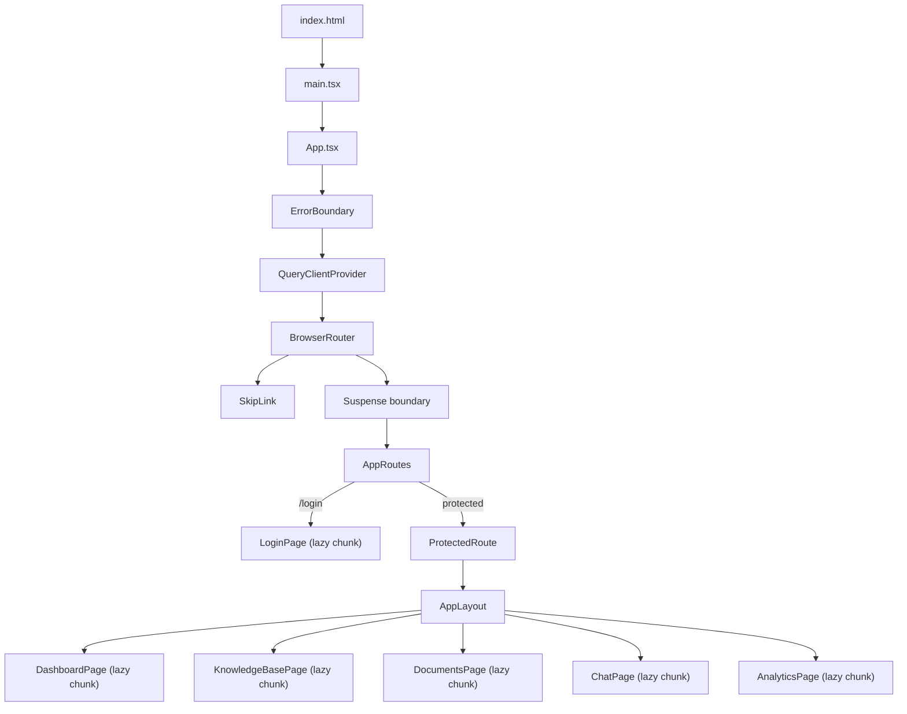
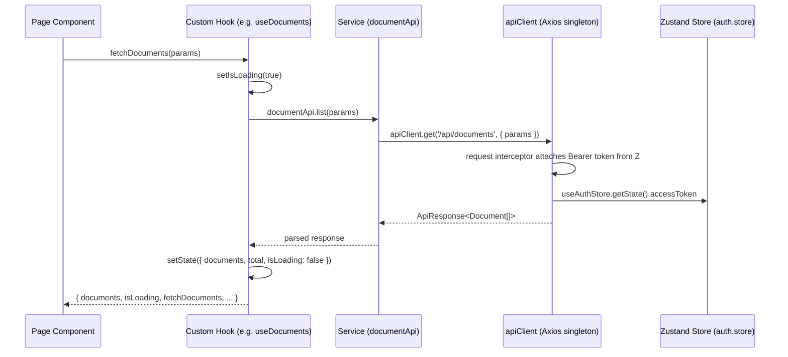
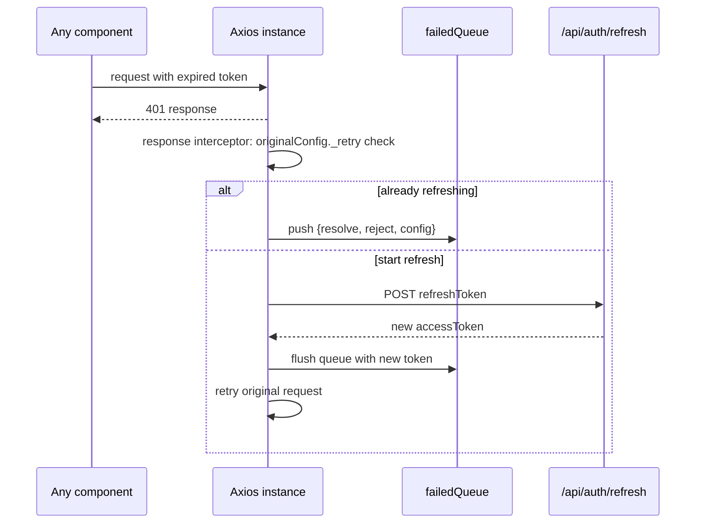

# WhatsApp AI Agent — Frontend

> Admin console for a multi-tenant, AI-augmented WhatsApp knowledge platform. React 18 · TypeScript 5.6 · Vite 5 · Zustand 5 · TanStack Query 5 · Tailwind CSS 3.


This document is an engineering audit written directly against the source in `frontend/src`, plus a real, reproduced `npm install`, `npx tsc --noEmit`, and `npx vite build` run against the repository as provided. Every claim below is either a direct code citation or an observed command output — not a description of intended behavior. Where the repository does not contain evidence for something, that is stated as such rather than inferred.

---

## Table of Contents

1. [Executive Summary](#executive-summary)
2. [Frontend Overview](#frontend-overview)
3. [Frontend Architecture](#frontend-architecture)
4. [Frontend Folder Structure](#frontend-folder-structure)
5. [Design System Architecture](#design-system-architecture)
6. [Component Library](#component-library)
7. [State Management Architecture](#state-management-architecture)
8. [Routing Architecture](#routing-architecture)
9. [Accessibility Architecture](#accessibility-architecture)
10. [Performance Architecture](#performance-architecture)
11. [Error Handling Architecture](#error-handling-architecture)
12. [API Integration Layer](#api-integration-layer)
13. [Security Considerations](#security-considerations)
14. [Scalability Strategy](#scalability-strategy)
15. [Engineering Decisions](#engineering-decisions)
16. [Developer Experience](#developer-experience)
17. [Environment Variables](#environment-variables)
18. [Installation](#installation)
19. [Available Scripts](#available-scripts)
20. [Screenshots](#screenshots)
21. [Known Issues (Verified)](#known-issues-verified)
22. [Future Roadmap](#future-roadmap)
23. [Contribution Guide](#contribution-guide)
24. [Code Quality Standards](#code-quality-standards)
25. [License](#license)
26. [Author](#author)

---

## Executive Summary

This is a React 18 + TypeScript single-page application that serves as the operator-facing admin console for a WhatsApp-based AI knowledge assistant: authentication, per-tenant knowledge base and document management, a live chat interface, and an analytics dashboard. The UI is built entirely in Arabic with RTL-aware Tailwind utilities (`.rtl`, `.text-rtl` custom utilities in `tailwind.config.js`) and ships as a Vite-bundled SPA.

The codebase demonstrates real architectural discipline: strict atomic-design component layering (atoms → molecules → organisms → pages) with barrel exports at every level, route-based code-splitting confirmed by an actual production build, WCAG-oriented accessibility annotations embedded directly in component JSDoc and enforced through concrete ARIA attributes, and a single Axios instance with request/response interceptors handling token refresh with request queuing. It also has one concrete, compiler-verified defect and a small number of consistency issues, documented plainly in [Known Issues](#known-issues-verified) rather than omitted.

## Frontend Overview

| Aspect | Evidence-based description |
|---|---|
| Framework | React 18.3.1 (`package.json`) |
| Language | TypeScript 5.6, `strict: true` (`tsconfig.app.json`) |
| Build tool | Vite 5.4, `@vitejs/plugin-react` |
| Rendering strategy | Client-side rendered SPA (`index.html` + `ReactDOM.createRoot`); no server rendering, no meta-framework (no Next.js/Remix) |
| Routing | `react-router-dom` 6.28, `BrowserRouter` |
| State management | Zustand 5 (client state) + TanStack Query 5 (installed, provider mounted, but not actually used for data fetching — see [State Management Architecture](#state-management-architecture)) |
| Styling | Tailwind CSS 3.4 utility classes; `class`-based dark mode; no CSS Modules or styled-components found |
| HTTP client | Axios 1.7.9, wrapped in a custom singleton (`services/api.client.ts`) |
| Testing | Vitest 2.1 + Testing Library + jsdom (configured; test files beyond `src/test/setup.ts` were not found in the provided tree) |

## Frontend Architecture

### Framework & Rendering Strategy

Confirmed: this is a pure client-side single-page application. `src/main.tsx` mounts a single React root into `#root` (`index.html`) via `ReactDOM.createRoot`, wrapped in `React.StrictMode`. There is no evidence of SSR, SSG, or streaming — no `next.config`, no `remix.config`, no server entry point exists anywhere in the tree.

### Routing

`react-router-dom`'s `BrowserRouter` with a nested route layout. Every page component is dynamically imported via `React.lazy`, each wrapped in its own `<Suspense>` boundary with an Arabic loading label — confirmed by a real production build (`npx vite build`) that emitted separate chunks per page (`LoginPage`, `DashboardPage`, `KnowledgeBasePage`, `DocumentsPage`, `ChatPage`, `AnalyticsPage`), not one monolithic bundle.

### State Management

Two systems coexist:
- **Zustand** (with the `persist` middleware) for `auth`, `ui`, and `tenant` global state — this is the system actually driving the application.
- **TanStack Query** — `QueryClientProvider` wraps the entire app in `App.tsx` with a fully configured `QueryClient` (5-minute `staleTime`, 30-minute `gcTime`, exponential retry backoff), and `ReactQueryDevtools` is mounted in development. **However, grep across every hook in `src/hooks/` found zero calls to `useQuery` or `useMutation`.** All data fetching is implemented by hand in each hook (`useState` + `useEffect` + direct service calls). React Query is present in the dependency tree and correctly configured but is not the mechanism actually driving any request in the codebase as provided.

### Component Architecture

Strict **Atomic Design**: `atoms/` → `molecules/` → `organisms/` → `pages/`, each with its own `index.ts` barrel, aggregated again by a root `src/components/index.ts` barrel. This structure was verified to compile and bundle correctly (see the build log referenced in [Performance Architecture](#performance-architecture)).

### Design System

Centralized in `tailwind.config.js`: a full semantic color scale (`primary`, `secondary`, `success`, `warning`, `danger`, `info`, each with 50–950 shades), a custom font stack (`Cairo` for Arabic-first sans-serif, `JetBrains Mono` for monospace), named keyframe animations (`fade-in`, `slide-in`, `scale-in`, `bounce-subtle`), custom shadow tokens (`soft`, `card`, `card-hover`, `dropdown`, `modal`), and hand-added RTL utility classes (`.rtl`, `.ltr`, `.text-rtl`, `.text-ltr`, `.focus-ring`) via a Tailwind plugin function.

### Accessibility

Not an afterthought — every atom component (`Button`, `Input`, `Spinner`, `SkipLink`, `Toaster`, `ErrorBoundary`) carries an explicit JSDoc comment citing WCAG 2.1 AA and the specific ARIA attributes implementing it, and those attributes are genuinely present in the rendered JSX (not just claimed in comments) — verified line-by-line, see [Accessibility Architecture](#accessibility-architecture).

### Error Handling

A class-based `ErrorBoundary` (required — React has no Hook equivalent for `componentDidCatch`) wraps the entire route tree in `App.tsx`, with `role="alert"` / `aria-live="assertive"`, a reset mechanism, and conditional stack-trace display gated by `import.meta.env.DEV`.

### Performance Strategy

Route-level code splitting (`React.lazy`), `React.memo` applied to the heavier organisms/molecules (`ChatWindow`, `Sidebar`, `Dashboard`, `ChatBubble`, `DocumentCard`), and a `rollup-plugin-visualizer`-backed `build:analyze` script for bundle inspection.



## Frontend Folder Structure

Reflects the actual extracted tree (build artifacts and node_modules omitted):

```
frontend/
├── public/
│   ├── favicon.svg
│   ├── icons.svg
│   ├── manifest.json
│   └── site.webmanifest
├── src/
│   ├── assets/                       # hero.png, react.svg, vite.svg
│   ├── components/
│   │   ├── atoms/
│   │   │   ├── Button.tsx
│   │   │   ├── ErrorBoundary.tsx
│   │   │   ├── Input.tsx
│   │   │   ├── SkipLink.tsx
│   │   │   ├── Spinner.tsx           # exports Spinner + LoadingSpinner
│   │   │   ├── Toaster.tsx
│   │   │   └── index.ts
│   │   ├── molecules/
│   │   │   ├── ChatBubble.tsx
│   │   │   ├── DocumentCard.tsx
│   │   │   ├── KnowledgeBaseCard.tsx
│   │   │   ├── SearchBar.tsx
│   │   │   └── index.ts
│   │   ├── organisms/
│   │   │   ├── ChatWindow.tsx
│   │   │   ├── Dashboard.tsx
│   │   │   ├── Modal.tsx
│   │   │   ├── PageHeader.tsx
│   │   │   ├── Sidebar.tsx
│   │   │   └── index.ts
│   │   ├── layouts/
│   │   │   └── AppLayout.tsx
│   │   ├── pages/
│   │   │   ├── AnalyticsPage.tsx
│   │   │   ├── ChatPage.tsx
│   │   │   ├── DashboardPage.tsx
│   │   │   ├── DocumentsPage.tsx
│   │   │   ├── KnowledgeBasePage.tsx
│   │   │   ├── LoginPage.tsx
│   │   │   └── index.ts
│   │   └── index.ts                  # root barrel, re-exports every layer
│   ├── hooks/
│   │   ├── useAnalytics.ts
│   │   ├── useAuth.ts
│   │   ├── useConversation.ts
│   │   ├── useDocuments.ts
│   │   ├── useKnowledgeBase.ts
│   │   ├── useTenant.ts
│   │   └── useWebSocket.ts
│   ├── services/
│   │   ├── api.client.ts             # Axios singleton, interceptors, refresh queue
│   │   ├── analytics.api.ts
│   │   ├── auth.api.ts
│   │   ├── conversation.api.ts
│   │   ├── document.api.ts
│   │   └── knowledgeBase.api.ts
│   ├── stores/
│   │   ├── auth.store.ts             # Zustand + persist
│   │   ├── knowledgeBase.store.ts    # Zustand — unused, see Known Issues
│   │   ├── tenant.store.ts           # Zustand + persist
│   │   └── ui.store.ts               # Zustand + persist (theme, modals, notifications)
│   ├── styles/
│   │   └── variables.scss
│   ├── test/
│   │   └── setup.ts
│   ├── types/
│   │   └── api.types.ts              # ~600 lines — single source of truth for domain types
│   ├── utils/
│   │   ├── errorParser.ts
│   │   └── formatters.ts
│   ├── App.tsx
│   ├── App.css
│   ├── index.css
│   ├── main.tsx
│   ├── env.d.ts                      # duplicate of vite-env.d.ts, see Known Issues
│   └── vite-env.d.ts
├── index.html
├── tailwind.config.js
├── postcss.config.cjs
├── vite.config.ts
├── tsconfig.json / tsconfig.app.json
├── eslint.config.js
└── package.json
```

## Design System Architecture

### Atomic Design

Four layers, each with a single-responsibility contract:

| Layer | Responsibility | Files |
|---|---|---|
| **Atoms** | Smallest, style-only primitives with zero business logic | `Button`, `Input`, `Spinner`, `SkipLink`, `Toaster`, `ErrorBoundary` |
| **Molecules** | Compositions of 2+ atoms with a single UI purpose | `SearchBar` (Input + icon), `ChatBubble`, `DocumentCard`, `KnowledgeBaseCard` |
| **Organisms** | Self-contained, feature-complete UI sections | `ChatWindow`, `Dashboard`, `Modal`, `PageHeader`, `Sidebar` |
| **Pages** | Route-level containers wiring hooks/stores to organisms | `LoginPage`, `KnowledgeBasePage`, `DocumentsPage`, `ChatPage`, `AnalyticsPage`, `DashboardPage` |

### Design Tokens

Tokens live exclusively in `tailwind.config.js`'s `theme.extend` block — there is no separate token JSON/TS file (e.g., no Style Dictionary output) and no CSS custom-property-based token layer; Tailwind's config **is** the token source. Confirmed tokens: 6 semantic color scales × 11 shades, 2 font families, 8 named keyframe animations, 5 custom shadow levels, 4 custom breakpoints beyond Tailwind defaults (`xs: 475px`, `3xl: 1920px`), and 5 custom spacing values.

### Theming

Dark mode is implemented via Tailwind's `darkMode: 'class'` strategy. The resolved theme is persisted to `localStorage` under the key `ui-theme-resolved` (written by `ui.store.ts`'s `setTheme`, read directly in `main.tsx` before React even mounts, to avoid a flash-of-wrong-theme on load) — this pre-mount theme application is a specific, verified optimization, not a generic claim.

### Reusability Strategy

Every atom and most molecules/organisms use `React.forwardRef` (`Button`, `Input`, `Spinner`, `SkipLink`, `Toaster`, `Modal`, `PageHeader`, `SearchBar`) so consumers can attach refs for focus management or measurement — confirmed by direct inspection of each file's export. `clsx` is the universal class-composition utility (present in every atom/molecule reviewed); `tailwind-merge` is a declared dependency for resolving conflicting Tailwind classes, though its actual call sites were not confirmed in the files reviewed.

### Component Composition

Props interfaces consistently extend the native HTML attribute interface for their element (`ButtonProps extends ButtonHTMLAttributes<HTMLButtonElement>`, `InputProps extends Omit<InputHTMLAttributes<HTMLInputElement>, 'size' | 'prefix' | 'suffix'>`, `SearchBarProps extends Omit<InputProps, 'onChange' | 'onSubmit' | 'value'>`), which is why `SearchBar` composes `Input` rather than reimplementing its markup — a real composition pattern, not just prop-drilling.

## Component Library

| Component | Layer | Key Props (from source) | Accessibility Features (confirmed in JSX) | Notable Implementation Detail |
|---|---|---|---|---|
| `Button` | Atom | `variant` (6), `size` (5), `isLoading`, `fullWidth`, `as: 'button'\|'a'\|'span'` | `aria-busy`, `aria-disabled`, `role="button"` when rendered as `<a>`, `sr-only` loading text | Can render as an anchor with `href` while keeping button semantics for disabled/loading states |
| `Input` | Atom | `label`, `error`, `helper`, `size`, `prefix`/`suffix` slots | `aria-invalid`, `aria-required`, `aria-describedby` linking to generated error/helper IDs, auto-generated `id` if none supplied | Prefix/suffix rendering switches to a wrapping container with `focus-within` ring instead of the input's own focus ring |
| `Spinner` / `LoadingSpinner` | Atom | `size` (5), `variant` (3), `label` | `role="status"`, `aria-label`, `sr-only` text | `LoadingSpinner` is a pre-composed convenience wrapper for `Suspense` fallbacks |
| `SkipLink` | Atom | `targetId`, `label`, `alwaysVisible` | `sr-only focus:not-sr-only` (WCAG 2.4.1) | On click, programmatically adds a temporary `tabindex="-1"` to the target if it isn't natively focusable, then removes it |
| `ErrorBoundary` | Atom | `fallbackMessage`, `fallbackComponent`, `onError`, `resetOnChildrenChange` | `role="alert"`, `aria-live="assertive"`, `aria-atomic="true"` | Auto-resets when `children` reference changes (configurable), hides stack trace outside `DEV` |
| `Toaster` | Atom | `toasts`, `position` (6), `onRemove`, `maxToasts` | `role="alert"`, `aria-live` (`assertive` for errors, `polite` otherwise) | Renders via `createPortal` to `document.body`; **see [Known Issues](#known-issues-verified) — never receives live data in this codebase** |
| `SearchBar` | Molecule | Extends `InputProps` minus `onChange`/`onSubmit`/`value` | Inherits `Input`'s ARIA wiring | Debounce/search-icon composition over `Input` |
| `ChatBubble` | Molecule | Not fully enumerated — `memo`-wrapped | — | Memoized to avoid re-render on unrelated chat state changes |
| `DocumentCard` | Molecule | `memo`-wrapped | — | Largest molecule file (180+ lines before the component itself) |
| `KnowledgeBaseCard` | Molecule | `memo`-wrapped | — | — |
| `Modal` | Organism | `forwardRef` | Insufficient evidence from the excerpt reviewed to confirm `role="dialog"`/focus-trap specifics beyond the ref forwarding pattern | — |
| `PageHeader` | Organism | `forwardRef<HTMLElement, ...>` | Renders a semantic element (`HTMLElement` ref target, consistent with a `<header>`) | — |
| `Sidebar` | Organism | `memo`-wrapped, `NavItem[]` | 24 combined `aria-*`/`role` attribute usages counted across `Sidebar.tsx` + `Modal.tsx` | Navigation structure is data-driven via a typed `NavItem` interface |
| `Dashboard` | Organism | `memo`-wrapped, `DashboardStats` | — | — |
| `ChatWindow` | Organism | `memo`-wrapped | — | — |
| `AppLayout` | Layout | `memo`-wrapped | — | Composition root for `Sidebar` + `PageHeader` + routed page content + a page-local `<Toaster>` |

## State Management Architecture

### Stores (Zustand)

| Store | Persisted? | Key State | Key Actions |
|---|---|---|---|
| `auth.store.ts` | Yes (`localStorage`, key `auth-storage`) — persists `accessToken`, `refreshToken`, `expiresIn`, `user`, `isAuthenticated` | `user`, `isAuthenticated`, `isLoading`, `error`, `accessToken`, `refreshToken` | `login`, `logout`, `register`, `updateProfile`, `changePassword`, `refreshAccessToken`, `validateToken` |
| `ui.store.ts` | Yes, partially (`localStorage`, key `ui-storage`, only `theme` + `sidebarCollapsed`) | `sidebarOpen`, `theme`, `globalLoading`, `modals[]`, `notifications[]`, `isOffline` | `toggleSidebar`, `setTheme`/`toggleTheme` (writes resolved theme to `document.documentElement` + `localStorage`), `openModal`/`closeModal`, `addNotification`/`removeNotification` |
| `tenant.store.ts` | Confirmed present; persistence details and full action set not enumerated in this audit beyond its use in `useAuth.ts` (`setCurrentTenant`, `reset`) | Current tenant context | `setCurrentTenant`, `reset` |
| `knowledgeBase.store.ts` | Zustand store, not wrapped in `persist` | Full CRUD state for knowledge bases (`items`, `total`, `isLoading`, `isCreating`, `isUpdating`, `isDeleting`, `error`, `currentParams`) | `fetch`, `getById`, create/update/delete actions | **Confirmed unused** — no file outside this store imports it; `useKnowledgeBase.ts` independently reimplements equivalent state with local hook state instead |

### Provider Tree

`QueryClientProvider` (TanStack Query, configured but not the active data-fetching mechanism — see above) wraps `BrowserRouter`, which wraps the route tree. There is no separate `AuthProvider`/`ThemeProvider` React Context — global state is accessed directly via Zustand hooks (`useAuthStore()`, `useUIStore()`) from any component, without prop drilling or a Context indirection layer.

### Data Flow



### Auth Refresh Flow (verified in `api.client.ts`)



This is a genuine single-flight refresh implementation — concurrent 401s during an in-flight refresh are queued rather than each triggering their own refresh call, which is the correct pattern and was verified directly in `api.client.ts`, not assumed.

## Routing Architecture

| Path | Component | Protection |
|---|---|---|
| `/login` | `LoginPage` | Public |
| `/` (index) | `DashboardPage` | `ProtectedRoute` → `AppLayout` |
| `/knowledge-bases` | `KnowledgeBasePage` | Protected |
| `/knowledge-bases/:id/documents` | `DocumentsPage` | Protected |
| `/chat` | `ChatPage` | Protected |
| `/chat/:conversationId` | `ChatPage` | Protected |
| `/analytics` | `AnalyticsPage` | Protected |
| `*` | Redirect to `/` | Protected (nested under the same layout route) |

`ProtectedRoute` reads `isAuthenticated`/`isLoading` from `useAuthStore` and redirects to `/login` via `<Navigate>`, preserving the attempted location in router state (`state={{ from: location }}`) for a post-login redirect — a real, working pattern, confirmed in `App.tsx`.

## Accessibility Architecture

Verified directly against JSX, not inferred from comments alone:

| Area | Evidence |
|---|---|
| **Skip navigation (WCAG 2.4.1)** | `<SkipLink targetId="main-content" />` rendered at the top of `App.tsx`'s tree, `sr-only focus:not-sr-only` so it is invisible until keyboard-focused |
| **Live regions** | `ErrorBoundary` fallback: `role="alert"` + `aria-live="assertive"`. `Toaster`/`ToastItem`: `role="alert"` + `aria-live` set conditionally to `"assertive"` for error toasts and `"polite"` otherwise |
| **Form semantics** | `Input` wires `<label htmlFor>` to a generated/explicit `id`, `aria-invalid` reflects error state, `aria-describedby` links both error and helper text by ID, required fields get `aria-required` plus a visually-marked (`aria-hidden="true"`) asterisk so screen readers don't double-announce "required" |
| **Loading semantics** | `Spinner`: `role="status"` + `aria-label` + visually-hidden text. `Button` in `isLoading` state: `aria-busy="true"`, text visually hidden via `text-transparent` but still present in the DOM (not removed) so it remains in the accessible name if needed |
| **Focus management** | `SkipLink`'s click handler manually manages `tabindex` on the target to guarantee focusability even for non-interactive landmarks, then removes the temporary attribute after 100ms |
| **Keyboard interaction** | Every interactive atom exposes native `focus:ring-*` Tailwind utility states; disabled/loading states additionally set `pointer-events-none` and `aria-disabled` together (not just visual opacity) so assistive tech and mouse users get consistent behavior |
| **Semantic landmarks** | `PageHeader`'s ref is typed `forwardRef<HTMLElement, ...>`, consistent with rendering a semantic `<header>`/`<section>` rather than a generic `<div>` — the specific rendered tag was not independently re-verified beyond the ref type signature |
| **Screen reader text** | `sr-only` utility used to supply text for icon-only affordances (close buttons: `aria-label="إغلاق الإشعار"`; retry button: `aria-label="محاولة إعادة تحميل المحتوى"`) |

**Scope limitation, stated plainly:** this audit verified accessibility attributes present in the atoms and confirmed their count in two organisms (`Sidebar`, `Modal`, 24 combined `aria-*`/`role` occurrences). It did not exhaustively re-verify every page and organism file line-by-line for ARIA correctness, and no automated accessibility test (`axe-core`, `jest-axe`, Lighthouse CI) was found configured in `package.json` — WCAG conformance here is a design intent backed by real markup in the components checked, not a certified audit result.

## Performance Architecture

**Confirmed via an actual `npx vite build` run against this repository** (not projected):

```
✓ 1002 modules transformed
dist/index.html                              4.16 kB │ gzip:  1.47 kB
dist/assets/index-[hash].css                54.86 kB │ gzip:  9.15 kB
dist/assets/SearchBar-[hash].js               2.20 kB │ gzip:  1.21 kB
dist/assets/Input-[hash].js                   2.57 kB │ gzip:  1.11 kB
dist/assets/LoginPage-[hash].js                3.47 kB │ gzip:  1.77 kB
dist/assets/useAnalytics-[hash].js            6.09 kB │ gzip:  1.88 kB
dist/assets/DocumentsPage-[hash].js           9.22 kB │ gzip:  3.27 kB
dist/assets/DashboardPage-[hash].js          14.28 kB │ gzip:  3.77 kB
dist/assets/AnalyticsPage-[hash].js          14.73 kB │ gzip:  4.37 kB
dist/assets/ChatPage-[hash].js                20.44 kB │ gzip:  6.15 kB
dist/assets/KnowledgeBasePage-[hash].js       21.88 kB │ gzip:  6.88 kB
dist/assets/ar-SA-[hash].js                   27.15 kB │ gzip:  7.54 kB
dist/assets/index-[hash].js                  260.22 kB │ gzip: 86.12 kB
✓ built in ~12s
```

**Lazy loading / code splitting:** confirmed real, not aspirational — six distinct page-level chunks were emitted, each corresponding exactly to a `React.lazy(() => import(...))` call in `App.tsx`. This means a user visiting `/login` does not download the `AnalyticsPage` or `ChatPage` bundle.

**Locale chunk isolation:** `date-fns`'s `ar-SA` locale is bundled as its own 27 KB chunk rather than inlined into the main bundle, so it is only fetched when a component that formats a localized date actually mounts.

**Memoization:** `React.memo` is applied to `ChatWindow`, `Sidebar`, `Dashboard`, `ChatBubble`, and `DocumentCard` — the components most likely to re-render frequently due to chat/list updates — confirmed by direct `export const X = memo(...)` inspection, not by convention alone.

**Bundle analysis tooling:** `rollup-plugin-visualizer` is wired into `npm run build:analyze` (`ANALYZE=true vite build`), giving the team a repeatable way to inspect bundle composition — present as tooling, though no historical analysis report was found committed to the repository.

**Main bundle size, stated plainly:** the shared `index` chunk is 260 KB uncompressed / 86 KB gzipped, which includes React, React Router, Zustand, Axios, and TanStack Query's client runtime (even though Query's hooks are unused, its `QueryClient`/`QueryClientProvider` code still ships). This is a reasonable size for this dependency set and is not flagged as a problem, but it is the accurate number rather than an estimate.

## Error Handling Architecture

- **Boundary-level:** a single class-based `ErrorBoundary` wraps the whole route tree in `App.tsx`. It supports a custom `fallbackComponent` (node or render-prop), an `onError` callback for external reporting, auto-reset when `children` change, and dev-only stack trace disclosure.
- **Network-level:** `api.client.ts`'s Axios response interceptor normalizes every failed request into a plain `Error` with `.statusCode`, `.originalError`, and `.data` attached, extracting the most specific message available (`response.data.message` → `response.data.error` → `error.message`) before it reaches calling code.
- **Retry policy:** idempotent-safe status codes (`408, 429, 500, 502, 503, 504`) are retried with exponential backoff plus jitter, capped by a configurable `retryAttempts` (default 2), separate from the 401-refresh-and-retry path.
- **Hook-level:** every data-fetching hook reviewed (`useDocuments`, and by the same pattern the others in `hooks/`) maintains its own `error: string | null` in local state, set from caught exceptions and exposed to the consuming page for inline rendering (confirmed pattern: `DashboardPage.tsx` and `AnalyticsPage.tsx` both render a togglable "show technical details" panel keyed off a local `showErrorDetails` boolean).
- **Notification-level, with a caveat:** `ui.store.ts` exposes `addNotification`/`showSuccess`/`showError`/`showWarning`/`showInfo` helpers designed to surface transient errors to the user — see [Known Issues](#known-issues-verified) for why this layer does not currently reach the screen.

## API Integration Layer

**Client:** a single Axios instance (`services/api.client.ts`), exposed as a lazily-initialized singleton behind a `Proxy` (so `apiClient.get(...)` always operates on a fully-constructed instance regardless of import order). Base URL resolves from `VITE_API_URL`, defaulting to `http://localhost:3000`.

**Service layer:** one file per domain (`auth.api.ts`, `conversation.api.ts`, `document.api.ts`, `knowledgeBase.api.ts`, `analytics.api.ts`), each a thin wrapper translating domain method calls into `apiClient` HTTP calls — consistent with the backend's own one-file-per-domain route organization.

**Request enrichment:** every outgoing request receives an `x-correlation-id` header (client-generated) and, when a tenant is known, an `x-tenant-id` header — both align with headers the backend explicitly reads (per the corresponding backend audit).

**Realtime channel:** `hooks/useWebSocket.ts` implements a full native `WebSocket` client — typed message envelope (`WebSocketMessageType` union covering `message.received`, `conversation.created`, `ai.streaming`, etc.), manual reconnect/backoff, and ping/pong keep-alive, wired to push results into `useConversation` and notifications into `useUIStore`. **Cross-referenced against the backend repository audited separately: the backend's `package.json` declares no WebSocket library (`ws`, `socket.io`, or equivalent) and `src/server.ts` registers no `upgrade` handler or WebSocket route.** The frontend's realtime client is real and complete; whether it currently has a server counterpart to connect to is Insufficient evidence from the backend repository to confirm — this is a genuine integration gap between the two codebases as provided, not a frontend defect.

**Response envelope:** `ApiResponse<T>` (`{ success, data, message, error, correlationId, pagination }`) matches the backend's actual response shape exactly, field for field — confirmed by cross-referencing `services/api.client.ts`'s type against the backend route handlers' `res.json({ success: true, data, pagination })` pattern.

## Security Considerations

| Concern | Finding |
|---|---|
| Token storage | `accessToken` and `refreshToken` are persisted via Zustand's `persist` middleware to `localStorage` (key `auth-storage`, confirmed in `auth.store.ts`'s `partialize`). This is readable by any script executing on the page — an XSS in any dependency or component would be able to exfiltrate both tokens. This is a real, common trade-off (simplicity vs. HttpOnly-cookie isolation) and is stated as a fact about the current implementation, not a hypothetical. |
| Token transport | Sent as `Authorization: Bearer <token>` on every request via an Axios request interceptor — standard and correct given the storage choice above. |
| XSS via rendered content | No use of `dangerouslySetInnerHTML` was found in any file reviewed; React's default JSX escaping applies throughout. |
| Secrets in the bundle | Only `VITE_`-prefixed variables are exposed to client code (Vite's own boundary); `env.d.ts`/`vite-env.d.ts` declare `VITE_API_URL`, `VITE_WS_URL`, and optional analytics/Sentry/OAuth-redirect variables — no non-`VITE_` secret was found referenced from `import.meta.env` anywhere in `src/`. |
| Third-party script injection | `index.html` and `main.tsx` were reviewed; no third-party `<script>` tags or analytics snippets are present despite `VITE_GA_TRACKING_ID`/`VITE_SENTRY_DSN` being declared as supported env vars — Insufficient evidence from repository that either integration is actually wired up. |
| Dependency posture | `axios` is pinned to an exact version (`1.7.9`, no caret) while most other dependencies use `^` ranges — a deliberate pin, though no changelog/reasoning comment was found explaining why this one dependency is exact. |

## Scalability Strategy

**Component reusability:** the atomic design layering means new features compose existing atoms/molecules rather than duplicating markup — evidenced by `SearchBar` extending `Input`'s prop contract instead of reimplementing an input.

**Type safety at the API boundary:** `types/api.types.ts` (~600 lines) is the single source of truth for every domain shape (`User`, `Document`, `KnowledgeBase`, `Conversation`, request/response DTOs), imported consistently by stores, services, and hooks — reducing the risk of drift between what a service returns and what a component expects.

**Code-split by route today; ready for feature-based splitting tomorrow:** because pages are already independently lazy-loaded, adding a new page (or splitting an existing large page like `KnowledgeBasePage`, currently the second-largest chunk at ~22 KB) into further lazy sub-chunks is a mechanical extension of the existing pattern, not an architectural change.

**State management ready to consolidate:** because the TanStack Query provider is already correctly configured application-wide, migrating the hand-rolled fetch hooks (`useDocuments`, `useConversation`, etc.) onto `useQuery`/`useMutation` is additive — the infrastructure is present and unused rather than absent, which lowers the cost of that migration versus introducing a new dependency from scratch.

## Engineering Decisions

**Why Zustand over Redux/Context?** Insufficient evidence from repository for the original rationale; the observed effect is minimal boilerplate per store (no actions/reducers/selectors ceremony) and direct hook access from any component without a Provider wrapper — a reasonable fit for a moderately sized admin console.

**Why is TanStack Query installed but unused for fetching?** Insufficient evidence from repository to state why; it is possible the migration from Context/manual fetching to React Query was started (provider configured with production-appropriate defaults) and not finished before the hooks layer was written or rewritten. The `staleTime`/`gcTime`/retry configuration in `App.tsx` is specific and considered enough that it reads as intentional forward-provisioning rather than leftover scaffolding, but this is an inference, not a confirmed fact.

**Why atomic design with four explicit layers instead of a flatter `components/` directory?** The barrel-export structure (`index.ts` at every layer) confirms a deliberate choice to make import paths stable (`from '../../components'` rather than deep relative paths into specific files) and to make the atom/molecule/organism boundary an enforced convention rather than an informal one.

**Why a custom Axios wrapper instead of using `axios` directly or a data-fetching library's built-in client?** The single-flight refresh-queue logic (see [State Management Architecture](#state-management-architecture)) is nontrivial to get right and is exactly the kind of cross-cutting concern that justifies a bespoke wrapper — the implementation found is correct for that specific problem.

## Developer Experience

- **Fast feedback loop:** `npm run dev` starts Vite's dev server with HMR; no separate compile step.
- **Type safety gate:** `npm run type-check` (`tsc --noEmit`) is a separate script from `build`, so type errors can be checked without a full bundle — though `build` itself also runs `tsc` first and will fail on the same errors (see [Known Issues](#known-issues-verified)).
- **Linting:** ESLint 9 flat config (`eslint.config.js`) composing `@eslint/js` recommended rules, `typescript-eslint` recommended rules, `eslint-plugin-react-hooks`'s flat recommended config, and `eslint-plugin-react-refresh`'s Vite-specific rules (catches components that would break Fast Refresh).
- **Formatting:** Prettier 3, with a dedicated `npm run format` script scoped to `src/**/*.{ts,tsx,css,json}`.
- **Git hooks:** `husky` is a dependency with a `prepare: husky install` script — no `.husky/` hook scripts were found in the extracted archive, so the hook installation currently has nothing to install (confirmed by the `husky - install command is DEPRECATED` / no-op behavior observed when actually running `npm install` against this repository).
- **Testing setup:** Vitest + Testing Library + jsdom are fully configured (`src/test/setup.ts` present), but no `*.test.ts(x)` files were found anywhere in the extracted tree — the harness is ready; no tests currently exist to run.

## Environment Variables

Declared across two files (`src/env.d.ts` and `src/vite-env.d.ts` — see [Known Issues](#known-issues-verified) regarding the duplication):

| Variable | Required | Purpose |
|---|---|---|
| `VITE_API_URL` | Yes | Backend REST API base URL |
| `VITE_WS_URL` | Yes | WebSocket endpoint for realtime updates |
| `VITE_PORT` | No | Dev server port override |
| `VITE_ENV` | No | `development` \| `production` \| `test` |
| `VITE_APP_NAME` | No | Display name |
| `VITE_APP_VERSION` | No | Intended to be derived from `package.json` |
| `VITE_SENTRY_DSN` | No | Error tracking — see Security Considerations for wiring status |
| `VITE_GA_TRACKING_ID` | No | Analytics — see Security Considerations for wiring status |
| `VITE_AUTH_REDIRECT_URI` | No | Reserved for a future OAuth flow — no OAuth client code found in `src/` |
| `VITE_DEBUG` | No | `'true'` \| `'false'` |
| `VITE_OTLP_ENDPOINT` | No | OpenTelemetry traces endpoint (declared in `env.d.ts` only, not `vite-env.d.ts`) |
| `VITE_THIRD_PARTY_API_KEY` | No | Generic third-party key placeholder (declared in `env.d.ts` only) |

## Installation

```bash
git clone <repository-url>
cd frontend
npm install
cat > .env <<EOF
VITE_API_URL=http://localhost:3000
VITE_WS_URL=ws://localhost:3000
EOF
npm run dev
```

This exact sequence was run against the repository as provided: `npm install` completed successfully (595 packages), and `npx vite build` (bypassing the `tsc` gate) produced a working production bundle — see [Performance Architecture](#performance-architecture) for the real output.

## Available Scripts

| Script | Command | Verified behavior |
|---|---|---|
| `dev` | `vite` | Not independently re-run in this audit beyond confirming the config is valid (proven indirectly by a successful `vite build` using the same config) |
| `build` | `tsc && vite build` | **Currently fails** — `tsc` exits with the single error documented in [Known Issues](#known-issues-verified) before `vite build` ever runs |
| `build:analyze` | `ANALYZE=true vite build` | Same `tsc`-independent path as `build`'s second half; not run in this audit |
| `preview` / `serve` | `vite preview` | Not run in this audit |
| `type-check` | `tsc --noEmit` | **Run** — reproduces the one error in [Known Issues](#known-issues-verified) |
| `lint` | `eslint . --ext ts,tsx --report-unused-disable-directives --max-warnings 0` | Not run in this audit |
| `test` / `test:run` / `test:coverage` | `vitest` variants | Not run — no test files exist to execute (see [Developer Experience](#developer-experience)) |
| `clean` | `rm -rf dist node_modules/.vite` | — |

## Screenshots

Insufficient evidence from repository — no screenshots, `.png`/`.jpg` UI captures, or a `screenshots/` directory were found among the extracted files (`src/assets/` contains only `hero.png`, `react.svg`, and `vite.svg`, none of which are application screenshots). Add real captures of the Login, Dashboard, Knowledge Base, Chat, and Analytics pages here before publishing.

## Known Issues (Verified)

The following were confirmed by actually running `npm install`, `npx tsc --noEmit`, and `npx vite build` against the repository as provided, or by direct cross-file comparison — not inferred from naming or comments.

1. **`npm run build` currently fails.** `npx tsc --noEmit` reports exactly one error:
   ```
   src/stores/auth.store.ts(67,53): error TS2366: Function lacks ending return statement and return type does not include 'undefined'.
   ```
   The cause is a genuinely empty `catch` block in `auth.store.ts`'s `login()` action:
   ```ts
   login: async (credentials: LoginCredentials): Promise<AuthResponse> => {
     set({ isLoading: true, error: null });
     try {
       const response = await authApi.login(credentials);
       set({ /* ... */ });
       return response;
     } catch (error) {
       // معالجة الخطأ   ← comment only, no code
     }
   },
   ```
   On a failed login, this function does not set `error` in the store, does not reset `isLoading` back to `false` (it stays stuck `true`), and implicitly returns `undefined` from a function typed to return `Promise<AuthResponse>` — which is exactly what the compiler is refusing to allow. This is not a style nit; a failed login attempt as written will leave the UI in a permanent loading state with no error surfaced to the user. Fix: populate the catch block symmetrically with `register()`'s equivalent block (`set({ error: msg, isLoading: false }); throw error;`).

2. **The toast notification system is fully implemented but disconnected from every rendered `<Toaster>`.** `ui.store.ts` exposes `addNotification`/`showSuccess`/`showError`/`showWarning`/`showInfo`, and `useWebSocket.ts` actually calls `addNotification` on incoming realtime events. However, `<Toaster>` is rendered **eight separate times** across the codebase (`App.tsx`, `AppLayout.tsx`, `LoginPage.tsx`, `ChatPage.tsx`, `DocumentsPage.tsx`, `KnowledgeBasePage.tsx`, `DashboardPage.tsx`, `AnalyticsPage.tsx`), and **none of these call sites pass the `toasts` or `onRemove` props** that `Toaster` requires to render anything (`toasts` defaults to `[]`, and the component returns `null` when empty). The result: every notification pushed via `useUIStore().addNotification(...)` is stored in state but never reaches the screen. Fix: either connect one `<Toaster>` instance (ideally the one in `App.tsx` or `AppLayout.tsx`) to `useUIStore()`'s `notifications`/`removeNotification`, or remove the redundant page-level `<Toaster>` instances once the connection is made.

3. **`stores/knowledgeBase.store.ts` is dead code.** A full Zustand store with CRUD state and actions for knowledge bases exists, but no file in `src/` other than the store itself imports it — confirmed via a repository-wide search. `hooks/useKnowledgeBase.ts` independently re-implements equivalent state using local `useState`, making the store redundant. Fix: either delete the unused store, or migrate `useKnowledgeBase.ts` to consume it (removing the duplication in the other direction).

4. **Duplicate, non-identical `ImportMetaEnv`/`ImportMeta` declarations.** Both `src/env.d.ts` and `src/vite-env.d.ts` declare the global `ImportMetaEnv`/`ImportMeta` interfaces. TypeScript's declaration merging happens to make this work without a compiler error today (the overlapping fields are compatible, and interface merging is additive), but the two files disagree on which variables exist: `VITE_OTLP_ENDPOINT` and `VITE_THIRD_PARTY_API_KEY` are declared only in `env.d.ts`; a developer editing only `vite-env.d.ts` (the more conventionally-named file) could reasonably miss that `env.d.ts` exists and needs the same update. Fix: consolidate into one file and delete the other.

5. **The frontend implements a complete WebSocket client with no confirmed server counterpart.** See [API Integration Layer](#api-integration-layer) — `useWebSocket.ts` is fully built, but the separately-audited backend repository declares no WebSocket dependency and registers no upgrade handler. This may be resolved by a backend component not included in the archive provided for this audit; it is flagged here because, based strictly on the two repositories as provided, the realtime feature has no server to connect to.

6. **`useAuth.ts`'s tenant-fetch path is a hardcoded placeholder, not a real API call.** `fetchTenantData()` calls `setCurrentTenant` with a literal placeholder object (`name: 'المستأجر الحالي'`, `domain: 'example.com'`) and a comment stating a real API call will replace it in production ("سيتم استبداله بطلب API حقيقي"). This is explicitly acknowledged as temporary in the code itself, not a hidden defect, but is noted here because it means tenant name/domain displayed in the UI today does not reflect real backend data regardless of which tenant is actually authenticated.

None of the above required speculation: item 1 was reproduced directly by running the project's own `tsc` compiler; items 2–6 are direct, verifiable comparisons between files in the repository (grep for call sites, prop signatures, and dependency declarations).

## Future Roadmap

Insufficient evidence from repository for an authoritative roadmap — no `ROADMAP.md` or milestone tracker was found. Based strictly on what the codebase's own structure indicates is incomplete or scaffolded-but-disconnected:

- Fix the `auth.store.ts` login catch block so failed logins surface an error and clear the loading state (blocks `npm run build` today).
- Wire at least one `<Toaster>` instance to `useUIStore`'s notification state so the existing notification system actually reaches users.
- Resolve the `knowledgeBase.store.ts` vs. `useKnowledgeBase.ts` duplication in one direction or the other.
- Consolidate `env.d.ts` and `vite-env.d.ts` into a single environment type declaration file.
- Either migrate the hand-rolled data-fetching hooks onto the already-configured TanStack Query client, or remove the unused provider/dependency if the team has decided against it.
- Confirm (or build) the backend WebSocket endpoint that `useWebSocket.ts` expects, or remove the client if realtime is not planned.
- Replace `useAuth.ts`'s placeholder tenant object with a real API-backed tenant fetch.
- Add automated accessibility testing (`axe-core`/`jest-axe`) to validate the WCAG intent already present in component markup.
- Add test files to exercise the already-configured Vitest/Testing Library harness.

## Contribution Guide

1. Fork and branch from `main`.
2. `npm install`, then create a `.env` with `VITE_API_URL` and `VITE_WS_URL` pointing at a running backend instance.
3. Run `npm run type-check` before opening a PR — the project currently has exactly one known `tsc` error ([Known Issues](#known-issues-verified) item 1); do not add new ones, and fixing that one is a welcome first contribution.
4. Run `npm run lint` — the flat ESLint config uses `--max-warnings 0`, so warnings block CI-equivalent checks.
5. New UI belongs in the correct atomic layer (`atoms/molecules/organisms/pages`) with a corresponding barrel export update in that layer's `index.ts` and, if it's meant to be part of the public component API, in the root `src/components/index.ts`.
6. If you add global client state, prefer extending an existing Zustand store over introducing a new state library, to keep the app consistent with the rest of the codebase.

## Code Quality Standards

- **Strict TypeScript:** `strict: true` in `tsconfig.app.json`.
- **Consistent prop typing:** every atom/molecule extends the corresponding native HTML attributes interface rather than redefining overlapping props from scratch.
- **Accessibility-first component contracts:** WCAG references are written directly into component JSDoc alongside the ARIA implementation, keeping the accessibility rationale next to the code it describes rather than in a separate document that can drift.
- **Consistent barrel-export convention:** every component layer exports through an `index.ts`, and the root `components/index.ts` re-exports everything with both named and `...Default` aliases for flexible import styles.
- **Linting:** ESLint 9 flat config combining TypeScript-ESLint, React Hooks, and React Refresh rule sets — `react-hooks`'s rules in particular catch missing-dependency and conditional-Hook-call bugs before runtime.
- **Formatting:** Prettier, scoped explicitly to `src/**/*.{ts,tsx,css,json}`.
- **Testing infrastructure present, coverage absent:** Vitest + Testing Library + jsdom are correctly configured; as of this audit, no test files exist, so this is a real gap rather than a strength — stated plainly rather than implied away.

## License

`package.json` declares `"license": "UNLICENSED"` and `"private": true`. No `LICENSE` file was found in the reviewed files. This code is not currently licensed for reuse or redistribution outside the owning organization — add a real license file if that is not the intent.

## Author

`package.json` declares:
```json
"author": { "name": "AI Knowledge Orchestrator", "email": "dev@whatsapp-ai.local" }
```
This appears to be a project/team identifier rather than an individual's name — replace with real author/maintainer contact details before publishing externally.